## Singulärwertzerlegung {.title-slide}

::: {.subtitle}
::: {.title-expansion}
Singular Value Decomposition (SVD)
:::

Erklärt anhand von Bildkomprimierung
:::

## Rotation und Skalierung

::: {.basics-slide}

::: {.basics-visual}
{.generated-symbols fig-alt="Rotieren und Skalieren als geometrische Grundoperationen"}
:::

::: {.basics-text}
Eine **Rotation** ist eine Drehung um einen Winkel.

Eine **Skalierung** streckt oder staucht entlang einer Achse.

Diese beiden Operationen sind die geometrischen Bausteine, mit denen wir gleich eine lineare Abbildung in einfache Schritte zerlegen.

::: {.quiet-note}
Die Matrixschreibweise kommt später; hier geht es zuerst nur um die sichtbare Wirkung.
:::
:::

:::

## Von einer Form zur anderen

::: {.lead-text}
Bevor wir Bilder komprimieren, betrachten wir ein Rätsel: Wie kommt man nur durch Rotationen und Skalierungen entlang der Achsen von der linken Grafik zur rechten?
:::

::: {.generated-visual-wrap}
{.generated-puzzle fig-alt="Ausgangskreis wird mathematisch zu einem gestauchten und rotierten Oval transformiert"}
:::

## Rotation, Skalierung, Rotation

::: {.step-action-slide}
{.step-actions fig-alt="Vier Zustände mit drei Aktionen: Rotation, Skalierung, Rotation"}

::: {.step-action-matrices}
$$
{\color{#16a34a}{R_{-90^\circ}}} =
\begin{pmatrix}
0 & 1 \\
-1 & 0
\end{pmatrix}
\qquad
{\color{#f2aa00}{\Sigma}} =
\begin{pmatrix}
0.45 & 0 \\
0 & 1
\end{pmatrix}
\qquad
{\color{#1e88ff}{R_{-45^\circ}}} =
\begin{pmatrix}
\frac{\sqrt2}{2} & \frac{\sqrt2}{2} \\
-\frac{\sqrt2}{2} & \frac{\sqrt2}{2}
\end{pmatrix}
$$
:::

::: {.transition-question}
Doch was hat das mit SVD zu tun?
:::
:::

## Die Idee der SVD

::: {.svd-bridge-slide}

::: {.svd-bridge-visual}
{.svd-bridge fig-alt="Miniatur der Transformation und Zusammenhang mit A gleich U Sigma V transponiert"}
:::

::: {.svd-bridge-text}
Im Kern ist das das Prinzip der SVD:

$$
A = {\color{#1e88ff}{U}}\,{\color{#f2aa00}{\Sigma}}\,{\color{#16a34a}{V^T}}
$$

Eine lineare Abbildung wird in drei lesbare Bausteine zerlegt: erst eine Rotation oder Spiegelung, dann eine Skalierung, dann erneut eine Rotation oder Spiegelung.

Unser Ablauf von der vorherigen Folie ist dabei ein **didaktisches Beispiel im Stil der SVD**. Er zeigt das Grundprinzip, ist aber nicht die kanonische SVD, weil die Singulärwerte dort nach Größe sortiert werden und die stärkste Skalierung zuerst steht.

Für dieses Beispiel entsteht die Gesamtmatrix durch Multiplikation:

$$
A =
{\color{#1e88ff}{R_{-45^\circ}}}
{\color{#f2aa00}{\begin{pmatrix}0.45&0\\0&1\end{pmatrix}}}
{\color{#16a34a}{R_{-90^\circ}}}
\approx
\begin{pmatrix}
-0.707 & 0.318 \\
-0.707 & -0.318
\end{pmatrix}
$$
:::

:::

## Dimensionsreduktion

::: {.dimension-slide}

::: {.dimension-visual}
{.dimension-reduction fig-alt="Dimensionsreduktion: Kreis wird nach Rotation und Rang-1-Skalierung zu einer Linie"}
:::

::: {.dimension-example}
$$
\underset{\textstyle {\color{#f2aa00}\Sigma}}{\begin{pmatrix}3&0\\0&2\end{pmatrix}}
\underset{\textstyle \text{Punkte}}{\begin{pmatrix}2&1\\1&2\end{pmatrix}}
=\begin{pmatrix}6&3\\2&4\end{pmatrix}
\qquad
\underset{\textstyle {\color{#f2aa00}\Sigma}\ (\sigma_2={\color{#16a34a}0})}{\begin{pmatrix}3&0\\0&{\color{#16a34a}0}\end{pmatrix}}
\begin{pmatrix}2&1\\1&2\end{pmatrix}
=\begin{pmatrix}6&3\\{\color{#16a34a}0}&{\color{#16a34a}0}\end{pmatrix}
$$

Links hat ${\color{#f2aa00}\Sigma}$ die **Singulärwerte** $\sigma_1=3,\ \sigma_2=2$ — die **Punkte** (je Spalte einer) bleiben in der Fläche. Rechts ist $\sigma_2={\color{#16a34a}0}$: die ganze $y$-Zeile wird $0$, alle Punkte landen auf der Linie $y=0$.
:::

::: {.dimension-text}
In der SVD $A={\color{#1e88ff}{U}}{\color{#f2aa00}{\Sigma}}{\color{#16a34a}{V^T}}$ steckt die ganze Streckung in ${\color{#f2aa00}{\Sigma}}$: dort stehen die **Singulärwerte** ${\color{#f2aa00}{\sigma_1}}\ge{\color{#f2aa00}{\sigma_2}}\ge\dots\ge 0$.

Sie bestimmen die Streckung jeder Richtung. Der **kleinste Singulärwert** $=0$ entfernt die unwichtigste Richtung.

Genau das ist Dimensionsreduktion: kleine Singulärwerte weglassen. Dieselbe Idee trägt später die Bildkompression.
:::

:::

## Rang-1-Matrix

::: {.rank1-slide}

::: {.rank1-visual}
{.rank1-matrix fig-alt="Eine Rang-1-Matrix wird als Spaltenvektor mal Zeilenvektor dargestellt"}
:::

::: {.rank1-text}
Diese Matrix wirkt zuerst wie 16 einzelne Zahlen. Tatsächlich steckt aber viel weniger unabhängige Information darin.

Alle Zeilen sind Vielfache der ersten Zeile:

$$
(1,2,3,4),\quad -(1,2,3,4),\quad 2(1,2,3,4),\quad 10(1,2,3,4).
$$

Die Matrix hat also vier Zeilen und vier Spalten, aber nur **eine unabhängige Richtung**. Deshalb ist ihr Rang gleich $1$.

Statt 16 Zahlen speichern wir nur zwei Vektoren mit insgesamt 8 Zahlen:

$$
A = {\color{#1e88ff}{u}}\,{\color{#16a34a}{v^T}}.
$$
:::

:::

## Höherer Rang: Summe aus Rang-1-Matrizen

::: {.rank-approx-slide}

::: {.rank-approx-visual}
{.rank-approx fig-alt="Eine Matrix mit höherem Rang wird durch mehrere Rang-1-Matrizen angenähert"}
:::

::: {.rank-approx-text}
Bei einer Matrix mit Rang $4$ sind die Zeilen nicht mehr alle Vielfache voneinander. Die einfache Zerlegung aus der vorherigen Folie reicht dann nicht mehr aus.

Das Grundprinzip bleibt aber gleich: Wir beschreiben die Matrix als Summe mehrerer Rang-1-Matrizen.

$$
A_k = {\color{#f2aa00}{\sigma_1}}{\color{#1e88ff}{u_1}}{\color{#16a34a}{v_1^T}} + {\color{#f2aa00}{\sigma_2}}{\color{#1e88ff}{u_2}}{\color{#16a34a}{v_2^T}} + \dots + {\color{#f2aa00}{\sigma_k}}{\color{#1e88ff}{u_k}}{\color{#16a34a}{v_k^T}}
$$

Für $k=r$ ist das die vollständige Zerlegung. Für $k<r$ entsteht eine Näherung: Je mehr Bausteine wir addieren, desto genauer wird sie. Für Kompression speichern wir nur die wichtigsten Bausteine und lassen kleine Beiträge weg.
:::

:::

## SVD als Summe von Rang-1-Beiträgen

::: {.svd-sum-slide}

::: {.svd-sum-top}
Die Produktform

$$
A =
{\color{#1e88ff}{U}}
{\color{#f2aa00}{\Sigma}}
{\color{#16a34a}{V^T}}
$$

ist gleichbedeutend mit einer Summe aus einzelnen Rang-1-Matrizen:

$$
A =
{\color{#f2aa00}{\sigma_1}}
{\color{#1e88ff}{u_1}}
{\color{#16a34a}{v_1^T}}
+
{\color{#f2aa00}{\sigma_2}}
{\color{#1e88ff}{u_2}}
{\color{#16a34a}{v_2^T}}
+
\dots
+
{\color{#f2aa00}{\sigma_r}}
{\color{#1e88ff}{u_r}}
{\color{#16a34a}{v_r^T}}.
$$
:::

::: {.svd-sum-bottom}
::: {.sum-piece .blue-piece}
$u_i$  
Spalte aus $U$
:::

::: {.sum-times}
$\times$
:::

::: {.sum-piece .yellow-piece}
$\sigma_i$  
Gewichtung aus $\Sigma$
:::

::: {.sum-times}
$\times$
:::

::: {.sum-piece .red-piece}
$v_i^T$  
Zeile aus $V^T$
:::

::: {.sum-result}
$=$ ein Rang-1-Beitrag
:::
:::

:::

## SVD-Rang-1-Zerlegung {.rank-sum-reconstruction-slide}

::: {.reconstruction-lead}
Dieselbe Zerlegung in zwei Sichtweisen: oben als **Produkt** $A=U\Sigma V^T$, unten als **Summe** einzelner Rang-1-Beiträge $\sigma_i u_i v_i^T$.
:::

::: {.rank-sum-reconstruction-wrap}
{.rank-sum-reconstruction fig-alt="SVD als Produkt A gleich U Sigma V transponiert und als Summe von vier Rang-1-Beiträgen"}
:::

::: {.reconstruction-caption}
${\color{#1e88ff}{u_i}}$ — Spalten von $U$ · ${\color{#f2aa00}{\sigma_i}}$ — Singulärwerte in $\Sigma$ · ${\color{#16a34a}{v_i^T}}$ — Zeilen von $V^T$

Jeder Block ${\color{#f2aa00}{\sigma_i}}{\color{#1e88ff}{u_i}}{\color{#16a34a}{v_i^T}}$ unten ist eine **Rang-1-Matrix**; aufsummiert ergeben sie genau die Produktform oben.
:::

## Bild als Matrix

::: {.image-matrix-slide}
::: {.image-matrix-visual}
{.duck-to-matrix fig-alt="Pixelente wird in eine Matrix mit Werten von 0 bis 255 umgewandelt"}
:::

::: {.image-matrix-text}
Bis hierhin haben wir Matrizen als Summen von Rang-1-Beiträgen betrachtet. Jetzt wenden wir genau diese Idee auf ein Bild an.

Ein Graustufenbild ist nichts anderes als eine Matrix $A$: Jeder Eintrag ist ein Pixelwert zwischen $0$ und $255$.

$$
A = {\color{#1e88ff}{U}}{\color{#f2aa00}{\Sigma}}{\color{#16a34a}{V^T}},
$$

zerlegt diese Pixelmatrix in geordnete Bildbausteine.

Die größten Singulärwerte beschreiben die wichtigsten Strukturen der Ente. Für die Kompression speichern wir nur diese stärksten Beiträge und lassen kleinere Details weg.

Auf der nächsten Folie sieht man diese Beiträge einzeln.
:::

:::

## SVD der Ente: erster Beitrag {.duck-svd-first-slide}

::: {.duck-svd-first-wrap}
{.duck-svd-first fig-alt="Entenmatrix mit SVD-Matrizen U Sigma V transponiert und erstem Rang-1-Beitrag"}
:::

## Rang-1-Beiträge der Ente

::: {.duck-rank-terms-slide}

::: {.duck-rank-terms-visual}
{.duck-rank-terms fig-alt="Oben werden die ersten drei Rang-1-Beiträge der Ente zur Rekonstruktion A3 aufsummiert; darunter ist jeder Beitrag in Spaltenvektor u, Singulärwert sigma und Zeilenvektor v transponiert zerlegt"}
:::

:::

## Rang-k-Näherung der Ente

::: {.rank-slide}

::: {.rank-explanation}
Bei einem Bild ist $A$ die Matrix der Pixelwerte.

$$
A_k = \sum_{i=1}^{k} {\color{#f2aa00}{\sigma_i}}{\color{#1e88ff}{u_i}}{\color{#16a34a}{v_i^T}}.
$$

Mit jedem Rang kommt ein weiteres Muster dazu. Kleine Ränge speichern wenig, verlieren aber Details; größere Ränge nähern sich der Originalmatrix an.
:::

```{=html}
<div class="svd-rank-demo">
  <div class="rank-control">
    <label>Rang k = <strong data-role="rank-label">1</strong></label>
    <input data-role="rank-slider" type="range" min="1" max="13" value="1" step="1">
    <span data-role="storage-label"></span>
  </div>
  <div class="rank-grids">
    <div>
      <div class="grid-title">Original</div>
      <div data-role="original-grid"></div>
    </div>
    <div>
      <div class="grid-title">Rekonstruktion</div>
      <div data-role="reconstructed-grid"></div>
    </div>
  </div>
</div>
```

:::

## Rang-k-Näherung von Albert Einstein

::: {.rank-slide}

::: {.rank-explanation}
Bei einem hochaufgelösten Bild wird die Pixelmatrix deutlich größer. Ein Originalbild mit $m$ Zeilen und $n$ Spalten speichert ungefähr $m\cdot n$ Helligkeitswerte.

$$
\text{Original: } m\cdot n
\qquad
\text{Rang-}k\text{: } k(m+n+1)
$$

Bei hoher Auflösung lohnt sich diese Speicherung stärker: Für kleine $k$ behalten wir nur wenige wichtige Bildmuster, sparen aber sehr viele Pixelwerte ein.

Je höher wir $k$ wählen, desto mehr Details, Kanten und feine Kontraste kommen zurück. Gleichzeitig steigt aber auch die Datenmenge wieder.
:::

```{=html}
<div class="svd-rank-demo image-rank-demo" data-svd-source="einstein" data-render="canvas">
  <div class="rank-control">
    <label>Rang k = <strong data-role="rank-label">1</strong></label>
    <input data-role="rank-slider" type="range" min="1" max="600" value="1" step="1">
    <span data-role="storage-label"></span>
  </div>
  <div class="rank-grids">
    <div>
      <div class="grid-title">Original</div>
      <div data-role="original-grid"></div>
    </div>
    <div>
      <div class="grid-title">Rekonstruktion</div>
      <div data-role="reconstructed-grid"></div>
    </div>
  </div>
</div>
```

:::

## Was war beim Einstein-Bild überraschend?

::: {.derivation-slide .two-column-derivation}

::: {.derivation-left}
Beim Einstein-Bild haben wir gesehen:

- Schon wenige Terme liefern eine erkennbare Rekonstruktion.
- Viele Bildinformationen können weggelassen werden.
- Trotzdem bleibt die grobe Struktur des Bildes erhalten.

$$
A_k=\sum_{i=1}^{k}{\color{#f2aa00}{\sigma_i}}\,{\color{#1e88ff}{u_i}}\,{\color{#16a34a}{v_i^T}}
$$
:::

::: {.derivation-right}
Dabei behalten wir nur die ersten $k$ Bildbausteine.

Das funktioniert nur, wenn die Bausteine vorher nach Wichtigkeit geordnet wurden: Die ersten Bausteine müssen die stärksten Bildanteile enthalten.

**Wie findet die SVD solche wichtigen Bausteine?**
:::

:::

## Ein Bild als Summe einfacher Bausteine

::: {.derivation-slide .two-column-derivation}

::: {.derivation-left}
Ein Bild als Matrix $A\in\mathbb{R}^{m\times n}$ enthält $m\cdot n$ Pixelwerte.

Für Kompression wollen wir das Bild nicht als einzelne Pixelwerte betrachten, sondern als Summe einfacher Bildanteile:

$$
A\approx B_1+B_2+\dots+B_k.
$$
:::

::: {.derivation-right}
Dabei soll gelten:

- $B_1$: wichtigster grober Bildanteil
- $B_2$: nächster wichtiger Anteil
- $\dots$
- nach $k$ Anteilen stoppen wir

Jeder Baustein soll also eine einfache Struktur erklären: zuerst grobe, starke Anteile, später feinere Details.

**Was steckt in einem einzelnen solchen Baustein?**
:::

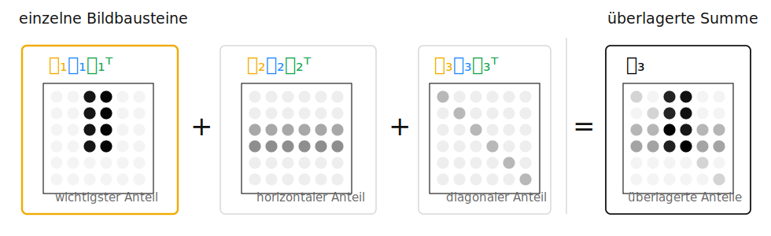{.svd-block-example fig-alt="Grafisches Beispiel für mehrere SVD-Bildbausteine und ihre überlagerte Summe"}

:::

## Was steckt in einem einzelnen SVD-Baustein?

::: {.svd-single-block-slide}

::: {.svd-single-intro}
Wir greifen den wichtigsten Baustein aus der vorherigen Folie heraus: den vertikalen Anteil.
:::

::: {.svd-single-meta}
Für das Prinzip verwenden wir hier den kleinen Baustein aus Folie 17. Beim echten Bild hätten $u_i$ und $v_i$ entsprechend viele Einträge wie Bildzeilen und Bildspalten.
:::

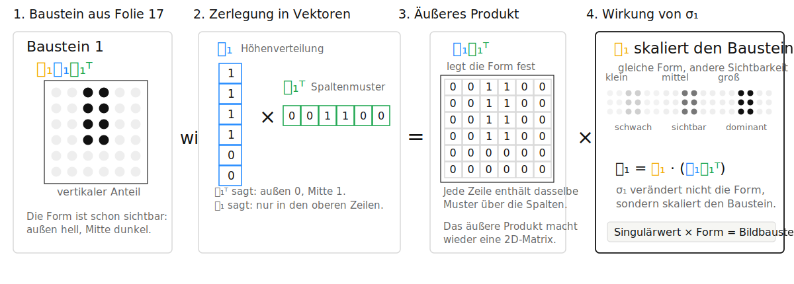{.svd-single-block fig-alt="Zerlegung eines einzelnen SVD-Bildbausteins in u1, v1 transponiert und sigma1"}

::: {.svd-single-hint}
Zur Veranschaulichung verwenden wir hier 0/1-Werte. In der echten SVD sind $u_i$ und $v_i$ normierte Vektoren.
:::

::: {.svd-single-note}
$u_1v_1^T$ legt die **Form** fest. $\sigma_1$ ist der **Singulärwert** dieses Bausteins; anschaulich bestimmt er seine Stärke.

Die nächste Frage ist: Welche dieser Bausteine sind stark genug, um zuerst gespeichert zu werden?
:::

:::

## Wie vermeiden wir doppelte Muster?

::: {.derivation-slide .two-column-derivation}

::: {.derivation-left}
Jede Schicht soll einen eigenen Anteil des Bildes erklären. Wenn zwei Schichten fast dasselbe Muster enthalten, wäre die Zerlegung redundant: dieselbe Struktur würde mehrfach gespeichert.

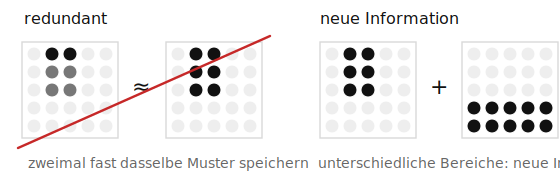{.orthogonal-layers-example fig-alt="Zwei fast gleiche Bildbausteine werden vermieden; unterschiedliche Muster bringen neue Information"}

Für Kompression wollen wir aber, dass jeder gespeicherte Baustein wirklich neue Information bringt.
:::

::: {.derivation-right}
Mathematisch heißt das:

$$
{\color{#16a34a}{v_i^Tv_j}}=0
\quad\text{für } i\neq j,
$$

Die Muster über die Spalten haben keinen gemeinsamen Anteil im Sinne des Skalarprodukts.

$$
{\color{#1e88ff}{u_i^Tu_j}}=0
\quad\text{für } i\neq j.
$$

Die Höhenverteilungen haben keinen gemeinsamen Anteil.
:::

::: {.uebergang}
Orthogonal heißt hier nicht räumlich getrennt. Die Schichten können an denselben Bildstellen wirken. Orthogonal heißt: Als normierte Vektoren enthalten sie keine gemeinsame Richtung, deshalb zählt man dieselbe Struktur nicht doppelt. **Jeder Baustein bringt eine neue unabhängige Bildschicht.**

**Wie finden wir nun starke Muster, die gleichzeitig unabhängig sind?**
:::

:::

## Wie finden wir starke und unabhängige Muster?

::: {.derivation-slide .two-column-derivation}

::: {.derivation-left}
Aus den letzten Folien wissen wir:
Ein guter SVD-Baustein soll zwei Bedingungen erfüllen:

1. **stark:**  
   Er soll viel sichtbare Bildinformation erklären.
2. **unabhängig:**  
   Er soll nicht dasselbe Muster speichern wie ein anderer Baustein.
:::

::: {.derivation-right}
Ein kompletter Baustein hat die Form

$$
{\color{#f2aa00}{B_i}}
=
{\color{#f2aa00}{\sigma_i}}{\color{#1e88ff}{u_i}}{\color{#16a34a}{v_i^T}}.
$$

Um ihn zu finden, starten wir mit einem Teil davon:

$$
{\color{#16a34a}{v}}\in\mathbb{R}^n
$$

${\color{#16a34a}{v}}$ ist ein mögliches **Muster über die Spalten**.

Die nächste Frage lautet:

**Wie messen wir, wie stark dieses Spaltenmuster \(v\) im Bild \(A\) vorkommt?**
:::

::: {.svd-search-start-wrap}
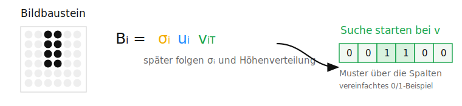{.svd-search-start fig-alt="Start der Suche nach einem SVD-Baustein über das Spaltenmuster v"}
:::

:::

## Was bedeutet \(Av\)?

::: {.derivation-slide .two-column-derivation .av-slide}

::: {.derivation-left}
Um zu messen, wie stark ein Spaltenmuster ${\color{#16a34a}{v}}$ im Bild vorkommt, wenden wir $A$ auf dieses Muster an:

$$
A{\color{#16a34a}{v}}
$$

Dabei gilt:

$$
{\color{#16a34a}{v}}\in\mathbb{R}^n
\qquad
A{\color{#16a34a}{v}}\in\mathbb{R}^m.
$$

Also: ${\color{#16a34a}{v}}$ hat einen Wert pro Bildspalte, $A{\color{#16a34a}{v}}$ einen Wert pro Bildzeile.
:::

::: {.derivation-right}
Für die $j$-te Bildzeile gilt:

$$
(A{\color{#16a34a}{v}})_j
=
\mathrm{Zeile}_j(A)\cdot{\color{#16a34a}{v}}
$$

Jede Bildzeile wird also per Skalarprodukt mit dem Spaltenmuster ${\color{#16a34a}{v}}$ verglichen.

Passt das Muster gut zu einer Zeile, wird der Wert groß. Passt es kaum, wird der Wert klein.

Damit ist $A{\color{#16a34a}{v}}$ die **Höhenantwort** des Bildes auf das Spaltenmuster.
:::

::: {.av-height-response-wrap}
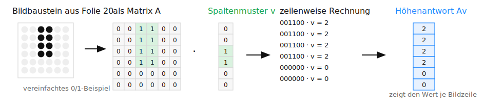{.av-height-response fig-alt="Matrixmultiplikation Av als Höhenantwort des Bildes auf ein Spaltenmuster"}
:::

::: {.derivation-fullnote}
Die Höhenantwort $A{\color{#16a34a}{v}}$ zeigt, wie stark das Spaltenmuster in jeder Bildzeile vorkommt. Ihre Länge misst die Gesamtstärke:

$$
\|A{\color{#16a34a}{v}}\|
=\sqrt{2^2+2^2+2^2+2^2+0^2+0^2}
=4.
$$

Je größer $\|A{\color{#16a34a}{v}}\|$, desto stärker ist die Antwort des Bildes auf das Muster ${\color{#16a34a}{v}}$. Damit wird unsere Suche konkret:

$$
\max_{\|{\color{#16a34a}{v}}\|=1}\|A{\color{#16a34a}{v}}\|.
$$

Wir suchen das normierte Spaltenmuster, das die stärkste Höhenantwort erzeugt. Im Beispiel verwenden wir 0/1-Werte. Für die eigentliche Suche normieren wir $v$ auf $\|v\|=1$, damit alle Spaltenmuster gleich lang sind und $\|Av\|$ nur die Antwort des Bildes auf dieses Muster misst -- nicht eine künstliche Skalierung von $v$.

$$
A{\color{#16a34a}{v}}=\text{Höhenantwort},
\qquad
\|A{\color{#16a34a}{v}}\|=\text{Gesamtstärke}.
$$
:::

:::

## Warum können wir $A$ nicht direkt verwenden?

::: {.derivation-slide .two-column-derivation .space-problem-slide}

::: {.derivation-left}
Wir haben jetzt eine Suchfrage:

$$
\max_{\|{\color{#16a34a}{v}}\|=1}\|A{\color{#16a34a}{v}}\|.
$$

Dafür wäre der Spektralsatz hilfreich, weil er orthogonale Richtungen liefert.

Für eine symmetrische Matrix $S$ gilt:

$$
S=Q\Lambda Q^T,
\qquad
S q_i=\lambda_i q_i.
$$

Die Spalten von $Q$ sind orthogonale Richtungen. In unserer SVD-Herleitung werden die zugehörigen Eigenwerte später zu Quadraten der Singulärwerte.

Aber der Spektralsatz gilt für symmetrische quadratische Matrizen.
:::

::: {.derivation-right}
Unsere Bildmatrix ist im Allgemeinen

$$
A\in\mathbb{R}^{m\times n}
$$

und damit oft rechteckig. Außerdem ist sie meist nicht symmetrisch:

$$
A^T\neq A.
$$

Anschaulich passiert bei $A$:

$$
A:\mathbb{R}^n\to\mathbb{R}^m.
$$

Ein Spaltenmuster ${\color{#16a34a}{v}}$ wird zu einer Höhenantwort $A{\color{#16a34a}{v}}$.

Der Spektralsatz braucht dagegen eine symmetrische quadratische Matrix, die einen Vektor wieder in denselben Raum abbildet.
:::

::: {.space-problem-graphic}
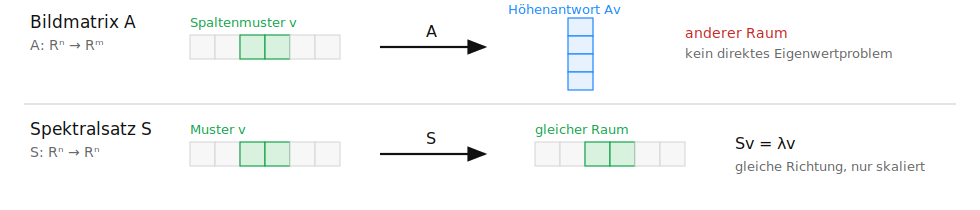{.spectral-space-problem fig-alt="A bildet ein Spaltenmuster in eine Höhenantwort ab, während der Spektralsatz eine Abbildung im selben Raum benötigt"}
:::

:::

## Warum führt die Normmessung zu $A^TA$?

::: {.derivation-slide .two-column-derivation .ata-strength-slide}

::: {.derivation-left}
Unsere Suchfrage war:

$$
\max_{\|{\color{#16a34a}{v}}\|=1}\|A{\color{#16a34a}{v}}\|.
$$

Da $\|A{\color{#16a34a}{v}}\|\ge0$, dürfen wir stattdessen die quadrierte Norm maximieren:

$$
\max_{\|{\color{#16a34a}{v}}\|=1}\|A{\color{#16a34a}{v}}\|^2.
$$

Das ändert nicht, welches Muster gewinnt. Beispiel: Aus $4>2$ wird $16>4$. Die Reihenfolge bleibt gleich.
:::

::: {.derivation-right}
Der Vorteil: Die quadrierte Länge kann als Skalarprodukt geschrieben werden:

$$
\|A{\color{#16a34a}{v}}\|^2
$$

$$
=
(A{\color{#16a34a}{v}})^T(A{\color{#16a34a}{v}})
$$

$$
=
{\color{#16a34a}{v^T}}A^TA{\color{#16a34a}{v}}.
$$

Der entscheidende Schritt ist:

$$
(A{\color{#16a34a}{v}})^T={\color{#16a34a}{v^T}}A^T.
$$

Dadurch erscheint zwischen den beiden ${\color{#16a34a}{v}}$-Termen automatisch $A^TA$.
:::

::: {.ata-strength-graphic}
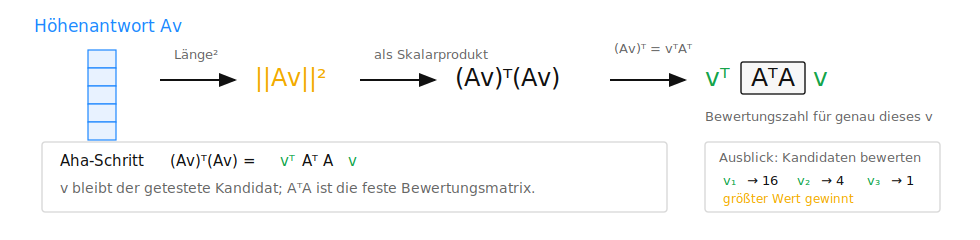{.ata-strength-derivation fig-alt="Die quadrierte Norm einer Höhenantwort führt zur Bewertungsmatrix A transponiert A"}
:::

::: {.uebergang}
Für ein festes Spaltenmuster ${\color{#16a34a}{v}}$ ist ${\color{#16a34a}{v^T}}A^TA{\color{#16a34a}{v}}$ genau dieselbe Zahl wie $\|A{\color{#16a34a}{v}}\|^2$: die quadrierte Norm der Höhenantwort im Originalbild.

$A^TA$ ist die Bewertungsmatrix. Die äußeren ${\color{#16a34a}{v}}$-Terme markieren den Kandidaten, der gerade getestet wird.
:::

:::

## Warum löst $A^TA$ unser Suchproblem?

::: {.derivation-slide .two-column-derivation}

::: {.derivation-left}
Aus der letzten Folie wurde unsere Suche:

$$
\max_{\|{\color{#16a34a}{v}}\|=1}\|A{\color{#16a34a}{v}}\|^2
=
\max_{\|{\color{#16a34a}{v}}\|=1}{\color{#16a34a}{v^T}}A^TA{\color{#16a34a}{v}}.
$$

Damit suchen wir nicht mehr direkt in der Höhenantwort $A{\color{#16a34a}{v}}$, sondern bewerten jedes Spaltenmuster ${\color{#16a34a}{v}}$ mit $A^TA$.

Wichtig: $A^TA$ ersetzt nicht das Bild $A$. Es ist die Bewertungsmatrix für die Spaltenmuster.
:::

::: {.derivation-right}
Jetzt passt $A^TA$ zum Spektralsatz:

$$
A^TA\in\mathbb{R}^{n\times n}
$$

Start und Ziel liegen wieder im Spaltenmuster-Raum.

Außerdem ist $A^TA$ symmetrisch:

$$
(A^TA)^T=A^TA.
$$

Für solche Matrizen liefert der Spektralsatz orthogonale Eigenrichtungen.
:::

::: {.ata-spectral-bridge-wrap}
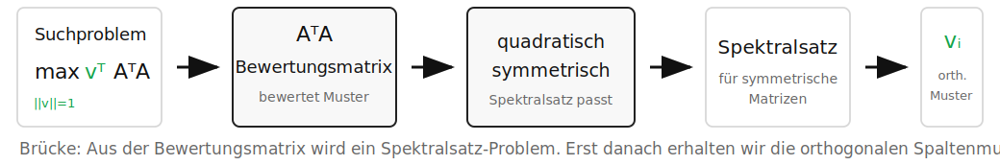{.ata-spectral-bridge fig-alt="Von der Bewertungsmatrix A transponiert A zum Spektralsatz und zu orthogonalen Spaltenmustern"}
:::

:::

## Der Spektralsatz liefert die gesuchten Muster

::: {.derivation-slide .two-column-derivation .spectral-output-slide}

::: {.derivation-left}
Unsere Suche lautet jetzt:

$$
\max_{\|{\color{#16a34a}{v}}\|=1}{\color{#16a34a}{v^T}}A^TA{\color{#16a34a}{v}}.
$$

Wir suchen also normierte Spaltenmuster ${\color{#16a34a}{v}}$, die von $A^TA$ möglichst stark bewertet werden.

Da $A^TA$ symmetrisch ist, dürfen wir den Spektralsatz anwenden.

Er liefert Eigenvektoren:

$$
A^TA{\color{#16a34a}{v_i}}
=
\lambda_i{\color{#16a34a}{v_i}}.
$$

Die Eigenvektoren ${\color{#16a34a}{v_i}}$ sind die gesuchten **Spaltenmuster**.

Das bedeutet: $A^TA$ verändert die Richtung ${\color{#16a34a}{v_i}}$ nicht, sondern skaliert sie nur mit $\lambda_i$. Solche Richtungen sind stabile Muster der Bewertungsmatrix.
:::

::: {.derivation-right}
Der Spektralsatz liefert genau das, was wir brauchen:

1. **Unabhängige Spaltenmuster**

$$
{\color{#16a34a}{v_i^Tv_j}}=0
\qquad (i\ne j)
$$

Die Muster speichern keine doppelte Richtung.

2. **Sortierbare Eigenwerte**

$$
\lambda_1\ge\lambda_2\ge\dots\ge0
$$

Die ersten ${\color{#16a34a}{v_i}}$ gehören zu den größten Eigenwerten.
:::

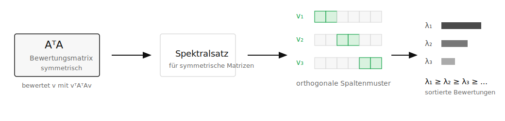{.spectral-theorem-outputs fig-alt="Der Spektralsatz auf A transponiert A liefert orthogonale Spaltenmuster und sortierte Eigenwerte"}

::: {.uebergang}
**Wir haben jetzt unabhängige Spaltenmuster ${\color{#16a34a}{v_i}}$ und zugehörige Eigenwerte $\lambda_i$. Nächste Frage: Warum gilt $\lambda_i={\color{#f2aa00}{\sigma_i^2}}$?**
:::

:::

## Warum gilt $\lambda_i=\sigma_i^2$?

::: {.derivation-slide .two-column-derivation .eigen-strength-slide}

::: {.derivation-left}
Aus dem Spektralsatz kennen wir jetzt die Spaltenmuster ${\color{#16a34a}{v_i}}$:

$$
A^TA{\color{#16a34a}{v_i}}
=
\lambda_i{\color{#16a34a}{v_i}}.
$$

Jetzt prüfen wir die Norm der Höhenantwort dieses gefundenen Musters im Originalbild $A$.

Für ein gefundenes Spaltenmuster ${\color{#16a34a}{v_i}}$ messen wir:

$$
\|A{\color{#16a34a}{v_i}}\|^2.
$$

Aus der vorherigen Umformung wissen wir:

$$
\|A{\color{#16a34a}{v_i}}\|^2
=
{\color{#16a34a}{v_i^T}}A^TA{\color{#16a34a}{v_i}}.
$$
:::

::: {.derivation-right}
Jetzt setzen wir die Eigenvektorgleichung ein:

$$
\|A{\color{#16a34a}{v_i}}\|^2
=
{\color{#16a34a}{v_i^T}}(\lambda_i{\color{#16a34a}{v_i}})
=
\lambda_i({\color{#16a34a}{v_i^T}}{\color{#16a34a}{v_i}}).
$$

Da ${\color{#16a34a}{v_i}}$ normiert ist, gilt:

$$
{\color{#16a34a}{v_i^T}}{\color{#16a34a}{v_i}}=1,
\qquad
\|A{\color{#16a34a}{v_i}}\|^2=\lambda_i.
$$

Damit ist der Eigenwert $\lambda_i$ das **Quadrat des zugehörigen Singulärwerts**.

$$
\lambda_i=\|A{\color{#16a34a}{v_i}}\|^2,
\qquad
{\color{#f2aa00}{\sigma_i}}=\|A{\color{#16a34a}{v_i}}\|=\sqrt{\lambda_i}.
$$
:::

::: {.eigenvalue-graphic}
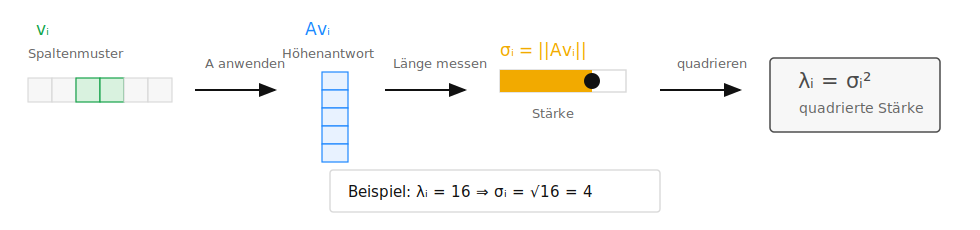{.eigenvalue-singularvalue fig-alt="Eigenwert als Quadrat des Singulärwerts eines Spaltenmusters"}
:::

::: {.uebergang}
**Merke: $\lambda_i={\color{#f2aa00}{\sigma_i^2}}$ und ${\color{#f2aa00}{\sigma_i}}=\|A{\color{#16a34a}{v_i}}\|$. Als Nächstes fehlt noch die Höhenverteilung ${\color{#1e88ff}{u_i}}$.**
:::

:::

## Vom Spaltenmuster zur Höhenverteilung

::: {.derivation-slide .two-column-derivation .from-v-to-u-slide}

::: {.derivation-left}
Aus der letzten Folie kennen wir:

- ${\color{#16a34a}{v_i}}$: Muster über die Spalten
- ${\color{#f2aa00}{\sigma_i}}$: Singulärwert des Musters

Für den vollständigen Baustein fehlt:

- ${\color{#1e88ff}{u_i}}$: Verteilung über die Bildzeilen

$$
{\color{#f2aa00}{B_i}}
=
{\color{#f2aa00}{\sigma_i}}{\color{#1e88ff}{u_i}}{\color{#16a34a}{v_i^T}}.
$$

Leitfrage: **In welchen Bildzeilen kommt ${\color{#16a34a}{v_i}}$ vor?**
:::

::: {.derivation-right}
Dazu benutzen wir wieder das Originalbild $A$:

$$
A{\color{#16a34a}{v_i}}.
$$

Das ist die **Höhenantwort**: ein Wert pro Bildzeile.

$$
\|A{\color{#16a34a}{v_i}}\|={\color{#f2aa00}{\sigma_i}}.
$$

Also enthält $A{\color{#16a34a}{v_i}}$ die Höhenform und den Singulärwert als Skalierung. Für die SVD trennen wir beides:

$$
A{\color{#16a34a}{v_i}}={\color{#f2aa00}{\sigma_i}}{\color{#1e88ff}{u_i}},
\qquad
{\color{#1e88ff}{u_i}}=\frac{A{\color{#16a34a}{v_i}}}{\sigma_i}
\quad(\sigma_i>0).
$$

Durch das Teilen durch ${\color{#f2aa00}{\sigma_i}}$ bleibt die Form über die Höhe erhalten; die Skalierung durch den Singulärwert wird entfernt.
:::

::: {.from-v-to-u-wrap}
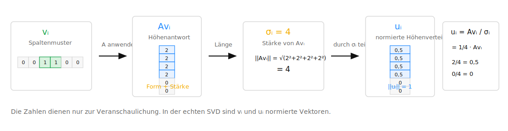{.from-v-to-u fig-alt="Vom Spaltenmuster über die Höhenantwort zur normierten Höhenverteilung"}
:::

:::

## Aus drei Teilen wird ein Bildbaustein

::: {.derivation-slide .two-column-derivation .block-from-parts-slide}

::: {.derivation-left}
Letzte Folie:

$$
{\color{#1e88ff}{u_i}}
=
\frac{A{\color{#16a34a}{v_i}}}{\sigma_i}.
$$

Umgestellt:

$$
A{\color{#16a34a}{v_i}}
=
{\color{#f2aa00}{\sigma_i}}{\color{#1e88ff}{u_i}}.
$$

Das heißt: Die Höhenantwort des Spaltenmusters besteht aus **Singulärwert** mal **normierter Höhenverteilung**.
:::

::: {.derivation-right}
Damit kennen wir alle drei Teile:

$$
{\color{#f2aa00}{B_i}}
=
{\color{#f2aa00}{\sigma_i}}
{\color{#1e88ff}{u_i}}
{\color{#16a34a}{v_i^T}}.
$$

- ${\color{#16a34a}{v_i^T}}$: Muster über die Spalten
- ${\color{#1e88ff}{u_i}}$: Verteilung über die Bildzeilen
- ${\color{#f2aa00}{\sigma_i}}$: Singulärwert des Bausteins

Das äußere Produkt ${\color{#1e88ff}{u_i}}{\color{#16a34a}{v_i^T}}$ macht daraus eine 2D-Bildschicht.
:::

::: {.svd-block-from-parts-wrap}
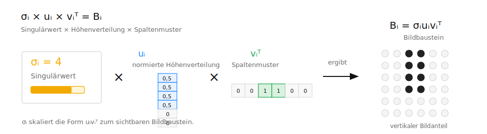{.svd-block-from-parts fig-alt="Aus Spaltenmuster, Höhenverteilung und Singulärwert entsteht ein SVD-Bildbaustein"}
:::

::: {.derivation-fullnote .block-from-parts-note}
Aus der Kernbeziehung $A{\color{#16a34a}{v_i}}={\color{#f2aa00}{\sigma_i}}{\color{#1e88ff}{u_i}}$ wird mit ${\color{#16a34a}{v_i^T}}$ der Matrixbaustein ${\color{#f2aa00}{B_i}}={\color{#f2aa00}{\sigma_i}}{\color{#1e88ff}{u_i}}{\color{#16a34a}{v_i^T}}$.
:::

::: {.uebergang}
**Merke: Höhenantwort plus Spaltenmuster ergibt die vollständige Bildschicht. Damit kennen wir wieder die Bausteinform aus dem Anfang der Herleitung.**
:::

:::

## Alle Bildbausteine zusammen ergeben das Bild

::: {.derivation-slide .two-column-derivation .sum-to-matrix-slide}

::: {.derivation-left}
Auf der letzten Folie hatten wir einen einzelnen Bildbaustein:

$$
{\color{#f2aa00}{B_i}}
=
{\color{#f2aa00}{\sigma_i}}{\color{#1e88ff}{u_i}}{\color{#16a34a}{v_i^T}}.
$$

Das ganze Bild entsteht, wenn wir alle nichtverschwindenden Bausteine addieren:

$$
A=B_1+B_2+\dots+B_r
$$

also:

$$
A=\sum_{i=1}^{r}{\color{#f2aa00}{\sigma_i}}{\color{#1e88ff}{u_i}}{\color{#16a34a}{v_i^T}}.
$$

$r$ ist die Anzahl der positiven Singulärwerte:

$$
r=\operatorname{rang}(A).
$$

Wenn $\sigma_i=0$, dann ist ${\color{#f2aa00}{\sigma_i}}{\color{#1e88ff}{u_i}}{\color{#16a34a}{v_i^T}}=0$. Dieser Baustein trägt nichts zum Bild bei.
:::

::: {.derivation-right}
Die Summe lässt sich kompakt als Matrixprodukt schreiben:

$$
{\color{#1e88ff}{U_r}}=(u_1,\dots,u_r),
\qquad
{\color{#16a34a}{V_r}}=(v_1,\dots,v_r).
$$

$$
{\color{#f2aa00}{\Sigma_r}}=
\begin{pmatrix}
\sigma_1 &        & 0\\
         & \ddots &  \\
0        &        & \sigma_r
\end{pmatrix}
$$

$$
A={\color{#1e88ff}{U_r}}{\color{#f2aa00}{\Sigma_r}}{\color{#16a34a}{V_r^T}}.
$$

- ${\color{#1e88ff}{U_r}}$: Höhenverteilungen
- ${\color{#f2aa00}{\Sigma_r}}$: Singulärwerte
- ${\color{#16a34a}{V_r^T}}$: Spaltenmuster
:::

::: {.svd-sum-to-matrix-wrap}
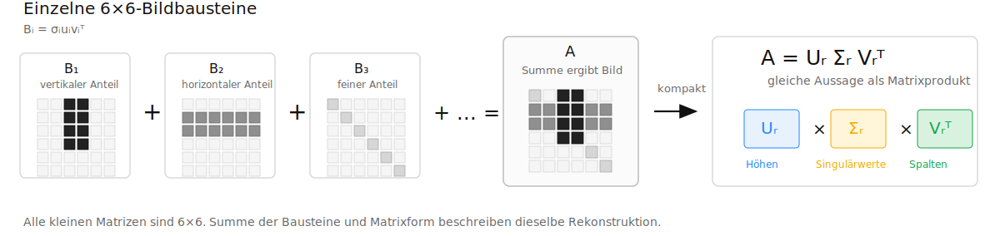{.svd-sum-to-matrix fig-alt="Die Summe einzelner SVD-Bildbausteine ergibt die Bildmatrix und entspricht der Matrixform A gleich U Sigma V transponiert"}
:::

:::

## Warum können wir kleine Bausteine weglassen?

::: {.derivation-slide .two-column-derivation .truncation-slide}

::: {.derivation-left}
Aus der letzten Folie wissen wir:

$$
A=\sum_{i=1}^{r}{\color{#f2aa00}{\sigma_i}}u_i v_i^T.
$$

Das Bild ist also eine Summe sortierter Bildbausteine.

Für Kompression behalten wir nur die ersten $k$ Bausteine:

$$
A_k=\sum_{i=1}^{k}{\color{#f2aa00}{\sigma_i}}u_i v_i^T.
$$

Die weggelassenen Bausteine bilden den Fehler:

$$
A-A_k=\sum_{i=k+1}^{r}{\color{#f2aa00}{\sigma_i}}u_i v_i^T.
$$

Weil die Singulärwerte absteigend sortiert sind, lassen wir genau die schwächsten Bildschichten weg.
:::

::: {.derivation-right}
Der Singulärwert eines Bausteins ist ${\color{#f2aa00}{\sigma_i}}$.

Weil die SVD-Bausteine orthogonal zueinander sind, addieren sich die Quadrate ihrer Singulärwerte sauber:

$$
\|A-A_k\|_F^2
=
\sum_{i=k+1}^{r}{\color{#f2aa00}{\sigma_i^2}}.
$$

Der Fehler besteht genau aus der Energie der weggelassenen Bildschichten.

Wenn die weggelassenen ${\color{#f2aa00}{\sigma_i}}$ klein sind, ist auch der Rekonstruktionsfehler klein.

Eckart-Young-Mirsky sagt zusätzlich:

$$
\|A-A_k\|_F \le \|A-B\|_F
\quad
\text{für alle } \operatorname{rang}(B)\le k.
$$

Also ist $A_k$ die beste Rang-$k$-Näherung im Frobeniusfehler.
:::

::: {.svd-truncation-k-wrap}
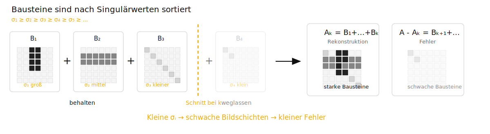{.svd-truncation-k fig-alt="Abschneiden der SVD nach den ersten k stärksten Bildbausteinen"}
:::

:::

## Was bleibt von der SVD hängen?

::: {.svd-final-slide}

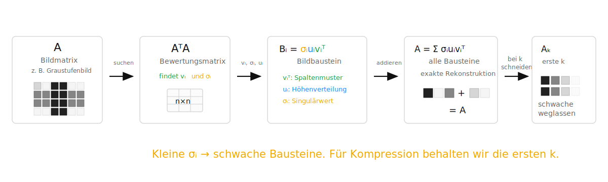{.svd-final-summary fig-alt="Zusammenfassung der SVD als Weg von der Bildmatrix über Bildbausteine zur komprimierten Rekonstruktion"}

::: {.svd-summary-cards}
::: {.svd-summary-card}
**Baustein**

$$
{\color{#f2aa00}{B_i}}={\color{#f2aa00}{\sigma_i}}{\color{#1e88ff}{u_i}}{\color{#16a34a}{v_i^T}}
$$

Singulärwert × Höhenverteilung × Spaltenmuster
:::

::: {.svd-summary-card}
**Sortierung**

$$
{\color{#f2aa00}{\sigma_1}}\ge{\color{#f2aa00}{\sigma_2}}\ge\dots
$$

Große ${\color{#f2aa00}{\sigma_i}}$ bedeuten wichtige Bildanteile.
:::

::: {.svd-summary-card}
**Kompression**

$$
A_k=\sum_{i=1}^{k}{\color{#f2aa00}{\sigma_i}}{\color{#1e88ff}{u_i}}{\color{#16a34a}{v_i^T}}
$$

Wir behalten die stärksten Bausteine.
:::
:::

::: {.svd-final-note}
Die SVD macht sichtbar, welche Bildstrukturen wichtig sind, und erlaubt dadurch eine kontrollierte Kompression.
:::

:::

## Quellen {.sources-slide}

::: {.sources-list}
- **[Bae16]** Bärwolff, G. *Numerik für Ingenieure, Physiker und Informatiker.* Springer, 2. Aufl., 2016 (Kap. 3).
- **[Bas20]** Bashier, E. *Practical Numerical and Scientific Computing with MATLAB and Python.* CRC Press, 2020 (Kap. 1).
- **[Kar15]** Karpfinger, C. *Höhere Mathematik in Rezepten.* Springer, 2. Aufl., 2015 (Kap. 42.3–42.4).
- **[Kel21]** Keller, A. *Aufgaben und Lösungen zur Mathematik für den Studienstart.* Springer, 2021 (Kap. 25.8–25.9).
- **[Kel24]** Keller, A. *Handout Eigenwerte, Spektralsatz, Singular Value Decomposition und Least-Squares.* THWS, 2024.
- **[Mol04]** Moler, C. B. *Numerical Computing with MATLAB.* SIAM, 2004 (Kap. 10.1–10.4 und 10.11).
- **[TB22]** Trefethen, L. und Bau, D. *Numerical Linear Algebra.* SIAM, 2022.
- **[Str10]** Strang, G. *Wissenschaftliches Rechnen.* Springer, 2010 (Kap. 1).
:::

## Eigenständigkeitserklärung {.ai-declaration-slide}

::: {.ai-decl-intro}
Bei der Erstellung dieser Themenausarbeitung wurden KI-gestützte Werkzeuge gemäß der KI-Leitlinie Hochschullehre Bayern wie folgt eingesetzt:
:::

::: {.ai-decl-table}
| KI-Werkzeug | Einsatzzweck |
|---|---|
| Claude (Anthropic) | Strukturierung und sprachliche Überarbeitung der Folien |
| Claude (Anthropic) | Erzeugung der Python-Skripte für die generierten Visualisierungen |
| Claude (Anthropic) | Unterstützung bei der Python-Implementierung der SVD-Bildkompression |
:::

::: {.ai-decl-statement}
Hiermit versichere ich, dass ich die vorliegende Arbeit eigenständig verfasst und keine anderen als die angegebenen Quellen und Hilfsmittel verwendet habe. Alle übernommenen Inhalte sowie mit Unterstützung von KI generierten Inhalte wurden entsprechend den anerkannten wissenschaftlichen Grundsätzen oder entsprechend der Regelungen zur Kennzeichnung von KI-Inhalten kenntlich gemacht. Ausgenommen von der Kenntlichmachung sind orthografische oder grammatikalische Korrekturen, Übersetzungen sowie nicht-sinnverändernde Verbesserungen von Formulierungen. Ich bin mir bewusst, dass mit KI generierte Texte keine Garantie für die Qualität von Inhalten und Text bieten. Daher erkläre ich, dass ich KI-Werkzeuge lediglich als Hilfsmittel genutzt habe, die von KI generierten Inhalte kritisch überprüft habe und mein eigenständiger sowie kreativer Einfluss in dieser Arbeit überwiegt. Ich versichere, dass ich Inhalte meiner Arbeit vollständig verstanden habe und selbstständig vertreten kann. Ich versichere, dass ich ausschließlich KI-Werkzeuge verwendet habe, deren Nutzung vom Prüfer oder der Prüferin als Hilfsmittel zugelassen wurden.
:::
