## Singulärwertzerlegung {.title-slide}

::: {.subtitle}
::: {.title-expansion}
Singular Value Decomposition (SVD)
:::

Erklärt anhand von Bildkomprimierung
:::

## Rotation und Skalierung

::: {.basics-slide}

::: {.basics-visual}
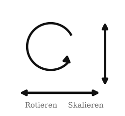{.generated-symbols fig-alt="Rotieren und Skalieren als geometrische Grundoperationen"}
:::

::: {.basics-text}
Eine **Rotation** ist eine Drehung um einen Winkel.

Eine **Skalierung** streckt oder staucht entlang einer Achse.

Diese beiden Operationen sind die geometrischen Bausteine, mit denen wir gleich eine lineare Abbildung in einfache Schritte zerlegen.

::: {.quiet-note}
Die Matrixschreibweise kommt später; hier geht es zuerst nur um die sichtbare Wirkung.
:::
:::

:::

## Von einer Form zur anderen

::: {.lead-text}
Bevor wir Bilder komprimieren, betrachten wir ein Rätsel: Wie kommt man nur durch Rotationen und Skalierungen entlang der Achsen von der linken Grafik zur rechten?
:::

::: {.generated-visual-wrap}
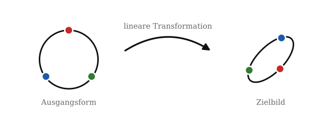{.generated-puzzle fig-alt="Ausgangskreis wird mathematisch zu einem gestauchten und rotierten Oval transformiert"}
:::

## Rotation, Skalierung, Rotation

::: {.step-action-slide}
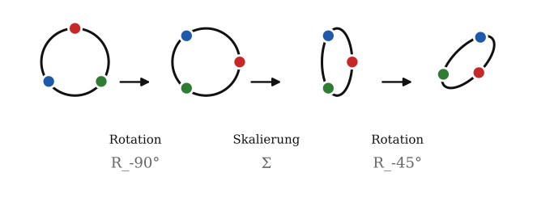{.step-actions fig-alt="Vier Zustände mit drei Aktionen: Rotation, Skalierung, Rotation"}

::: {.step-action-matrices}
$$
R_{-90^\circ} =
\begin{pmatrix}
0 & 1 \\
-1 & 0
\end{pmatrix}
\qquad
\Sigma =
\begin{pmatrix}
0.45 & 0 \\
0 & 1
\end{pmatrix}
\qquad
R_{-45^\circ} =
\begin{pmatrix}
\frac{\sqrt2}{2} & \frac{\sqrt2}{2} \\
-\frac{\sqrt2}{2} & \frac{\sqrt2}{2}
\end{pmatrix}
$$
:::

::: {.transition-question}
Doch was hat das mit SVD zu tun?
:::
:::

## Die Idee der SVD

::: {.svd-bridge-slide}

::: {.svd-bridge-visual}
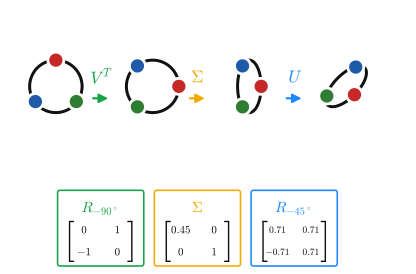{.svd-bridge fig-alt="Miniatur der Transformation und Zusammenhang mit A gleich U Sigma V transponiert"}
:::

::: {.svd-bridge-text}
Im Kern ist das das Prinzip der SVD:

$$
A = {\color{#1e88ff}{U}}\,{\color{#f2aa00}{\Sigma}}\,{\color{#16a34a}{V^T}}
$$

Eine lineare Abbildung wird in drei lesbare Bausteine zerlegt: erst eine Rotation oder Spiegelung, dann eine Skalierung, dann erneut eine Rotation oder Spiegelung.

Unser Ablauf von der vorherigen Folie ist dabei ein **didaktisches Beispiel im Stil der SVD**. Er zeigt das Grundprinzip, ist aber nicht die kanonische SVD, weil die Singulärwerte dort nach Größe sortiert werden und die stärkste Skalierung zuerst steht.

Für dieses Beispiel entsteht die Gesamtmatrix durch Multiplikation:

$$
A =
{\color{#1e88ff}{R_{-45^\circ}}}
{\color{#f2aa00}{\begin{pmatrix}0.45&0\\0&1\end{pmatrix}}}
{\color{#16a34a}{R_{-90^\circ}}}
\approx
\begin{pmatrix}
-0.707 & 0.318 \\
-0.707 & -0.318
\end{pmatrix}
$$
:::

:::

## Dimensionsreduktion

::: {.dimension-slide}

::: {.dimension-visual}
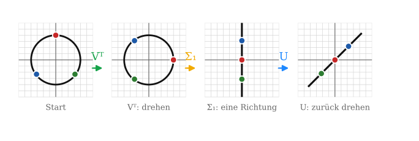{.dimension-reduction fig-alt="Dimensionsreduktion: Kreis wird nach Rotation und Rang-1-Skalierung zu einer Linie"}
:::

::: {.dimension-example}
$$
\underset{\textstyle {\color{#f2aa00}\Sigma}}{\begin{pmatrix}3&0\\0&2\end{pmatrix}}
\underset{\textstyle \text{Punkte}}{\begin{pmatrix}2&1\\1&2\end{pmatrix}}
=\begin{pmatrix}6&3\\2&4\end{pmatrix}
\qquad
\underset{\textstyle {\color{#f2aa00}\Sigma}\ (\sigma_2={\color{#16a34a}0})}{\begin{pmatrix}3&0\\0&{\color{#16a34a}0}\end{pmatrix}}
\begin{pmatrix}2&1\\1&2\end{pmatrix}
=\begin{pmatrix}6&3\\{\color{#16a34a}0}&{\color{#16a34a}0}\end{pmatrix}
$$

Links hat ${\color{#f2aa00}\Sigma}$ die **Singulärwerte** $\sigma_1=3,\ \sigma_2=2$ — die **Punkte** (je Spalte einer) bleiben in der Fläche. Rechts ist $\sigma_2={\color{#16a34a}0}$: die ganze $y$-Zeile wird $0$, alle Punkte landen auf der Linie $y=0$.
:::

::: {.dimension-text}
In der SVD $A=U\Sigma V^T$ steckt die ganze Streckung in $\Sigma$: dort stehen die **Singulärwerte** $\sigma_1\ge\sigma_2\ge\dots\ge 0$.

Sie bestimmen die Streckung jeder Richtung. Der **kleinste Singulärwert** $=0$ entfernt die unwichtigste Richtung.

Genau das ist Dimensionsreduktion: kleine Singulärwerte weglassen. Dieselbe Idee trägt später die Bildkompression.
:::

:::

## Rang-1-Matrix

::: {.rank1-slide}

::: {.rank1-visual}
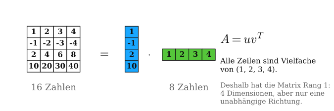{.rank1-matrix fig-alt="Eine Rang-1-Matrix wird als Spaltenvektor mal Zeilenvektor dargestellt"}
:::

::: {.rank1-text}
Diese Matrix wirkt zuerst wie 16 einzelne Zahlen. Tatsächlich steckt aber viel weniger unabhängige Information darin.

Alle Zeilen sind Vielfache der ersten Zeile:

$$
(1,2,3,4),\quad -(1,2,3,4),\quad 2(1,2,3,4),\quad 10(1,2,3,4).
$$

Die Matrix hat also vier Zeilen und vier Spalten, aber nur **eine unabhängige Richtung**. Deshalb ist ihr Rang gleich $1$.

Statt 16 Zahlen speichern wir nur zwei Vektoren mit insgesamt 8 Zahlen:

$$
A = u v^T.
$$
:::

:::

## Höherer Rang: Summe aus Rang-1-Matrizen

::: {.rank-approx-slide}

::: {.rank-approx-visual}
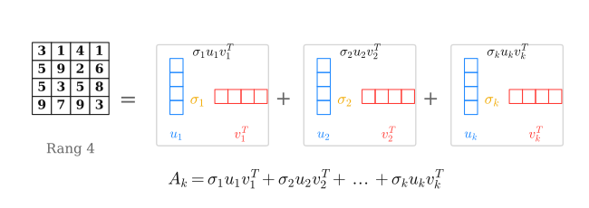{.rank-approx fig-alt="Eine Matrix mit höherem Rang wird durch mehrere Rang-1-Matrizen angenähert"}
:::

::: {.rank-approx-text}
Bei einer Matrix mit Rang $4$ sind die Zeilen nicht mehr alle Vielfache voneinander. Die einfache Zerlegung aus der vorherigen Folie reicht dann nicht mehr aus.

Das Grundprinzip bleibt aber gleich: Wir beschreiben die Matrix als Summe mehrerer Rang-1-Matrizen.

$$
A_k = \sigma_1 u_1 v_1^T + \sigma_2 u_2 v_2^T + \dots + \sigma_k u_k v_k^T
$$

Für $k=r$ ist das die vollständige Zerlegung. Für $k<r$ entsteht eine Näherung: Je mehr Bausteine wir addieren, desto genauer wird sie. Für Kompression speichern wir nur die wichtigsten Bausteine und lassen kleine Beiträge weg.
:::

:::

## SVD als Summe von Rang-1-Beiträgen

::: {.svd-sum-slide}

::: {.svd-sum-top}
Die Produktform

$$
A =
{\color{#1e88ff}{U}}
{\color{#f2aa00}{\Sigma}}
{\color{#16a34a}{V^T}}
$$

ist gleichbedeutend mit einer Summe aus einzelnen Rang-1-Matrizen:

$$
A =
{\color{#f2aa00}{\sigma_1}}
{\color{#1e88ff}{u_1}}
{\color{#16a34a}{v_1^T}}
+
{\color{#f2aa00}{\sigma_2}}
{\color{#1e88ff}{u_2}}
{\color{#16a34a}{v_2^T}}
+
\dots
+
{\color{#f2aa00}{\sigma_r}}
{\color{#1e88ff}{u_r}}
{\color{#16a34a}{v_r^T}}.
$$
:::

::: {.svd-sum-bottom}
::: {.sum-piece .blue-piece}
$u_i$  
Spalte aus $U$
:::

::: {.sum-times}
$\times$
:::

::: {.sum-piece .yellow-piece}
$\sigma_i$  
Gewichtung aus $\Sigma$
:::

::: {.sum-times}
$\times$
:::

::: {.sum-piece .red-piece}
$v_i^T$  
Zeile aus $V^T$
:::

::: {.sum-result}
$=$ ein Rang-1-Beitrag
:::
:::

:::

## SVD-Rang-1-Zerlegung {.rank-sum-reconstruction-slide}

::: {.reconstruction-lead}
Dieselbe Zerlegung in zwei Sichtweisen: oben als **Produkt** $A=U\Sigma V^T$, unten als **Summe** einzelner Rang-1-Beiträge $\sigma_i u_i v_i^T$.
:::

::: {.rank-sum-reconstruction-wrap}
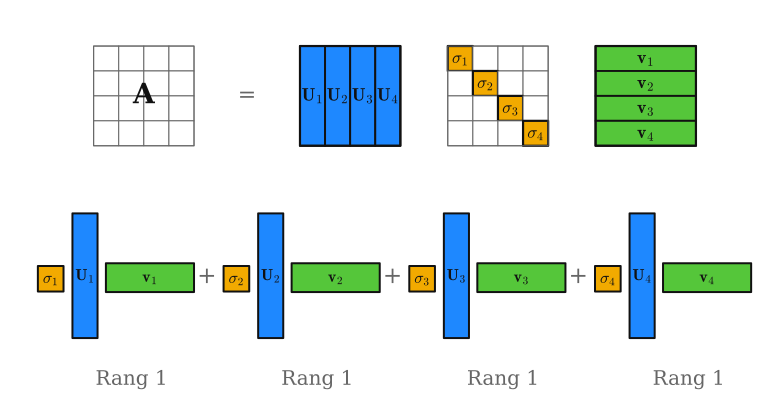{.rank-sum-reconstruction fig-alt="SVD als Produkt A gleich U Sigma V transponiert und als Summe von vier Rang-1-Beiträgen"}
:::

::: {.reconstruction-caption}
${\color{#1e88ff}{u_i}}$ — Spalten von $U$ · ${\color{#f2aa00}{\sigma_i}}$ — Singulärwerte in $\Sigma$ · ${\color{#16a34a}{v_i^T}}$ — Zeilen von $V^T$

Jeder Block ${\color{#f2aa00}{\sigma_i}}{\color{#1e88ff}{u_i}}{\color{#16a34a}{v_i^T}}$ unten ist eine **Rang-1-Matrix**; aufsummiert ergeben sie genau die Produktform oben.
:::

## Bild als Matrix

::: {.image-matrix-slide}
::: {.image-matrix-visual}
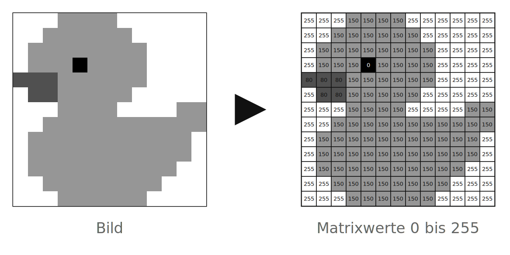{.duck-to-matrix fig-alt="Pixelente wird in eine Matrix mit Werten von 0 bis 255 umgewandelt"}
:::

::: {.image-matrix-text}
Bis hierhin haben wir Matrizen als Summen von Rang-1-Beiträgen betrachtet. Jetzt wenden wir genau diese Idee auf ein Bild an.

Ein Graustufenbild ist nichts anderes als eine Matrix $A$: Jeder Eintrag ist ein Pixelwert zwischen $0$ und $255$.

$$
A = U\Sigma V^T,
$$

zerlegt diese Pixelmatrix in geordnete Bildbausteine.

Die größten Singulärwerte beschreiben die wichtigsten Strukturen der Ente. Für die Kompression speichern wir nur diese stärksten Beiträge und lassen kleinere Details weg.

Auf der nächsten Folie sieht man diese Beiträge einzeln.
:::

:::

## SVD der Ente: erster Beitrag {.duck-svd-first-slide}

::: {.duck-svd-first-wrap}
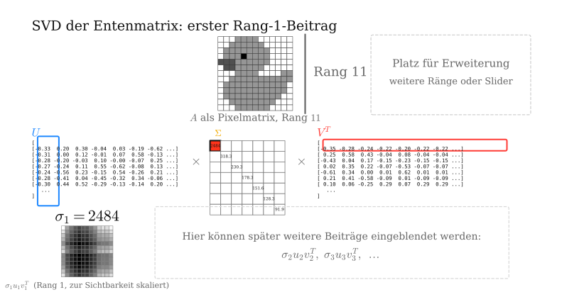{.duck-svd-first fig-alt="Entenmatrix mit SVD-Matrizen U Sigma V transponiert und erstem Rang-1-Beitrag"}
:::

## Rang-1-Beiträge der Ente

::: {.duck-rank-terms-slide}

::: {.duck-rank-terms-visual}
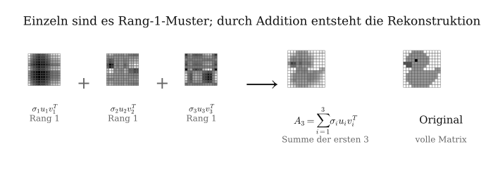{.duck-rank-terms fig-alt="Oben werden die ersten drei Rang-1-Beiträge der Ente zur Rekonstruktion A3 aufsummiert; darunter ist jeder Beitrag in Spaltenvektor u, Singulärwert sigma und Zeilenvektor v transponiert zerlegt"}
:::

:::

## Rang-k-Näherung der Ente

::: {.rank-slide}

::: {.rank-explanation}
Bei einem Bild ist $A$ die Matrix der Pixelwerte.

$$
A_k = \sum_{i=1}^{k} \sigma_i u_i v_i^T.
$$

Mit jedem Rang kommt ein weiteres Muster dazu. Kleine Ränge speichern wenig, verlieren aber Details; größere Ränge nähern sich der Originalmatrix an.
:::

```{=html}
<div class="svd-rank-demo">
  <div class="rank-control">
    <label>Rang k = <strong data-role="rank-label">1</strong></label>
    <input data-role="rank-slider" type="range" min="1" max="13" value="1" step="1">
    <span data-role="storage-label"></span>
  </div>
  <div class="rank-grids">
    <div>
      <div class="grid-title">Original</div>
      <div data-role="original-grid"></div>
    </div>
    <div>
      <div class="grid-title">Rekonstruktion</div>
      <div data-role="reconstructed-grid"></div>
    </div>
  </div>
</div>
```

:::

## Rang-k-Näherung von Albert Einstein

::: {.rank-slide}

::: {.rank-explanation}
Bei einem hochaufgelösten Bild wird die Pixelmatrix deutlich größer. Ein Originalbild mit $m$ Zeilen und $n$ Spalten speichert ungefähr $m\cdot n$ Helligkeitswerte.

$$
\text{Original: } m\cdot n
\qquad
\text{Rang-}k\text{: } k(m+n+1)
$$

Bei hoher Auflösung lohnt sich diese Speicherung stärker: Für kleine $k$ behalten wir nur wenige wichtige Bildmuster, sparen aber sehr viele Pixelwerte ein.

Je höher wir $k$ wählen, desto mehr Details, Kanten und feine Kontraste kommen zurück. Gleichzeitig steigt aber auch die Datenmenge wieder.
:::

```{=html}
<div class="svd-rank-demo image-rank-demo" data-svd-source="einstein" data-render="canvas">
  <div class="rank-control">
    <label>Rang k = <strong data-role="rank-label">1</strong></label>
    <input data-role="rank-slider" type="range" min="1" max="600" value="1" step="1">
    <span data-role="storage-label"></span>
  </div>
  <div class="rank-grids">
    <div>
      <div class="grid-title">Original</div>
      <div data-role="original-grid"></div>
    </div>
    <div>
      <div class="grid-title">Rekonstruktion</div>
      <div data-role="reconstructed-grid"></div>
    </div>
  </div>
</div>
```

:::

## Was haben wir gerade benutzt?

::: {.svd-question-slide}

::: {.svd-question-left}
Beim Einstein-Bild haben wir gesehen: Schon wenige Rang-1-Beiträge liefern eine erkennbare Rekonstruktion.

Damit das sinnvoll ist, müssen diese Beiträge nach Wichtigkeit sortiert sein:

$$
A_k =
\sum_{i=1}^{k}
{\color{#f2aa00}{\sigma_i}}\,
{\color{#1e88ff}{u_i}}\,
{\color{#16a34a}{v_i^T}}.
$$

Genau das leistet die SVD: Sie liefert geordnete Bildbausteine.
:::

::: {.svd-question-right}
::: {.mini-example}
Jetzt klären wir, warum diese Zerlegung für eine beliebige Bildmatrix existiert und wie ihre Bausteine entstehen.
:::

::: {.big-question}
Woher kommen
${\color{#1e88ff}{u_i}}$,
${\color{#f2aa00}{\sigma_i}}$ und
${\color{#16a34a}{v_i}}$?

Warum sind die ersten Beiträge die wichtigsten?

Warum dürfen kleine Beiträge weggelassen werden?

Warum funktioniert das bei einer beliebigen Bildmatrix?
:::
:::

::: {.uebergang}
Dazu schauen wir zuerst auf das Objekt selbst: Was ist an einer Bildmatrix schwierig?
:::

:::

## Das Problem: Eine Bildmatrix ist beliebig

::: {.derivation-slide .two-column-derivation}

::: {.derivation-left}
Ein Graustufenbild ist eine Matrix

$$
A\in\mathbb{R}^{m\times n}.
$$

Aber im Allgemeinen gilt

$$
A^T\neq A
\qquad\text{und oft auch}\qquad
m\neq n.
$$
:::

::: {.derivation-right}
Eine Bildmatrix ist also im Allgemeinen **nicht symmetrisch**.

Bei rechteckigen Bildern ist sie nicht einmal quadratisch.

Deshalb können wir den Spektralsatz nicht direkt auf $A$ anwenden.
:::

::: {.uebergang}
Trotzdem suchen wir genau das, was Eigenwertzerlegungen gut können: Richtungen und Gewichtungen.
:::

:::

## Warum reichen bekannte Zerlegungen nicht direkt?

::: {.compare-slide}

::: {.compare-grid}
::: {.compare-col}
[Diagonalisierung]{.compare-name}

$$
A=PDP^{-1}
$$

Zerlegt in Basiswechsel, Skalierung, Rückwechsel.

Aber: nur quadratisch, nicht immer diagonalisierbar, Eigenvektoren nicht immer orthogonal.
:::

::: {.compare-col}
[Spektralsatz]{.compare-name}

$$
S=Q\Lambda Q^T
$$

Liefert orthogonale Richtungen und reelle Gewichtungen.

Aber: nur für symmetrische Matrizen $S=S^T$.
:::

::: {.compare-col .is-svd}
[Gesucht]{.compare-name}

Eine Zerlegung für jede Bildmatrix.

Sie soll orthogonale Richtungen liefern, Beiträge nach Wichtigkeit sortieren und Rang-$k$-Näherungen ermöglichen.
:::
:::

::: {.compare-note}
Der Spektralsatz wäre ideal, weil er orthogonale Richtungen und klare Gewichtungen liefert. Aber unsere Bildmatrix $A$ ist nicht symmetrisch. Also müssen wir eine symmetrische Matrix aus $A$ bauen, die trotzdem die Wirkung von $A$ beschreibt.
:::

:::

## Was muss die gesuchte Zerlegung leisten?

::: {.derivation-slide .two-column-derivation}

::: {.leitfrage}
Für Bildkompression brauchen wir geordnete Bausteine für **jede** Matrix $A\in\mathbb{R}^{m\times n}$.
:::

::: {.derivation-left}
Die Zerlegung soll:

- für jede Matrix funktionieren,
- orthogonale Richtungen liefern,
- Beiträge nach Wichtigkeit sortieren,
- eine Rang-$k$-Näherung ermöglichen.
:::

::: {.derivation-right}
Die Zielstruktur ist

$$
A =
{\color{#1e88ff}{U}}\,
{\color{#f2aa00}{\Sigma}}\,
{\color{#16a34a}{V^T}}.
$$

In Wirkungsreihenfolge:

$$
{\color{#16a34a}{\text{Eingaberichtungen}}}
\rightarrow
{\color{#f2aa00}{\text{Streckung}}}
\rightarrow
{\color{#1e88ff}{\text{Zielrichtungen}}}.
$$

$V$: rechte Singulärvektoren  
$\Sigma$: Singulärwerte  
$U$: linke Singulärvektoren
:::

::: {.uebergang}
Damit bleibt die eigentliche Frage: Welche Eingaberichtung trägt am meisten Struktur?
:::

:::

## Leitfrage: Welche Richtung streckt $A$ am stärksten?

::: {.derivation-slide .two-column-derivation}

::: {.derivation-left}
Wenn ein Bildbaustein wichtig ist, wirkt $A$ in seiner Richtung besonders stark.

Für einen normierten Vektor $v$ messen wir deshalb die Länge

$$
\|Av\|.
$$

Große Länge heißt: Diese Richtung trägt viel Energie oder Struktur im Bild.
:::

::: {.derivation-right}
Die zentrale Herleitungsfrage lautet:

**Welche Eingaberichtung $v$ wird durch $A$ am stärksten gestreckt?**

Statt Eigenvektoren von $A$ zu suchen, suchen wir Richtungen, die die Streckwirkung von $A$ maximal machen.
:::

::: {.uebergang}
Um diese Streckung zu berechnen, quadrieren wir die Länge. Genau dabei entsteht $A^TA$.
:::

:::

## Streckung messen: Warum $A^TA$?

::: {.derivation-slide .two-column-derivation}

::: {.leitfrage}
$A^TA$ ist kein Trick — es entsteht automatisch aus der Länge von $Av$.
:::

::: {.derivation-left}
Für einen normierten Vektor $v$ messen wir

$$
\|Av\|.
$$

Zum Rechnen quadrieren wir:

$$
\|Av\|^2
=(Av)^T(Av)
=v^T{\color{#f2aa00}{A^TA}}v.
$$
:::

::: {.derivation-right}
Die Matrix $A^TA$ beschreibt also genau die Streckwirkung von $A$:

$$
v^TA^TAv=\|Av\|^2.
$$

Sie misst, wie stark eine Eingaberichtung nach der Abbildung durch $A$ wird.
:::

::: {.uebergang}
Jetzt müssen wir prüfen: Ist $A^TA$ die symmetrische Matrix, die wir gesucht haben?
:::

:::

## Warum ist $A^TA$ geeignet?

::: {.derivation-slide .two-column-derivation}

::: {.derivation-left}
$A^TA$ ist symmetrisch:

$$
(A^TA)^T=A^TA.
$$

Außerdem ist $A^TA$ positiv semidefinit:

$$
v^TA^TAv=\|Av\|^2\ge 0.
$$
:::

::: {.derivation-right}
Damit greift der Spektralsatz:

$$
A^TA={\color{#16a34a}{V}}\Lambda{\color{#16a34a}{V^T}}.
$$

Die Eigenvektoren von $A^TA$ sind die rechten Singulärvektoren $v_i$.
:::

::: {.uebergang}
Wir haben die Eingaberichtungen gefunden. Was sagen die Eigenwerte über ihre Stärke?
:::

:::

## Spektralsatz auf $A^TA$: rechte Singulärvektoren

::: {.derivation-slide .two-column-derivation}

::: {.leitfrage}
Die Richtungen $v_i$ kommen aus der Eigenzerlegung von $A^TA$.
:::

::: {.derivation-left}
Für jedes $v_i$ gilt

$$
A^TA{\color{#16a34a}{v_i}}
=\lambda_i{\color{#16a34a}{v_i}}.
$$

Da $A^TA$ symmetrisch ist, können die $v_i$ orthonormal gewählt werden.
:::

::: {.derivation-right}
Diese $v_i$ sind genau die Eingaberichtungen der SVD.

Sie beantworten: In welchen unabhängigen Richtungen analysieren wir die Bildmatrix?
:::

::: {.uebergang}
Jetzt fehlt die Stärke jeder Richtung: Wie wird aus $\lambda_i$ ein Streckfaktor?
:::

:::

## Eigenwerte werden Singulärwerte

::: {.derivation-slide .two-column-derivation}

::: {.leitfrage}
Eigenwerte von $A^TA$ sind quadrierte Streckungen von $A$.
:::

::: {.derivation-left}
Für normierte $v_i$ folgt

$$
\|Av_i\|^2
=v_i^TA^TAv_i
=v_i^T\lambda_i v_i
=\lambda_i.
$$

Die Eigenwerte $\lambda_i$ messen also die **quadrierte** Streckung.
:::

::: {.derivation-right}
Der Singulärwert soll der tatsächliche Streckfaktor sein. Deshalb ziehen wir die Wurzel:

$$
{\color{#f2aa00}{\sigma_i}}=\sqrt{\lambda_i}=\|Av_i\|.
$$

Sortiert wird absteigend: $\sigma_1\ge\sigma_2\ge\dots\ge0$.
:::

::: {.uebergang}
Wir kennen Eingaberichtungen und Streckfaktoren. Es fehlen die Zielrichtungen im Bildraum.
:::

:::

## Zielrichtungen $u_i$

::: {.derivation-slide .two-column-derivation}

::: {.leitfrage}
Wohin zeigt die gestreckte Richtung $Av_i$?
:::

::: {.derivation-left}
$Av_i$ liegt im Zielraum und hat Länge $\sigma_i$. Für $\sigma_i>0$ normieren wir:

$$
{\color{#1e88ff}{u_i}}
=\frac{A{\color{#16a34a}{v_i}}}{\sigma_i}.
$$

Damit gilt die Kernbeziehung der SVD:

$$
A{\color{#16a34a}{v_i}}
={\color{#f2aa00}{\sigma_i}}{\color{#1e88ff}{u_i}}.
$$
:::

::: {.derivation-right}
Für alle $\sigma_i>0$ entstehen orthonormale Zielrichtungen $u_i$. Sie spannen den Bildraum von $A$ auf.

Falls im Zielraum noch Richtungen fehlen, ergänzt man sie zu einer vollständigen orthonormalen Basis von $\mathbb{R}^m$.
:::

::: {.uebergang}
Aus diesen Einzelgleichungen entsteht jetzt die Matrixform.
:::

:::

## Von Einzelgleichungen zur SVD

::: {.derivation-slide .two-column-derivation}

::: {.leitfrage}
Die SVD fällt nicht vom Himmel: Sie bündelt die Gleichungen $Av_i=\sigma_i u_i$.
:::

::: {.derivation-left}
Für alle Richtungen zusammen:

$$
A{\color{#16a34a}{V}}
=
{\color{#1e88ff}{U}}{\color{#f2aa00}{\Sigma}}.
$$

$V$ ist orthogonal, also $V^{-1}=V^T$.
:::

::: {.derivation-right}
Multiplikation mit $V^T$ von rechts ergibt

$$
A =
{\color{#1e88ff}{U}}
{\color{#f2aa00}{\Sigma}}
{\color{#16a34a}{V^T}}.
$$

Damit existiert die SVD für jede Matrix $A\in\mathbb{R}^{m\times n}$.

Bei fehlenden Richtungen werden $U$ und $V$ zu vollständigen orthonormalen Basen ergänzt.
:::

::: {.uebergang}
Jetzt zurück zum Einstein-Bild: Warum dürfen wir nach $k$ Beiträgen abschneiden?
:::

:::

## Zurück zur Kompression: Warum abschneiden?

::: {.derivation-slide .two-column-derivation}

::: {.leitfrage}
Die geordneten Singulärwerte erklären, warum wenige Beiträge oft reichen.
:::

::: {.derivation-left}
Die Rang-$k$-Näherung behält die ersten $k$ SVD-Bausteine:

$$
A_k=\sum_{i=1}^{k}\sigma_i\,u_i\,v_i^T.
$$

Große Singulärwerte entsprechen starken Beiträgen zur Bildstruktur. Kleine Singulärwerte tragen weniger bei und können für Kompression weggelassen werden.
:::

::: {.derivation-right}
Der Satz von **Eckart-Young-Mirsky** sagt: Dieses Abschneiden ist bezüglich der Frobenius-Norm optimal:

$$
\|A-A_k\|_F \le \|A-B\|_F
\quad
\text{für alle } \operatorname{rang}(B)\le k.
$$

Der Fehler ist die Energie der weggelassenen Singulärwerte:

$$
\|A-A_k\|_F^2
=\sum_{i=k+1}^{r}\sigma_i^2.
$$
:::

::: {.uebergang}
Damit ist der Bogen geschlossen: Die Bildkompression funktioniert, weil die SVD die stärksten Richtungen zuerst sortiert.
:::

:::

## Algorithmus für eine Matrix

::: {.derivation-slide .algorithm-slide}

::: {.algorithm-steps}
::: {.algorithm-step}
**1.** Berechne $A^TA$.
:::

::: {.algorithm-step}
**2.** Löse $A^TA v_i=\lambda_i v_i$.
:::

::: {.algorithm-step}
**3.** Setze $\sigma_i=\sqrt{\lambda_i}$ und sortiere absteigend.
:::

::: {.algorithm-step}
**4.** Baue $V=(v_1,\dots,v_n)$ und $\Sigma$.
:::

::: {.algorithm-step}
**5.** Berechne $u_i=\frac{1}{\sigma_i}Av_i$ für $\sigma_i>0$ und ergänze $U$ bei Bedarf zu einer orthonormalen Basis.
:::
:::

::: {.algorithm-summary}
Für Bilder macht man das numerisch. Die Idee bleibt:

$$
\text{Streckung messen}
\rightarrow
\text{Richtungen sortieren}
\rightarrow
\text{erste }k\text{ behalten}.
$$
:::

:::

## Mini-Beispiel: SVD Schritt für Schritt

::: {.derivation-slide .two-column-derivation}

::: {.derivation-left}
Gegeben $A=\begin{pmatrix}2&2\\-1&2\end{pmatrix}$ — hier werden $U,V$ echte Rotationen.

**1.** $A^TA$ berechnen:

$$
A^TA=\begin{pmatrix}2&-1\\2&2\end{pmatrix}\!\begin{pmatrix}2&2\\-1&2\end{pmatrix}=\begin{pmatrix}5&2\\2&8\end{pmatrix}
$$

**2.** Eigenwerte aus $\det(A^TA-\lambda I)=0$:

$$
\lambda^2-13\lambda+36=0\ \Rightarrow\ \lambda_1=9,\ \lambda_2=4
$$

Eigenvektoren lösen, dann normieren:

$$
v_1=\tfrac{1}{\sqrt5}\binom{1}{2},\qquad
v_2=\tfrac{1}{\sqrt5}\binom{-2}{1}
$$

**3.** $\sigma_i=\sqrt{\lambda_i}$: $\ \sigma_1=3,\ \sigma_2=2$.
:::

::: {.derivation-right}
**4.** Spalten von $V$ einsetzen, $\Sigma$ diagonal:

$$
V^T=\tfrac{1}{\sqrt5}\begin{pmatrix}1&2\\-2&1\end{pmatrix},\quad
\Sigma=\begin{pmatrix}3&0\\0&2\end{pmatrix}
$$

**5.** $u_i=\tfrac{1}{\sigma_i}Av_i$, z. B.

$$
u_1=\tfrac{1}{3}\cdot\tfrac{1}{\sqrt5}\binom{6}{3}=\tfrac{1}{\sqrt5}\binom{2}{1},\quad
u_2=\tfrac{1}{\sqrt5}\binom{-1}{2}
$$

$$
U=\tfrac{1}{\sqrt5}\begin{pmatrix}2&-1\\1&2\end{pmatrix}
$$
:::

::: {.derivation-fullnote}
**Ergebnis** — die einzelnen Matrizen der SVD:

$$
A=
\underset{\textstyle U}{\vphantom{\big|}{\color{#1e88ff}{\tfrac{1}{\sqrt5}\begin{pmatrix}2&-1\\1&2\end{pmatrix}}}}\;
\underset{\textstyle \Sigma}{\vphantom{\big|}{\color{#f2aa00}{\begin{pmatrix}3&0\\0&2\end{pmatrix}}}}\;
\underset{\textstyle V^T}{\vphantom{\big|}{\color{#16a34a}{\tfrac{1}{\sqrt5}\begin{pmatrix}1&2\\-2&1\end{pmatrix}}}}
$$
:::

:::

## Mini-Beispiel: geometrische Deutung

::: {.derivation-slide .example-slide}

::: {.example-left}
Die gerade berechneten Faktoren haben eine **geometrische Bedeutung**: $U$ und $V^T$ sind beide reine **Drehungen** ($\det=1$), $\Sigma$ ist eine **Streckung** entlang der Achsen.

$$
A=
\underset{\textstyle U}{\color{#1e88ff}{R_{+26{,}6^\circ}}}\;
\underset{\textstyle \Sigma}{\color{#f2aa00}{\begin{pmatrix}3&0\\0&2\end{pmatrix}}}\;
\underset{\textstyle V^T}{\color{#16a34a}{R_{-63{,}4^\circ}}}
$$

Die SVD zerlegt also jede Matrix in immer dasselbe Muster:

$$
\text{Rotation}
\rightarrow
\text{Skalierung}
\rightarrow
\text{Rotation}.
$$
:::

::: {.example-right}
Mit jedem Vektor $x$ passiert nacheinander:

- **$V^T$** dreht ihn um $-63{,}4^\circ$ in das Achsensystem der Singulärrichtungen.
- **$\Sigma$** streckt entlang dieser Achsen um $\sigma_1=3$ und $\sigma_2=2$.
- **$U$** dreht das Ergebnis um $+26{,}6^\circ$ in die endgültige Lage.

Die Singulärwerte $\sigma_1=3,\ \sigma_2=2$ sind also die reinen Streckfaktoren; $U$ und $V$ liefern nur die Richtungen.

Das verbindet die geometrischen Folien am Anfang mit der Bildkompression am Ende.
:::

:::

## Numerischer Bezug: QR

::: {.derivation-slide .two-column-derivation}

::: {.derivation-left}
Die Herleitung nutzt die Eigenzerlegung von $A^TA$:

$$
A^TA=V\Lambda V^T.
$$

In der Numerik berechnet man Eigenwerte oft iterativ. Ein wichtiger Baustein ist die **QR-Zerlegung**:

$$
B=QR,
$$

wobei $Q$ orthogonal und $R$ eine obere Dreiecksmatrix ist.
:::

::: {.derivation-right}
Wichtig:

QR ist **nicht** die SVD.

Aber QR ist verwandt über orthogonale Matrizen. QR-Verfahren können Eigenwerte stabil approximieren, und daraus kann man wiederum Singulärwerte gewinnen.

Für große Bilder verwendet man meist direkte oder iterative SVD-Algorithmen, statt $A^TA$ naiv per Hand auszurechnen.
:::

:::

## Vor- und Nachteile der SVD

::: {.derivation-slide .two-column-derivation}

::: {.derivation-left}
**Vorteile**

- Existiert für **jede** Matrix — auch rechteckig oder singulär.
- **Orthonormale** Basen $U,V$ → numerisch stabil, gut konditioniert.
- Liefert die **beste** Rang-$k$-Näherung (Eckart-Young-Mirsky).
- Die $\sigma_i$ messen **Rang, Kondition und Wichtigkeit** der Richtungen.
:::

::: {.derivation-right}
**Nachteile**

- **Teuer:** ca. $O(mn\cdot\min(m,n))$ Operationen — für sehr große Matrizen aufwändig.
- Bei mehrfachen $\sigma_i$ **nicht eindeutig** (nur die Werte, nicht die Richtungen).
- Zerstört **dünnbesetzte** Struktur — $U,V$ sind voll besetzt.
- Der Weg über $A^TA$ ist **numerisch heikel**: Quadrieren verschlechtert die Kondition.
:::

::: {.uebergang}
Der letzte Punkt erklärt, warum $A^TA$ nur die **Herleitung** trägt — in der Praxis berechnet man die SVD direkt (vgl. QR-Folie).
:::

:::

## Quellen {.sources-slide}

::: {.sources-list}
- **[Bae16]** Bärwolff, G. *Numerik für Ingenieure, Physiker und Informatiker.* Springer, 2. Aufl., 2016 (Kap. 3).
- **[Bas20]** Bashier, E. *Practical Numerical and Scientific Computing with MATLAB and Python.* CRC Press, 2020 (Kap. 1).
- **[Kar15]** Karpfinger, C. *Höhere Mathematik in Rezepten.* Springer, 2. Aufl., 2015 (Kap. 42.3–42.4).
- **[Kel21]** Keller, A. *Aufgaben und Lösungen zur Mathematik für den Studienstart.* Springer, 2021 (Kap. 25.8–25.9).
- **[Kel24]** Keller, A. *Handout Eigenwerte, Spektralsatz, Singular Value Decomposition und Least-Squares.* THWS, 2024.
- **[Mol04]** Moler, C. B. *Numerical Computing with MATLAB.* SIAM, 2004 (Kap. 10.1–10.4 und 10.11).
- **[TB22]** Trefethen, L. und Bau, D. *Numerical Linear Algebra.* SIAM, 2022.
- **[Str10]** Strang, G. *Wissenschaftliches Rechnen.* Springer, 2010 (Kap. 1).
:::

## Eigenständigkeitserklärung {.ai-declaration-slide}

::: {.ai-decl-intro}
Bei der Erstellung dieser Themenausarbeitung wurden KI-gestützte Werkzeuge gemäß der KI-Leitlinie Hochschullehre Bayern wie folgt eingesetzt:
:::

::: {.ai-decl-table}
| KI-Werkzeug | Einsatzzweck |
|---|---|
| Claude (Anthropic) | Strukturierung und sprachliche Überarbeitung der Folien |
| Claude (Anthropic) | Erzeugung der Python-Skripte für die generierten Visualisierungen |
| Claude (Anthropic) | Unterstützung bei der Python-Implementierung der SVD-Bildkompression |
:::

::: {.ai-decl-statement}
Die durch die KI-Werkzeuge erzeugten Inhalte wurden von uns kritisch geprüft, überarbeitet und auf fachliche Richtigkeit kontrolliert. Die Verantwortung für sämtliche Inhalte dieser Arbeit liegt vollständig bei den Autorinnen und Autoren.
:::
