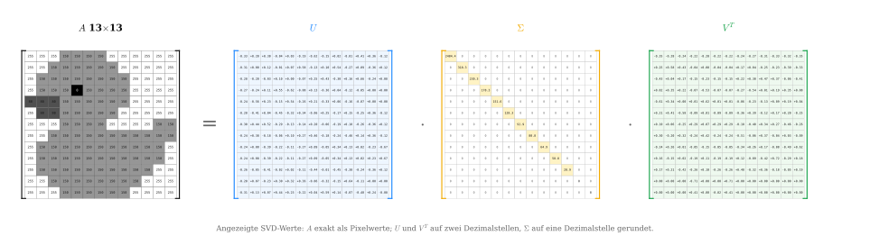

## Singulärwertzerlegung {.title-slide}

::: {.subtitle}
::: {.title-expansion}
Singular Value Decomposition (SVD)
:::

Erklärt anhand von Bildkomprimierung
:::

## Rotation und Skalierung

::: {.basics-slide}

::: {.basics-visual}
{.generated-symbols fig-alt="Rotieren und Skalieren als geometrische Grundoperationen"}
:::

::: {.basics-text}
Eine **Rotation** ist eine Drehung um einen Winkel.

Eine **Skalierung** streckt oder staucht entlang einer Achse.

Diese beiden Operationen sind die geometrischen Bausteine, mit denen wir gleich eine lineare Abbildung in einfache Schritte zerlegen.

::: {.quiet-note}
Die Matrixschreibweise kommt später; hier geht es zuerst nur um die sichtbare Wirkung.
:::
:::

:::

## Von einer Form zur anderen

::: {.lead-text}
Bevor wir Bilder komprimieren, betrachten wir ein Rätsel: Wie kommt man nur durch Rotationen und Skalierungen entlang der Achsen von der linken Grafik zur rechten?
:::

::: {.generated-visual-wrap}
{.generated-puzzle fig-alt="Ausgangskreis wird mathematisch zu einem gestauchten und rotierten Oval transformiert"}
:::

## Rotation, Skalierung, Rotation

::: {.step-action-slide}
{.step-actions fig-alt="Vier Zustände mit drei Aktionen: Rotation, Skalierung, Rotation"}

::: {.step-action-matrices}
::: {.step-action-matrix}
$$
R_{-90^\circ} =
\begin{pmatrix}
0 & 1 \\
-1 & 0
\end{pmatrix}
$$
:::

::: {.step-action-matrix}
$$
\Sigma =
\begin{pmatrix}
0.45 & 0 \\
0 & 1
\end{pmatrix}
$$
:::

::: {.step-action-matrix}
$$
R_{-45^\circ} =
\begin{pmatrix}
\tfrac{\sqrt2}{2} & \tfrac{\sqrt2}{2} \\
-\tfrac{\sqrt2}{2} & \tfrac{\sqrt2}{2}
\end{pmatrix}
$$
:::
:::

::: {.transition-question}
Doch was hat das mit SVD zu tun?
:::
:::

## Die Idee der SVD

::: {.svd-bridge-slide}

::: {.svd-bridge-visual}
{.svd-bridge fig-alt="Miniatur der Transformation und Zusammenhang mit A gleich U Sigma V transponiert"}
:::

::: {.svd-bridge-text}
Im Kern ist das das Prinzip der SVD:

$$
A = {\color{#1e88ff}{U}}\,{\color{#f2aa00}{\Sigma}}\,{\color{#55c63a}{V^T}}
$$

Eine lineare Abbildung wird in drei lesbare Bausteine zerlegt: erst eine Rotation oder Spiegelung, dann eine Skalierung, dann erneut eine Rotation oder Spiegelung.

Unser Ablauf von der vorherigen Folie ist dabei ein **didaktisches Beispiel im Stil der SVD**. Er zeigt das Grundprinzip, ist aber nicht die kanonische SVD, weil die Singulärwerte dort nach Größe sortiert werden und die stärkste Skalierung zuerst steht.

Für dieses Beispiel entsteht die Gesamtmatrix durch Multiplikation:

$$
A =
{\color{#1e88ff}{R_{-45^\circ}}}
{\color{#f2aa00}{\begin{pmatrix}0.45&0\\0&1\end{pmatrix}}}
{\color{#55c63a}{R_{-90^\circ}}}
\approx
\begin{pmatrix}
-0.707 & 0.318 \\
-0.707 & -0.318
\end{pmatrix}
$$
:::

:::

## Dimensionsreduktion

::: {.dimension-slide}

::: {.dimension-visual}
{.dimension-reduction fig-alt="Dimensionsreduktion: Kreis wird nach Rotation und Rang-1-Skalierung zu einer Linie"}
:::

::: {.dimension-example}
$$
\Sigma=\begin{pmatrix}0.45&0\\0&1\end{pmatrix}\binom{1}{1}=\binom{0.45}{1}
\qquad\Longrightarrow\qquad
\begin{pmatrix}{\color{#ff3b35}0}&0\\0&1\end{pmatrix}\binom{1}{1}=\binom{{\color{#ff3b35}0}}{1}
$$

Den ersten Eintrag auf ${\color{#ff3b35}0}$ setzen löscht die horizontale Richtung — alle Punkte landen auf der $y$-Achse. *(Die Werte stammen direkt aus dem Beispiel der Vorgängerfolie; in der kanonischen SVD wären sie absteigend sortiert.)*
:::

::: {.dimension-text}
In der SVD $A=U\Sigma V^T$ steckt die ganze Streckung in $\Sigma$: dort stehen die **Singulärwerte** $\sigma_1\ge\sigma_2\ge\dots\ge 0$.

Sie bestimmen, wie stark jede Richtung gewichtet wird. Einen Eintrag auf $0$ zu setzen entfernt die zugehörige Richtung vollständig — aus einer Fläche wird eine Linie.

Genau das ist Dimensionsreduktion: unwichtige Richtungen weglassen. Dieselbe Idee trägt später die Bildkompression.
:::

:::

## Rang-1-Matrix

::: {.rank1-slide}

::: {.rank1-top}
::: {.rank1-visual}
{.rank1-matrix fig-alt="Eine Rang-1-Matrix wird als Spaltenvektor mal Zeilenvektor dargestellt"}
:::

::: {.rank1-formula}
$$A = {\color{#19a7ff}{u}}\,{\color{#55c63a}{v^T}}$$
:::
:::

::: {.rank1-desc}
Die 4×4-Matrix links enthält 16 Zahlen. Sie lässt sich exakt als Produkt zweier Vektoren schreiben: ein **blauer Spaltenvektor** (4 Zahlen) multipliziert mit einem **grünen Zeilenvektor** (4 Zahlen) — zusammen nur 8 statt 16 Zahlen, mit identischem Ergebnis.
:::

::: {.rank1-text}
**Lineare Abhängigkeit** — Zeilen, die sich als Vielfache einer anderen schreiben lassen, liefern keine neue Information. Alle vier Zeilen dieser Matrix zeigen in dieselbe Richtung.

**Zeilenraum** — Der Raum aller Linearkombinationen der Zeilen heißt Zeilenraum. Obwohl die Matrix 4×4 groß ist, spannen die Zeilen nur eine einzige Linie auf — der Zeilenraum hat Dimension 1.

**Rang** — Die Dimension des Zeilenraums heißt Rang. Diese Matrix hat Rang 1, nicht Rang 4. Der Rang beschreibt nicht die Größe der Matrix, sondern wie viele Zeilen wirklich unabhängig sind.
:::

::: {.notes}
Die vier Zeilen lauten $(1,2,3,4)$, $-(1,2,3,4)$, $2(1,2,3,4)$ und $10(1,2,3,4)$ — alle skalieren denselben Zeilenvektor. Das ist das Paradebeispiel für lineare Abhängigkeit: keine der anderen drei Zeilen fügt eine neue Richtung hinzu. In späteren Folien kommt zu jedem Rang-1-Term noch ein Singulärwert $\sigma_i$ dazu.
:::

:::

## Höherer Rang: Summe aus Rang-1-Matrizen

::: {.rank-approx-slide}

::: {.rank-approx-visual}
{.rank-approx fig-alt="Eine Matrix mit höherem Rang wird durch mehrere Rang-1-Matrizen angenähert"}
:::

::: {.rank-approx-formula}
$$A_k = {\color{#f2aa00}{\sigma_1}} {\color{#19a7ff}{u_1}} {\color{#55c63a}{v_1^T}} + {\color{#f2aa00}{\sigma_2}} {\color{#19a7ff}{u_2}} {\color{#55c63a}{v_2^T}} + \dots + {\color{#f2aa00}{\sigma_k}} {\color{#19a7ff}{u_k}} {\color{#55c63a}{v_k^T}}$$
:::

::: {.rank-approx-text}
Bei einer Matrix mit Rang $4$ sind die Zeilen nicht mehr alle Vielfache voneinander. Die einfache Zerlegung aus der vorherigen Folie reicht dann nicht mehr aus.

Das Grundprinzip bleibt aber gleich: Wir beschreiben die Matrix als Summe mehrerer Rang-1-Matrizen.

Für $k=r$ ist das die vollständige Zerlegung. Für $k<r$ entsteht eine Näherung: Je mehr Bausteine wir addieren, desto genauer wird sie. Für Kompression speichern wir nur die wichtigsten Bausteine und lassen kleine Beiträge weg.
:::

:::

## SVD als Summe von Rang-1-Beiträgen

::: {.svd-sum-slide}

::: {.svd-sum-top}
Die Produktform

$$
A =
{\color{#1e88ff}{U}}
{\color{#f2aa00}{\Sigma}}
{\color{#55c63a}{V^T}}
$$

ist gleichbedeutend mit einer Summe aus einzelnen Rang-1-Matrizen:

$$
A =
{\color{#f2aa00}{\sigma_1}}
{\color{#1e88ff}{u_1}}
{\color{#55c63a}{v_1^T}}
+
{\color{#f2aa00}{\sigma_2}}
{\color{#1e88ff}{u_2}}
{\color{#55c63a}{v_2^T}}
+
\dots
+
{\color{#f2aa00}{\sigma_r}}
{\color{#1e88ff}{u_r}}
{\color{#55c63a}{v_r^T}}.
$$
:::

::: {.svd-sum-bottom}
::: {.sum-piece .blue-piece}
$u_i$  
Spalte aus $U$
:::

::: {.sum-times}
$\times$
:::

::: {.sum-piece .yellow-piece}
$\sigma_i$  
Gewichtung aus $\Sigma$
:::

::: {.sum-times}
$\times$
:::

::: {.sum-piece .green-piece}
$v_i^T$  
Zeile aus $V^T$
:::

::: {.sum-result}
$=$ ein Rang-1-Beitrag
:::
:::

:::

## SVD-Rang-1-Zerlegung {.rank-sum-reconstruction-slide}

::: {.reconstruction-lead}
Dieselbe Zerlegung in zwei Sichtweisen: oben als **Produkt** $A=U\Sigma V^T$, unten als **Summe** einzelner Rang-1-Beiträge $\sigma_i u_i v_i^T$.
:::

::: {.rank-sum-reconstruction-wrap}
{.rank-sum-reconstruction fig-alt="SVD als Produkt A gleich U Sigma V transponiert und als Summe von vier Rang-1-Beiträgen"}
:::

::: {.reconstruction-caption}
${\color{#1e88ff}{u_i}}$ — Spalten von $U$ · ${\color{#f2aa00}{\sigma_i}}$ — Singulärwerte in $\Sigma$ · ${\color{#55c63a}{v_i^T}}$ — Zeilen von $V^T$

Jeder Block ${\color{#f2aa00}{\sigma_i}}{\color{#1e88ff}{u_i}}{\color{#55c63a}{v_i^T}}$ unten ist eine **Rang-1-Matrix**; aufsummiert ergeben sie genau die Produktform oben.
:::

## Bild als Matrix

::: {.image-matrix-slide}
::: {.image-matrix-visual}
{.duck-to-matrix fig-alt="Pixelente wird in eine Matrix mit Werten von 0 bis 255 umgewandelt"}
:::

::: {.image-matrix-text}
Bis hierhin haben wir Matrizen als Summen von Rang-1-Beiträgen betrachtet. Jetzt wenden wir genau diese Idee auf ein Bild an.

Ein Graustufenbild ist nichts anderes als eine Matrix $A$: Jeder Eintrag ist ein Pixelwert zwischen $0$ und $255$.

$$
A = U\Sigma V^T,
$$

zerlegt diese Pixelmatrix in geordnete Bildbausteine.

Die größten Singulärwerte beschreiben die wichtigsten Strukturen der Ente. Für die Kompression speichern wir nur diese stärksten Beiträge und lassen kleinere Details weg.
:::

:::

## Vollständige SVD der Entenmatrix {.duck-full-svd-slide}

::: {.duck-full-svd-formula}
$$
A = U\Sigma V^T
$$
:::

::: {.duck-full-svd-visual}
{.duck-full-svd-equation fig-alt="Vollständige SVD der 13 mal 13 Entenmatrix mit A gleich U Sigma V transponiert und allen angezeigten Matrixwerten"}
:::

::: {.duck-full-svd-note}
Links steht $A$ als vollständige $13\times13$-Pixelmatrix der Ente. $U$ und $V^T$ sind orthogonale Matrizen: ihre Spalten bzw. Zeilen sind normierte, unabhängige Bildmuster. $\Sigma$ ist diagonal; die Singulärwerte stehen absteigend auf der Diagonalen und zeigen, welche Muster das Bild am stärksten prägen.
:::

## Rang-1-Beiträge der Ente

::: {.duck-rank-v4-slide}

::: {.duck-rank-v4-visual}
{.duck-rank-v4-img fig-alt="Links die drei einzelnen Rang-1-Beiträge der Ente mit farbigen Beschriftungen; rechts die kumulierten Bilder A1, A2, A3 mit zugehöriger Formel"}
:::

::: {.duck-rank-v4-caption}
Jeder Rang-1-Term $\sigma_i u_i v_i^T$ ergibt ein eigenes Muster (oben). Unten: der Singulärwert $\sigma_i$ (gelb) gewichtet das äußere Produkt $u_i v_i^T$ — ein Spaltenvektor mal einem Zeilenvektor. Die Summe $A_3 = \sigma_1 u_1 v_1^T + \sigma_2 u_2 v_2^T + \sigma_3 u_3 v_3^T$ ist akkurat berechnet und individuell auf $[0,255]$ skaliert.
:::

:::

## Rang-k-Näherung der Ente

::: {.rank-slide}

::: {.rank-explanation}
Bei einem Bild ist $A$ die Matrix der Pixelwerte.

$$
A_k = \sum_{i=1}^{k} \sigma_i u_i v_i^T.
$$

Mit jedem Rang kommt ein weiteres Muster dazu. Kleine Ränge speichern wenig, verlieren aber Details; größere Ränge nähern sich der Originalmatrix an.
:::

```{=html}
<div class="svd-rank-demo">
  <div class="rank-control">
    <label>Rang k = <strong data-role="rank-label">1</strong></label>
    <input data-role="rank-slider" type="range" min="1" max="11" value="1" step="1">
    <span data-role="storage-label"></span>
  </div>
  <div class="rank-grids">
    <div>
      <div class="grid-title">Original</div>
      <div data-role="original-grid"></div>
    </div>
    <div>
      <div class="grid-title">Rekonstruktion</div>
      <div data-role="reconstructed-grid"></div>
    </div>
  </div>
</div>
```

:::

## Rang-k-Näherung von Albert Einstein

::: {.rank-slide}

::: {.rank-explanation}
Bei einem hochaufgelösten Bild wird die Pixelmatrix deutlich größer. Ein Originalbild mit $m$ Zeilen und $n$ Spalten speichert ungefähr $m\cdot n$ Helligkeitswerte.

$$
\text{Original: } m\cdot n \\
\text{Rang-}k\text{: } k(m+n+1)
$$

Bei hoher Auflösung lohnt sich diese Speicherung stärker: Für kleine $k$ behalten wir nur wenige wichtige Bildmuster, sparen aber sehr viele Pixelwerte ein.

Je höher wir $k$ wählen, desto mehr Details, Kanten und feine Kontraste kommen zurück. Gleichzeitig steigt aber auch die Datenmenge wieder.
:::

```{=html}
<div class="svd-rank-demo image-rank-demo" data-svd-source="einstein" data-render="canvas">
  <div class="rank-control">
    <label>Rang k = <strong data-role="rank-label">1</strong></label>
    <input data-role="rank-slider" type="range" min="1" max="600" value="1" step="1">
    <span data-role="storage-label"></span>
  </div>
  <div class="rank-grids">
    <div>
      <div class="grid-title">Original</div>
      <div data-role="original-grid"></div>
    </div>
    <div>
      <div class="grid-title">Rekonstruktion</div>
      <div data-role="reconstructed-grid"></div>
    </div>
  </div>
</div>
```

:::


## Was war beim Einstein-Bild überraschend?

::: {.derivation-slide .two-column-derivation .einstein-surprise-layout}

::: {.derivation-left}
Beim Einstein-Bild haben wir gesehen:

- Schon wenige Terme liefern eine erkennbare Rekonstruktion.
- Viele Bildinformationen können weggelassen werden.
- Trotzdem bleibt die grobe Struktur des Bildes erhalten.

$$
A_k=\sum_{i=1}^{k}{\color{#f2aa00}{\sigma_i}}\,{\color{#1e88ff}{u_i}}\,{\color{#16a34a}{v_i^T}}
$$
:::

::: {.derivation-right}
Dabei behalten wir nur die ersten $k$ Bildbausteine.

Das funktioniert nur, wenn die Bausteine vorher nach Wichtigkeit geordnet wurden.

$\Rightarrow$ Die ersten Bausteine müssen die stärksten Bildanteile enthalten.

**Wie findet die SVD solche wichtigen Bausteine?**
:::

:::

## SVD (1/4): von $A$ zu den Singulärwerten {.svd-handcalc-slide}

::: {.handcalc-steps .steps-2x2}

::: {.handcalc-step}
::: {.step-label}
**I** Transponieren
:::
::: {.step-eq}
$$A=\begin{pmatrix}1&1\\1&0\\0&1\end{pmatrix}\qquad A^{T}=\begin{pmatrix}1&1&0\\1&0&1\end{pmatrix}$$
:::
:::

::: {.handcalc-step}
::: {.step-label}
**II** $A^{T}A$ bilden
:::
::: {.step-eq}
$$A^{T}A=\begin{pmatrix}1&1&0\\1&0&1\end{pmatrix}\begin{pmatrix}1&1\\1&0\\0&1\end{pmatrix}=\begin{pmatrix}2&1\\1&2\end{pmatrix}$$
:::
:::

::: {.handcalc-step}
::: {.step-label}
**III** Eigenwerte von $A^{T}A$
:::
::: {.step-eq}
$$A^{T}A-\lambda I=\begin{pmatrix}2-\lambda&1\\1&2-\lambda\end{pmatrix}$$
$$\det=(2-\lambda)^2-1=(\lambda-1)(\lambda-3)\ \Rightarrow\ \lambda_1=3,\ \lambda_2=1$$
:::
:::

::: {.handcalc-step}
::: {.step-label}
**IV** Singulärwerte $\to$ ${\color{#f2aa00}{\Sigma}}$
:::
::: {.step-eq}
$$\begin{aligned}\sigma_i&=\sqrt{\lambda_i}\\ \sigma_1&=\sqrt{\lambda_1}=\sqrt3\\ \sigma_2&=\sqrt{\lambda_2}=1\end{aligned}\qquad {\color{#f2aa00}{\Sigma}}=\begin{pmatrix}\sqrt3&0\\0&1\\0&0\end{pmatrix}$$
:::
::: {.step-hint}
absteigend sortiert: $\sigma_1\ge\sigma_2\ge0$ (hier $\sqrt3>1$)
:::
:::

:::

## SVD (2/4): Eigenvektoren $\to$ ${\color{#16a34a}{V}}$ {.svd-handcalc-slide}

::: {.step-label .calc-mainstep}
**V** Eigenvektoren lösen: $(A^{T}A-\lambda_i I)\,v_i=0$, danach auf $\|v_i\|=1$ normieren.
:::

::: {.calc-2col}

::: {.calc-case}
::: {.case-head}
Zu $\lambda_1={\color{#7048e8}{3}}$
:::
$$A^{T}A-{\color{#7048e8}{3}}I=\begin{pmatrix}2&1\\1&2\end{pmatrix}-\begin{pmatrix}{\color{#7048e8}{3}}&0\\0&{\color{#7048e8}{3}}\end{pmatrix}=\begin{pmatrix}-1&1\\1&-1\end{pmatrix}$$
$$\begin{pmatrix}-1&1\\1&-1\end{pmatrix}\binom{x}{y}=0\ \Rightarrow\ -x+y=0\ \Rightarrow\ y=x$$
$$v=\binom{1}{1},\quad \|v\|=\sqrt{1^2+1^2}=\sqrt2$$
$$v_1=\frac{v}{\|v\|}=\tfrac{1}{\sqrt2}\binom{1}{1}$$
:::

::: {.calc-case}
::: {.case-head}
Zu $\lambda_2={\color{#7048e8}{1}}$
:::
$$A^{T}A-{\color{#7048e8}{1}}\cdot I=\begin{pmatrix}2&1\\1&2\end{pmatrix}-\begin{pmatrix}{\color{#7048e8}{1}}&0\\0&{\color{#7048e8}{1}}\end{pmatrix}=\begin{pmatrix}1&1\\1&1\end{pmatrix}$$
$$\begin{pmatrix}1&1\\1&1\end{pmatrix}\binom{x}{y}=0\ \Rightarrow\ x+y=0\ \Rightarrow\ y=-x$$
$$v=\binom{1}{-1},\quad \|v\|=\sqrt{1^2+(-1)^2}=\sqrt2$$
$$v_2=\frac{v}{\|v\|}=\tfrac{1}{\sqrt2}\binom{1}{-1}$$
:::

:::

::: {.handcalc-result}
$${\color{#16a34a}{V}}=(\,v_1\ \ v_2\,)=\begin{pmatrix}\tfrac{1}{\sqrt2}&\tfrac{1}{\sqrt2}\\\tfrac{1}{\sqrt2}&-\tfrac{1}{\sqrt2}\end{pmatrix}\qquad V^{T}V=I$$
:::

## SVD (3/4): linke Singulärvektoren $\to$ ${\color{#1e88ff}{U}}$ {.svd-handcalc-slide}

::: {.step-label .calc-mainstep}
**VI** Jede Spalte aus $u_i=\dfrac{Av_i}{\sigma_i}$; die fehlende Spalte $u_3$ ergänzt die orthonormale Basis.
:::

::: {.u-grid}

::: {.calc-case}
::: {.case-head}
${\color{#1e88ff}{u_1}}$ — zu $\sigma_1=\sqrt3$
:::
$$Av_1=\begin{pmatrix}1&1\\1&0\\0&1\end{pmatrix}\tfrac{1}{\sqrt2}\binom{1}{1}=\tfrac{1}{\sqrt2}\begin{pmatrix}2\\1\\1\end{pmatrix}$$
$$u_1=\frac{Av_1}{\sigma_1}=\tfrac{1}{\sqrt3}\cdot\tfrac{1}{\sqrt2}\begin{pmatrix}2\\1\\1\end{pmatrix}=\tfrac{1}{\sqrt6}\begin{pmatrix}2\\1\\1\end{pmatrix}$$
:::

::: {.calc-case}
::: {.case-head}
${\color{#1e88ff}{u_2}}$ — zu $\sigma_2=1$
:::
$$Av_2=\begin{pmatrix}1&1\\1&0\\0&1\end{pmatrix}\tfrac{1}{\sqrt2}\binom{1}{-1}=\tfrac{1}{\sqrt2}\begin{pmatrix}0\\1\\-1\end{pmatrix}$$
$$u_2=\frac{Av_2}{\sigma_2}=\frac{Av_2}{1}=\tfrac{1}{\sqrt2}\begin{pmatrix}0\\1\\-1\end{pmatrix}$$
:::

::: {.calc-case}
::: {.case-head}
${\color{#1e88ff}{u_3}}$ — Basis ergänzen
:::
$$u_1\times u_2=\begin{pmatrix}2\\1\\1\end{pmatrix}\times\begin{pmatrix}0\\1\\-1\end{pmatrix}=\begin{pmatrix}-2\\2\\2\end{pmatrix}$$
$$u_3=\frac{u_1\times u_2}{\sqrt{(-2)^2+2^2+2^2}}=\tfrac{1}{2\sqrt3}\begin{pmatrix}-2\\2\\2\end{pmatrix}=\tfrac{1}{\sqrt3}\begin{pmatrix}-1\\1\\1\end{pmatrix}$$
:::

::: {.calc-case .u-final}
::: {.case-head}
${\color{#1e88ff}{U}}$ — Spalten zusammensetzen
:::
$${\color{#1e88ff}{U}}=(\,u_1\ \ u_2\ \ u_3\,)=\begin{pmatrix}\tfrac{2}{\sqrt6}&0&-\tfrac{1}{\sqrt3}\\\tfrac{1}{\sqrt6}&\tfrac{1}{\sqrt2}&\tfrac{1}{\sqrt3}\\\tfrac{1}{\sqrt6}&-\tfrac{1}{\sqrt2}&\tfrac{1}{\sqrt3}\end{pmatrix}$$
:::

:::

## SVD (4/4): Ergebnis & Übersicht {.svd-handcalc-slide}

::: {.step-label .calc-mainstep}
**VII** Probe: Das Produkt ${\color{#1e88ff}{U}}\,{\color{#f2aa00}{\Sigma}}\,{\color{#16a34a}{V^{T}}}$ ergibt wieder die Ausgangsmatrix $A$.
:::

::: {.handcalc-result .result-wide}
$$A={\color{#1e88ff}{U}}\,{\color{#f2aa00}{\Sigma}}\,{\color{#16a34a}{V^{T}}}=\begin{pmatrix}\tfrac{2}{\sqrt6}&0&-\tfrac{1}{\sqrt3}\\\tfrac{1}{\sqrt6}&\tfrac{1}{\sqrt2}&\tfrac{1}{\sqrt3}\\\tfrac{1}{\sqrt6}&-\tfrac{1}{\sqrt2}&\tfrac{1}{\sqrt3}\end{pmatrix}\begin{pmatrix}\sqrt3&0\\0&1\\0&0\end{pmatrix}\begin{pmatrix}\tfrac{1}{\sqrt2}&\tfrac{1}{\sqrt2}\\\tfrac{1}{\sqrt2}&-\tfrac{1}{\sqrt2}\end{pmatrix}=\begin{pmatrix}1&1\\1&0\\0&1\end{pmatrix}$$
:::

::: {.handcalc-overview}
::: {.ov-card}
**$A$**

- beliebige reelle $m\times n$-Matrix (hier $3\times2$)
- darf rechteckig sein
:::
::: {.ov-card}
**$A^{T}A$**

- symmetrisch: $(A^{T}A)^{T}=A^{T}A$
- quadratisch $n\times n$
- positiv semidefinit ($\lambda_i\ge0$)
:::
::: {.ov-card .ov-u}
**${\color{#1e88ff}{U}}$**

- orthogonal $m\times m$ ($U^{T}U=I$)
- Spalten $u_i$ = linke Singulärvektoren
:::
::: {.ov-card .ov-sigma}
**${\color{#f2aa00}{\Sigma}}$**

- rechteckige $m\times n$-Diagonalmatrix
- $\sigma_1\ge\sigma_2\ge\dots\ge0$
:::
::: {.ov-card .ov-v}
**${\color{#16a34a}{V}}$**

- orthogonal $n\times n$ ($V^{T}V=I$)
- Spalten $v_i$ = Eigenvektoren von $A^{T}A$
:::
::: {.ov-card .ov-v}
**${\color{#16a34a}{V^{T}}}$**

- transponiert und zugleich invers
- $V^{T}=V^{-1}$; orthogonal
:::
:::

## Mathematische Herleitung der SVD: Gliederung {.formal-overview-slide}

::: {.formal-overview}
::: {.formal-overview-subtitle}
Wir klären Schritt für Schritt, warum eine reelle Matrix in der Form

$$
A=U\Sigma V^T
$$

geschrieben werden kann.
:::

::: {.formal-overview-list}
::: {.formal-overview-col}
1. Ausgangspunkt: die Matrix $A^TA$
2. Spektralsatz auf $A^TA$
3. Definition der Singulärwerte
4. Herleitung der linken Singulärvektoren
5. Warum ist $u_i$ normiert?
:::

::: {.formal-overview-col}
6. Warum sind die $u_i$ orthogonal?
7. Zusammensetzen der Gleichungen
8. Was passiert bei $\sigma_i=0$?
9. Kompakte Gesamtidee
10. Geometrische Bedeutung
:::
:::
:::

## Ziel der Herleitung {.formal-derivation-slide}

::: {.formal-start-layout}
::: {.formal-start-left}
Gegeben sei eine Matrix

$$
A\in\mathbb{R}^{m\times n}.
$$

Gesucht ist eine Zerlegung der Form

$$
\boxed{A=U\Sigma V^T}.
$$
:::

::: {.formal-panel .formal-start-right}
Dabei sollen gelten:

- $U$ und $V$ sind orthogonale Matrizen.
- $\Sigma$ ist eine Diagonalmatrix mit nichtnegativen Einträgen.

Diese Diagonaleinträge heißen später Singulärwerte.
:::
:::

## 1. Ausgangspunkt: Die Matrix $A^TA$ {.formal-derivation-slide}

::: {.formal-derivation-grid}
::: {.formal-panel}
Wir betrachten zunächst

$$
A^TA\in\mathbb{R}^{n\times n}.
$$

Diese Matrix hat zwei wichtige Eigenschaften.

**Symmetrie**

$$
(A^TA)^T=A^T(A^T)^T=A^TA.
$$

Also ist $A^TA$ symmetrisch.
:::

::: {.formal-panel}
**Positive Semidefinitheit**

Für jeden Vektor $x\in\mathbb{R}^n$ gilt:

$$
x^TA^TAx=(Ax)^T(Ax)=\|Ax\|^2\geq 0.
$$

Daraus folgt, dass alle Eigenwerte von $A^TA$ nichtnegativ sind:

$$
\lambda_i\geq 0.
$$
:::
:::

## 2. Spektralsatz auf $A^TA$ {.formal-derivation-slide}

::: {.formal-derivation-grid}
::: {.formal-panel}
Da $A^TA$ symmetrisch ist, besitzt sie eine orthonormale Eigenbasis.

Es existieren also Eigenvektoren

$$
v_1,\dots,v_n
$$

mit

$$
A^TAv_i=\lambda_i v_i
$$

und

$$
v_i^Tv_j=
\begin{cases}
1,& i=j\\
0,& i\neq j.
\end{cases}
$$
:::

::: {.formal-panel}
Diese Eigenvektoren werden als Spalten in $V$ geschrieben:

$$
V=
\begin{pmatrix}
| & & |\\
v_1 & \cdots & v_n\\
| & & |
\end{pmatrix}.
$$

Da die Spalten orthonormal sind:

$$
V^TV=I,\qquad V^{-1}=V^T.
$$

Außerdem kann man $A^TA$ diagonalisieren:

$$
A^TA=V\Lambda V^T,
\qquad
\Lambda=\operatorname{diag}(\lambda_1,\dots,\lambda_n).
$$
:::
:::

## 3. Definition der Singulärwerte {.formal-derivation-slide}

::: {.formal-derivation-grid}
::: {.formal-panel}
Da alle Eigenwerte $\lambda_i\geq 0$ sind, dürfen wir ihre Quadratwurzeln bilden.

Wir definieren:

$$
\boxed{\sigma_i=\sqrt{\lambda_i}}.
$$

Diese Werte heißen Singulärwerte von $A$.

Üblicherweise werden sie absteigend sortiert:

$$
\sigma_1\geq\sigma_2\geq\dots\geq 0.
$$
:::

::: {.formal-panel}
Die Singulärwerte werden in die Matrix $\Sigma$ eingetragen.

Für eine Matrix $A\in\mathbb{R}^{m\times n}$ hat $\Sigma$ die Form

$$
\Sigma\in\mathbb{R}^{m\times n}.
$$

Zum Beispiel:

$$
\Sigma=
\begin{pmatrix}
\sigma_1 & 0 & \cdots\\
0 & \sigma_2 & \cdots\\
\vdots & \vdots & \ddots
\end{pmatrix}.
$$
:::
:::

## 4. Herleitung der linken Singulärvektoren {.formal-derivation-slide}

::: {.formal-derivation-grid}
::: {.formal-panel}
Aus der Eigenwertgleichung

$$
A^TAv_i=\lambda_i v_i
$$

und

$$
\lambda_i=\sigma_i^2
$$

folgt:

$$
A^TAv_i=\sigma_i^2v_i.
$$
:::

::: {.formal-panel}
Für $\sigma_i>0$ definieren wir

$$
\boxed{u_i=\frac{Av_i}{\sigma_i}}.
$$

Damit gilt sofort:

$$
Av_i=\sigma_i u_i.
$$

Das ist eine der zentralen Beziehungen der SVD.
:::
:::

## 5. Warum ist $u_i$ normiert? {.formal-derivation-slide}

::: {.formal-derivation-grid}
::: {.formal-panel}
Wir prüfen die Länge von $u_i$:

$$
\|u_i\|^2=u_i^Tu_i.
$$

Einsetzen von

$$
u_i=\frac{Av_i}{\sigma_i}
$$

ergibt:

$$
\|u_i\|^2
=
\left(\frac{Av_i}{\sigma_i}\right)^T
\left(\frac{Av_i}{\sigma_i}\right)
=
\frac{1}{\sigma_i^2}v_i^TA^TAv_i.
$$
:::

::: {.formal-panel}
Da

$$
A^TAv_i=\sigma_i^2v_i
$$

folgt:

$$
\|u_i\|^2
=
\frac{1}{\sigma_i^2}
v_i^T(\sigma_i^2v_i)
=
v_i^Tv_i.
$$

Da $v_i$ normiert ist:

$$
v_i^Tv_i=1,
\qquad
\boxed{\|u_i\|=1}.
$$
:::
:::

## 6. Warum sind die $u_i$ orthogonal? {.formal-derivation-slide}

::: {.formal-derivation-grid}
::: {.formal-panel}
Für $i\neq j$ gilt:

$$
\begin{aligned}
u_i^Tu_j
&=
\left(\frac{Av_i}{\sigma_i}\right)^T
\left(\frac{Av_j}{\sigma_j}\right)\\
&=
\frac{1}{\sigma_i\sigma_j}v_i^TA^TAv_j.
\end{aligned}
$$

Mit

$$
A^TAv_j=\sigma_j^2v_j
$$

folgt:

$$
u_i^Tu_j
=
\frac{\sigma_j^2}{\sigma_i\sigma_j}v_i^Tv_j.
$$
:::

::: {.formal-panel}
Da die $v_i$ orthogonal sind:

$$
v_i^Tv_j=0.
$$

Damit ergibt sich:

$$
\boxed{u_i^Tu_j=0}.
$$

Die Vektoren $u_i$ sind also orthonormal. Sie bilden die Spalten von $U$:

$$
U=
\begin{pmatrix}
| & & |\\
u_1 & \cdots & u_m\\
| & & |
\end{pmatrix},
\qquad
U^TU=I.
$$
:::
:::

## 7. Zusammensetzen der Gleichungen {.formal-derivation-slide}

::: {.formal-derivation-grid}
::: {.formal-panel}
Für jeden Singulärvektor gilt:

$$
Av_i=\sigma_i u_i.
$$

Schreibt man alle Gleichungen nebeneinander, erhält man:

$$
A
\begin{pmatrix}
| & & |\\
v_1 & \cdots & v_n\\
| & & |
\end{pmatrix}
=
\begin{pmatrix}
| & & |\\
u_1 & \cdots & u_m\\
| & & |
\end{pmatrix}
\Sigma.
$$

Also:

$$
AV=U\Sigma.
$$
:::

::: {.formal-panel}
Nun multiplizieren wir von rechts mit $V^T$:

$$
AVV^T=U\Sigma V^T.
$$

Da $V$ orthogonal ist:

$$
VV^T=I.
$$

Folglich:

$$
\boxed{A=U\Sigma V^T}.
$$

Damit ist die SVD hergeleitet.
:::
:::

## 8. Was passiert bei $\sigma_i=0$? {.formal-derivation-slide}

::: {.formal-derivation-grid}
::: {.formal-panel}
Falls

$$
\sigma_i=0,
$$

ist, gilt:

$$
\lambda_i=0
$$

und damit:

$$
A^TAv_i=0.
$$

Außerdem:

$$
\|Av_i\|^2=v_i^TA^TAv_i=0,
\qquad
Av_i=0.
$$
:::

::: {.formal-panel}
Der Vektor $v_i$ liegt dann im Kern von $A$.

Die Formel

$$
u_i=\frac{Av_i}{\sigma_i}
$$

kann hier nicht verwendet werden, weil man durch null teilen würde.

Die fehlenden Vektoren in $U$ werden stattdessen so ergänzt, dass alle Spalten von $U$ weiterhin eine orthonormale Basis bilden.
:::
:::

## 9. Kompakte Gesamtidee {.formal-derivation-slide}

::: {.formal-derivation-grid}
::: {.formal-panel}
Die Herleitung basiert auf:

$$
A^TA v_i=\lambda_i v_i.
$$

Dann setzt man:

$$
\sigma_i=\sqrt{\lambda_i}
$$

und

$$
u_i=\frac{Av_i}{\sigma_i}.
$$
:::

::: {.formal-panel}
Dadurch erhält man:

$$
Av_i=\sigma_i u_i.
$$

Für alle Vektoren gleichzeitig:

$$
AV=U\Sigma.
$$

Und schließlich:

$$
\boxed{A=U\Sigma V^T}.
$$
:::
:::

## 10. Geometrische Bedeutung {.formal-derivation-slide}

::: {.formal-derivation-grid}
::: {.formal-panel}
Für einen Vektor $x$ gilt:

$$
Ax=U\Sigma V^Tx.
$$

Die Transformation läuft in drei Schritten ab:

$$
x
\overset{V^T}{\longrightarrow}
V^Tx
\overset{\Sigma}{\longrightarrow}
\Sigma V^Tx
\overset{U}{\longrightarrow}
U\Sigma V^Tx.
$$
:::

::: {.formal-panel}
- $V^T$: Wechsel in die Basis der rechten Singulärvektoren
- $\Sigma$: Streckung oder Stauchung entlang orthogonaler Richtungen
- $U$: Wechsel in die Basis der linken Singulärvektoren

Damit beschreibt die SVD jede lineare Abbildung als

$$
\boxed{\text{Basiswechsel}\rightarrow\text{Skalierung}\rightarrow\text{Basiswechsel}}.
$$
:::
:::

## Was bleibt von der SVD hängen?

::: {.svd-final-slide}

{.svd-final-summary fig-alt="Zusammenfassung der SVD als Weg von der Bildmatrix über Bildbausteine zur komprimierten Rekonstruktion"}

::: {.svd-summary-cards}
::: {.svd-summary-card}
**Baustein**

$$
{\color{#f2aa00}{B_i}}={\color{#f2aa00}{\sigma_i}}{\color{#1e88ff}{u_i}}{\color{#16a34a}{v_i^T}}
$$

Singulärwert × Höhenverteilung × Spaltenmuster
:::
::: {.svd-summary-card}
**Matrixform**

$$
A={\color{#1e88ff}{U}}{\color{#f2aa00}{\Sigma}}{\color{#16a34a}{V^T}}
$$

$U$ und $V$ orthogonal, $\Sigma$ diagonal
:::
::: {.svd-summary-card}
**Kompression**

$$
A_k=\sum_{i=1}^{k}{\color{#f2aa00}{\sigma_i}}{\color{#1e88ff}{u_i}}{\color{#16a34a}{v_i^T}}
$$

nur die stärksten $k$ Terme speichern
:::
:::

::: {.svd-final-note}
Die SVD macht sichtbar, welche Bildstrukturen wichtig sind, und erlaubt dadurch eine kontrollierte Kompression.
:::

:::


## Quellen {.sources-slide}

::: {.sources-list}
- **[Bae16]** Bärwolff, G. *Numerik für Ingenieure, Physiker und Informatiker.* Springer, 2. Aufl., 2016 (Kap. 3).
- **[Bas20]** Bashier, E. *Practical Numerical and Scientific Computing with MATLAB and Python.* CRC Press, 2020 (Kap. 1).
- **[Kar15]** Karpfinger, C. *Höhere Mathematik in Rezepten.* Springer, 2. Aufl., 2015 (Kap. 42.3–42.4).
- **[Kel21]** Keller, A. *Aufgaben und Lösungen zur Mathematik für den Studienstart.* Springer, 2021 (Kap. 25.8–25.9).
- **[Kel24]** Keller, A. *Handout Eigenwerte, Spektralsatz, Singular Value Decomposition und Least-Squares.* THWS, 2024.
- **[MatYT]** MathemaTrick. YouTube-Kanal. <https://www.youtube.com/@MathemaTrick>
- **[PetYT]** MathePeter. YouTube-Kanal. <https://www.youtube.com/@MathePeter>
- **[Mol04]** Moler, C. B. *Numerical Computing with MATLAB.* SIAM, 2004 (Kap. 10.1–10.4 und 10.11).
- **[SerYT]** Serrano Academy. YouTube-Kanal. <https://www.youtube.com/@SerranoAcademy>
- **[TB22]** Trefethen, L. und Bau, D. *Numerical Linear Algebra.* SIAM, 2022.
- **[Str10]** Strang, G. *Wissenschaftliches Rechnen.* Springer, 2010 (Kap. 1).
:::

## Eigenständigkeitserklärung {.ai-declaration-slide}

::: {.ai-decl-intro}
Bei der Erstellung dieser Themenausarbeitung wurden KI-gestützte Werkzeuge gemäß der KI-Leitlinie Hochschullehre Bayern wie folgt eingesetzt:
:::

::: {.ai-decl-table}
| KI-Werkzeug | Einsatzzweck |
|---|---|
| Claude (Anthropic) | Strukturierung und sprachliche Überarbeitung der Folien |
| Claude (Anthropic) | Erzeugung der Python-Skripte für die generierten Visualisierungen |
| Claude (Anthropic) | Unterstützung bei der Python-Implementierung der SVD-Bildkompression |
| ChatGPT (OpenAI) | Entwurf der mathematischen SVD-Herleitung |
:::

::: {.ai-decl-statement}
Hiermit versichere ich, dass ich die vorliegende Arbeit eigenständig verfasst und keine anderen als die angegebenen Quellen und Hilfsmittel verwendet habe. Alle übernommenen Inhalte sowie mit Unterstützung von KI generierten Inhalte wurden entsprechend den anerkannten wissenschaftlichen Grundsätzen oder entsprechend der Regelungen zur Kennzeichnung von KI-Inhalten kenntlich gemacht. Ausgenommen von der Kenntlichmachung sind orthografische oder grammatikalische Korrekturen, Übersetzungen sowie nicht-sinnverändernde Verbesserungen von Formulierungen. Ich bin mir bewusst, dass mit KI generierte Texte keine Garantie für die Qualität von Inhalten und Text bieten. Daher erkläre ich, dass ich KI-Werkzeuge lediglich als Hilfsmittel genutzt habe, die von KI generierten Inhalte kritisch überprüft habe und mein eigenständiger sowie kreativer Einfluss in dieser Arbeit überwiegt. Ich versichere, dass ich Inhalte meiner Arbeit vollständig verstanden habe und selbstständig vertreten kann. Ich versichere, dass ich ausschließlich KI-Werkzeuge verwendet habe, deren Nutzung vom Prüfer oder der Prüferin als Hilfsmittel zugelassen wurden.
:::
