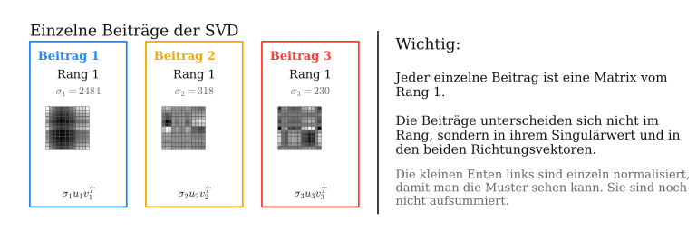
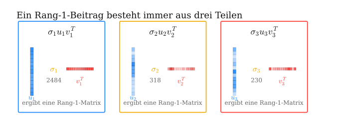

## Singulärwertzerlegung {.title-slide}

::: {.subtitle}
::: {.title-expansion}
Singular Value Decomposition (SVD)
:::

Erklärt anhand von Bildkomprimierung
:::

## Rotation und Skalierung

::: {.basics-slide}

::: {.basics-visual}
{.generated-symbols fig-alt="Rotieren und Skalieren als geometrische Grundoperationen"}
:::

::: {.basics-text}
Eine **Rotation** ist eine Drehung um einen Winkel.

Eine **Skalierung** streckt oder staucht entlang einer Achse.

Diese beiden Operationen sind die geometrischen Bausteine, mit denen wir gleich eine lineare Abbildung in einfache Schritte zerlegen.

::: {.quiet-note}
Die Matrixschreibweise kommt später; hier geht es zuerst nur um die sichtbare Wirkung.
:::
:::

:::

## Von einer Form zur anderen

::: {.lead-text}
Bevor wir Bilder komprimieren, betrachten wir ein Rätsel: Wie kommt man nur durch Rotationen und Skalierungen entlang der Achsen von der linken Grafik zur rechten?
:::

::: {.generated-visual-wrap}
{.generated-puzzle fig-alt="Ausgangskreis wird mathematisch zu einem gestauchten und rotierten Oval transformiert"}
:::

## Rotation, Skalierung, Rotation

::: {.step-action-slide}
{.step-actions fig-alt="Vier Zustände mit drei Aktionen: Rotation, Skalierung, Rotation"}

::: {.step-action-matrices}
$$
R_{-90^\circ} =
\begin{pmatrix}
0 & 1 \\
-1 & 0
\end{pmatrix}
\qquad
\Sigma =
\begin{pmatrix}
0.45 & 0 \\
0 & 1
\end{pmatrix}
\qquad
R_{-45^\circ} =
\begin{pmatrix}
\frac{\sqrt2}{2} & \frac{\sqrt2}{2} \\
-\frac{\sqrt2}{2} & \frac{\sqrt2}{2}
\end{pmatrix}
$$
:::

::: {.transition-question}
Doch was hat das mit SVD zu tun?
:::
:::

## Die Idee der SVD

::: {.svd-bridge-slide}

::: {.svd-bridge-visual}
{.svd-bridge fig-alt="Miniatur der Transformation und Zusammenhang mit A gleich U Sigma V transponiert"}
:::

::: {.svd-bridge-text}
Im Kern ist das das Prinzip der SVD:

$$
A = {\color{#1e88ff}{U}}\,{\color{#f2aa00}{\Sigma}}\,{\color{#ff3b35}{V^T}}
$$

Eine lineare Abbildung wird in drei lesbare Bausteine zerlegt: erst eine Rotation oder Spiegelung, dann eine Skalierung, dann erneut eine Rotation oder Spiegelung.

Unser Ablauf von der vorherigen Folie ist dabei ein **didaktisches Beispiel im Stil der SVD**. Er zeigt das Grundprinzip, ist aber nicht die kanonische SVD, weil die Singulärwerte dort nach Größe sortiert werden und die stärkste Skalierung zuerst steht.

Für dieses Beispiel entsteht die Gesamtmatrix durch Multiplikation:

$$
A =
{\color{#1e88ff}{R_{-45^\circ}}}
{\color{#f2aa00}{\begin{pmatrix}0.45&0\\0&1\end{pmatrix}}}
{\color{#ff3b35}{R_{-90^\circ}}}
\approx
\begin{pmatrix}
-0.707 & 0.318 \\
-0.707 & -0.318
\end{pmatrix}
$$
:::

:::

## Dimensionsreduktion

::: {.dimension-slide}

::: {.dimension-visual}
{.dimension-reduction fig-alt="Dimensionsreduktion: Kreis wird nach Rotation und Rang-1-Skalierung zu einer Linie"}
:::

::: {.dimension-text}
Warum ist die Zerlegung nützlich, wenn eine einzige Matrix $A$ die Abbildung auch direkt beschreibt?

Der entscheidende Punkt liegt in $\Sigma$: Wenn ein Skalierungswert auf $0$ gesetzt wird, bleibt eine Richtung erhalten und die andere verschwindet.

Aus einer Fläche wird eine Linie. Genau diese Idee steckt hinter Dimensionsreduktion und später hinter Bildkomprimierung.
:::

:::

## Rang-1-Matrix

::: {.rank1-slide}

::: {.rank1-visual}
{.rank1-matrix fig-alt="Eine Rang-1-Matrix wird als Spaltenvektor mal Zeilenvektor dargestellt"}
:::

::: {.rank1-text}
Diese Matrix wirkt zuerst wie 16 einzelne Zahlen. Tatsächlich steckt aber viel weniger unabhängige Information darin.

Alle Zeilen sind Vielfache der ersten Zeile:

$$
(1,2,3,4),\quad -(1,2,3,4),\quad 2(1,2,3,4),\quad 10(1,2,3,4).
$$

Die Matrix hat also vier Zeilen und vier Spalten, aber nur **eine unabhängige Richtung**. Deshalb ist ihr Rang gleich $1$.

Statt 16 Zahlen speichern wir nur zwei Vektoren mit insgesamt 8 Zahlen:

$$
A = u v^T.
$$
:::

:::

## Höherer Rang: Summe aus Rang-1-Matrizen

::: {.rank-approx-slide}

::: {.rank-approx-visual}
{.rank-approx fig-alt="Eine Matrix mit höherem Rang wird durch mehrere Rang-1-Matrizen angenähert"}
:::

::: {.rank-approx-text}
Bei einer Matrix mit Rang $4$ sind die Zeilen nicht mehr alle Vielfache voneinander. Die einfache Zerlegung aus der vorherigen Folie reicht dann nicht mehr aus.

Das Grundprinzip bleibt aber gleich: Wir beschreiben die Matrix als Summe mehrerer Rang-1-Matrizen.

$$
A_k = \sigma_1 u_1 v_1^T + \sigma_2 u_2 v_2^T + \dots + \sigma_k u_k v_k^T
$$

Für $k=r$ ist das die vollständige Zerlegung. Für $k<r$ entsteht eine Näherung: Je mehr Bausteine wir addieren, desto genauer wird sie. Für Kompression speichern wir nur die wichtigsten Bausteine und lassen kleine Beiträge weg.
:::

:::

## SVD als Summe von Rang-1-Beiträgen

::: {.svd-sum-slide}

::: {.svd-sum-top}
Die Produktform

$$
A =
{\color{#1e88ff}{U}}
{\color{#f2aa00}{\Sigma}}
{\color{#ff3b35}{V^T}}
$$

ist gleichbedeutend mit einer Summe aus einzelnen Rang-1-Matrizen:

$$
A =
{\color{#f2aa00}{\sigma_1}}
{\color{#1e88ff}{u_1}}
{\color{#ff3b35}{v_1^T}}
+
{\color{#f2aa00}{\sigma_2}}
{\color{#1e88ff}{u_2}}
{\color{#ff3b35}{v_2^T}}
+
\dots
+
{\color{#f2aa00}{\sigma_r}}
{\color{#1e88ff}{u_r}}
{\color{#ff3b35}{v_r^T}}.
$$
:::

::: {.svd-sum-bottom}
::: {.sum-piece .blue-piece}
$u_i$  
Spalte aus $U$
:::

::: {.sum-times}
$\times$
:::

::: {.sum-piece .yellow-piece}
$\sigma_i$  
Gewichtung aus $\Sigma$
:::

::: {.sum-times}
$\times$
:::

::: {.sum-piece .red-piece}
$v_i^T$  
Zeile aus $V^T$
:::

::: {.sum-result}
$=$ ein Rang-1-Beitrag
:::
:::

:::

## SVD-Rang-1-Zerlegung {.rank-sum-reconstruction-slide}

::: {.rank-sum-reconstruction-wrap}
{.rank-sum-reconstruction fig-alt="SVD als Produkt A gleich U Sigma V transponiert und als Summe von vier Rang-1-Beiträgen"}
:::

## Bild als Matrix

::: {.image-matrix-slide}
::: {.image-matrix-visual}
{.duck-to-matrix fig-alt="Pixelente wird in eine Matrix mit Werten von 0 bis 255 umgewandelt"}
:::

::: {.image-matrix-text}
Bis hierhin haben wir Matrizen als Summen von Rang-1-Beiträgen betrachtet. Jetzt wenden wir genau diese Idee auf ein Bild an.

Ein Graustufenbild ist nichts anderes als eine Matrix $A$: Jeder Eintrag ist ein Pixelwert zwischen $0$ und $255$.

$$
A = U\Sigma V^T,
$$

zerlegt diese Pixelmatrix in geordnete Bildbausteine.

Die größten Singulärwerte beschreiben die wichtigsten Strukturen der Ente. Für die Kompression speichern wir nur diese stärksten Beiträge und lassen kleinere Details weg.

Auf der nächsten Folie sieht man diese Beiträge einzeln.
:::

:::

## SVD der Ente: erster Beitrag {.duck-svd-first-slide}

::: {.duck-svd-first-wrap}
{.duck-svd-first fig-alt="Entenmatrix mit SVD-Matrizen U Sigma V transponiert und erstem Rang-1-Beitrag"}
:::

## Rang-1-Beiträge der Ente: Konzept A

::: {.duck-rank-terms-slide}

::: {.duck-rank-terms-visual}
{.duck-rank-terms fig-alt="Drei einzelne Rang-1-Beiträge der Ente mit erklärendem Textfeld"}
:::

:::

## Rang-1-Beiträge der Ente: Konzept B

::: {.duck-rank-terms-slide}

::: {.duck-rank-terms-visual}
{.duck-rank-terms fig-alt="Drei Rang-1-Beiträge als Produkt aus Spaltenvektor, Singulärwert und Zeilenvektor"}
:::

::: {.duck-rank-terms-text}
::: {.duck-rank-note}
Jeder Term

$$
\sigma_i u_i v_i^T
$$

ist eine Matrix vom Rang $1$.
:::

::: {.duck-rank-note}
Der Singulärwert $\sigma_i$ gewichtet den Beitrag. Die Vektoren $u_i$ und $v_i^T$ bestimmen das konkrete Muster.
:::

::: {.duck-rank-note}
$$
A_k = \sum_{i=1}^{k} \sigma_i u_i v_i^T
$$

Die Bildmatrix entsteht durch Addition dieser Rang-1-Beiträge.
:::
:::

:::

## Rang-1-Beiträge der Ente: Konzept C

::: {.duck-rank-terms-slide}

::: {.duck-rank-terms-visual}
{.duck-rank-terms fig-alt="Einzelne Rang-1-Beiträge der Ente werden zur Rang-3-Rekonstruktion aufsummiert"}
:::

::: {.duck-rank-terms-text}
::: {.duck-rank-note}
Links sind die ersten drei Beiträge einzeln dargestellt. Jeder einzelne Beitrag hat Rang $1$.
:::

::: {.duck-rank-note}
Erst durch Addition entsteht eine bessere Näherung:

$$
A_3 = \sigma_1u_1v_1^T+\sigma_2u_2v_2^T+\sigma_3u_3v_3^T.
$$
:::

::: {.duck-rank-note}
Diese Variante macht den Unterschied zwischen **einzelnem Beitrag** und **aufsummierter Rekonstruktion** sichtbar.
:::
:::

:::

## Rang-k-Näherung der Ente

::: {.rank-slide}

::: {.rank-explanation}
Bei einem Bild ist $A$ die Matrix der Pixelwerte.

$$
A_k = \sum_{i=1}^{k} \sigma_i u_i v_i^T.
$$

Mit jedem Rang kommt ein weiteres Muster dazu. Kleine Ränge speichern wenig, verlieren aber Details; größere Ränge nähern sich der Originalmatrix an.
:::

```{=html}
<div class="svd-rank-demo">
  <div class="rank-control">
    <label>Rang k = <strong data-role="rank-label">1</strong></label>
    <input data-role="rank-slider" type="range" min="1" max="13" value="1" step="1">
    <span data-role="storage-label"></span>
  </div>
  <div class="rank-grids">
    <div>
      <div class="grid-title">Original</div>
      <div data-role="original-grid"></div>
    </div>
    <div>
      <div class="grid-title">Rekonstruktion</div>
      <div data-role="reconstructed-grid"></div>
    </div>
  </div>
</div>
```

:::

## Rang-k-Näherung von Albert Einstein

::: {.rank-slide}

::: {.rank-explanation}
Bei einem hochaufgelösten Bild wird die Pixelmatrix deutlich größer. Ein Originalbild mit $m$ Zeilen und $n$ Spalten speichert ungefähr $m\cdot n$ Helligkeitswerte.

$$
\text{Original: } m\cdot n
\qquad
\text{Rang-}k\text{: } k(m+n+1)
$$

Bei hoher Auflösung lohnt sich diese Speicherung stärker: Für kleine $k$ behalten wir nur wenige wichtige Bildmuster, sparen aber sehr viele Pixelwerte ein.

Je höher wir $k$ wählen, desto mehr Details, Kanten und feine Kontraste kommen zurück. Gleichzeitig steigt aber auch die Datenmenge wieder.
:::

```{=html}
<div class="svd-rank-demo image-rank-demo" data-svd-source="einstein" data-render="canvas">
  <div class="rank-control">
    <label>Rang k = <strong data-role="rank-label">1</strong></label>
    <input data-role="rank-slider" type="range" min="1" max="600" value="1" step="1">
    <span data-role="storage-label"></span>
  </div>
  <div class="rank-grids">
    <div>
      <div class="grid-title">Original</div>
      <div data-role="original-grid"></div>
    </div>
    <div>
      <div class="grid-title">Rekonstruktion</div>
      <div data-role="reconstructed-grid"></div>
    </div>
  </div>
</div>
```

:::

## Von der Matrix zur SVD

::: {.svd-question-slide}

::: {.svd-question-left}
Bis hierhin haben wir die SVD benutzt. Jetzt klären wir, wie man aus einer gegebenen Matrix $A$ die drei Teile findet:

$$
A =
{\color{#1e88ff}{U}}
{\color{#f2aa00}{\Sigma}}
{\color{#ff3b35}{V^T}}.
$$

Die äquivalente Rang-Form ist:

$$
A_k =
\sum_{i=1}^{k}
{\color{#f2aa00}{\sigma_i}}\,
{\color{#1e88ff}{u_i}}\,
{\color{#ff3b35}{v_i^T}}.
$$
:::

::: {.svd-question-right}
::: {.mini-example}
Für ein Bild ist $A$ die Pixelmatrix:

$$
A =
\begin{pmatrix}
a_{11} & \dots & a_{1n}\\
\vdots & \ddots & \vdots\\
a_{m1} & \dots & a_{mn}
\end{pmatrix}.
$$

Die SVD sucht darin geordnete Muster: erst die wichtigsten, dann immer feinere Details.
:::

::: {.big-question}
Wie berechnet man
${\color{#1e88ff}{U}}$,
${\color{#f2aa00}{\Sigma}}$
und
${\color{#ff3b35}{V^T}}$
aus $A$?
:::
:::

:::

## Ziel: drei einfache Bausteine

::: {.derivation-slide .derivation-start}

::: {.derivation-main}
Für $A\in\mathbb{R}^{m\times n}$ suchen wir

$$
A =
{\color{#1e88ff}{U}}
{\color{#f2aa00}{\Sigma}}
{\color{#ff3b35}{V^T}},
$$

mit

$$
{\color{#1e88ff}{U^TU=I}},\qquad
{\color{#ff3b35}{V^TV=I}},\qquad
{\color{#f2aa00}{\Sigma}} =
\begin{pmatrix}
\sigma_1 & 0 & \dots\\
0 & \sigma_2 & \dots\\
\vdots & \vdots & \ddots
\end{pmatrix}.
$$
:::

::: {.derivation-cards}
::: {.derivation-card .blue-card}
$U$  
orthogonale Richtungen im Zielraum
:::

::: {.derivation-card .yellow-card}
$\Sigma$  
Stärken der Richtungen
:::

::: {.derivation-card .red-card}
$V^T$  
orthogonale Richtungen im Eingaberaum
:::
:::

::: {.derivation-note}
Orthogonale Matrizen sind wie Rotationen oder Spiegelungen: Sie verändern Längen nicht. Die eigentliche Streckung steckt vollständig in den Singulärwerten.
:::

:::

## Schritt 1: Warum $A^TA$?

::: {.derivation-slide .two-column-derivation}

::: {.derivation-left}
Wir suchen Eingaberichtungen $v_i$, die durch $A$ besonders stark oder schwach gestreckt werden.

Die Länge nach der Abbildung ist

$$
\|Av\|^2.
$$

Das lässt sich umformen:

$$
\|Av\|^2
= (Av)^T(Av)
= v^T A^T A v.
$$
:::

::: {.derivation-right}
Deshalb betrachten wir

$$
A^T A.
$$

Diese Matrix ist symmetrisch:

$$
(A^TA)^T=A^TA.
$$

Außerdem ist sie positiv semidefinit:

$$
v^TA^TAv=\|Av\|^2\ge 0.
$$
:::

:::

## Schritt 2: Eigenzerlegung

::: {.derivation-slide .two-column-derivation}

::: {.derivation-left}
Für symmetrische Matrizen gilt der **Spektralsatz**:

Sie besitzen orthogonale Eigenvektoren und lassen sich diagonalisieren.

$$
A^TA =
{\color{#ff3b35}{V}}
\Lambda
{\color{#ff3b35}{V^T}}.
$$

Die Spalten von $V$ sind Eigenvektoren:

$$
A^TA{\color{#ff3b35}{v_i}}
=
\lambda_i{\color{#ff3b35}{v_i}}.
$$
:::

::: {.derivation-right}
Diese Eigenvektoren sind die Eingaberichtungen der SVD.

Warum ist das nützlich?

$$
\|A v_i\|^2
= v_i^TA^TA v_i
= \lambda_i.
$$

Die Eigenwerte $\lambda_i$ sagen also, wie stark $A$ die Richtung $v_i$ streckt.
:::
:::

## Schritt 3: Singulärwerte

::: {.derivation-slide .two-column-derivation}

::: {.derivation-left}
Aus den Eigenwerten von $A^TA$ werden die Singulärwerte:

$$
{\color{#f2aa00}{\sigma_i}}=\sqrt{\lambda_i}.
$$

Da $A^TA$ positiv semidefinit ist, gilt

$$
\lambda_i\ge 0.
$$

Also sind die Singulärwerte reell und nichtnegativ.
:::

::: {.derivation-right}
Sortiert wird absteigend:

$$
\sigma_1\ge\sigma_2\ge\dots\ge\sigma_r>0.
$$

Dadurch stehen die wichtigsten Muster zuerst:

$$
\Sigma =
\begin{pmatrix}
\sigma_1 & 0 & \dots\\
0 & \sigma_2 & \dots\\
\vdots & \vdots & \ddots
\end{pmatrix}.
$$
:::

:::

## Schritt 4: Zielrichtungen $u_i$

::: {.derivation-slide .two-column-derivation}

::: {.derivation-left}
Wenn $v_i$ bekannt ist, zeigt $Av_i$ in den Zielraum.

Die Länge kennen wir schon:

$$
\|A v_i\| = \sigma_i.
$$

Also normieren wir:

$$
{\color{#1e88ff}{u_i}} =
\frac{1}{\sigma_i} A{\color{#ff3b35}{v_i}}.
$$
:::

::: {.derivation-right}
Damit gilt

$$
A{\color{#ff3b35}{v_i}}
=
{\color{#f2aa00}{\sigma_i}}
{\color{#1e88ff}{u_i}}.
$$

Alle Richtungen zusammen:

$$
A{\color{#ff3b35}{V}}
=
{\color{#1e88ff}{U}}
{\color{#f2aa00}{\Sigma}}.
$$

Da $V$ orthogonal ist, gilt $V^{-1}=V^T$. Also:

$$
A =
{\color{#1e88ff}{U}}
{\color{#f2aa00}{\Sigma}}
{\color{#ff3b35}{V^T}}.
$$
:::

:::

## Algorithmus für eine Matrix

::: {.derivation-slide .algorithm-slide}

::: {.algorithm-steps}
::: {.algorithm-step}
**1.** Berechne $A^TA$.
:::

::: {.algorithm-step}
**2.** Löse $A^TA v_i=\lambda_i v_i$.
:::

::: {.algorithm-step}
**3.** Setze $\sigma_i=\sqrt{\lambda_i}$ und sortiere absteigend.
:::

::: {.algorithm-step}
**4.** Baue $V=(v_1,\dots,v_n)$ und $\Sigma$.
:::

::: {.algorithm-step}
**5.** Berechne $u_i=\frac{1}{\sigma_i}Av_i$ für $\sigma_i>0$.
:::
:::

::: {.algorithm-summary}
Für Bilder macht man das numerisch. Die Idee bleibt:

$$
\text{Richtungen finden}
\rightarrow
\text{Stärken sortieren}
\rightarrow
\text{erste }k\text{ behalten}.
$$

So entsteht die Kompression:

$$
A_k=\sum_{i=1}^{k}\sigma_i u_i v_i^T.
$$
:::

:::

## Numerischer Bezug: QR

::: {.derivation-slide .two-column-derivation}

::: {.derivation-left}
Die Herleitung nutzt die Eigenzerlegung von $A^TA$:

$$
A^TA=V\Lambda V^T.
$$

In der Numerik berechnet man Eigenwerte oft iterativ. Ein wichtiger Baustein ist die **QR-Zerlegung**:

$$
B=QR,
$$

wobei $Q$ orthogonal und $R$ eine obere Dreiecksmatrix ist.
:::

::: {.derivation-right}
Wichtig:

QR ist **nicht** die SVD.

Aber QR ist verwandt über orthogonale Matrizen. QR-Verfahren können Eigenwerte stabil approximieren, und daraus kann man wiederum Singulärwerte gewinnen.

Für große Bilder verwendet man meist direkte oder iterative SVD-Algorithmen, statt $A^TA$ naiv per Hand auszurechnen.
:::

:::

## Warum Rang-$k$ optimal ist

::: {.derivation-slide .two-column-derivation}

::: {.derivation-left}
Die SVD liefert nicht irgendeine Kürzung, sondern die beste Rang-$k$-Approximation.

Der Satz dahinter heißt **Eckart-Young-Mirsky**:

$$
A_k =
\sum_{i=1}^{k}\sigma_i u_i v_i^T
$$

minimiert den Fehler unter allen Matrizen mit Rang höchstens $k$:

$$
\|A-B\|_F
\quad\text{für}\quad
\operatorname{rang}(B)\le k.
$$
:::

::: {.derivation-right}
Der Fehler hängt direkt an den weggelassenen Singulärwerten:

$$
\|A-A_k\|_F^2
=
\sigma_{k+1}^2+\sigma_{k+2}^2+\dots
$$

Deshalb funktioniert Bildkompression gut, wenn viele spätere Singulärwerte klein sind: Wir verlieren wenig sichtbare Information, sparen aber viele Daten.
:::

:::

## Mini-Beispiel: reine Skalierung

::: {.derivation-slide .example-slide}

::: {.example-left}
Nehmen wir

$$
A =
\begin{pmatrix}
3 & 0\\
0 & 1
\end{pmatrix}.
$$

Dann ist

$$
A^TA =
\begin{pmatrix}
9 & 0\\
0 & 1
\end{pmatrix}.
$$

Die Eigenwerte sind $\lambda_1=9$ und $\lambda_2=1$.
:::

::: {.example-right}
Also sind die Singulärwerte

$$
\sigma_1=3,\qquad \sigma_2=1.
$$

Die Eigenvektoren sind

$$
v_1=\begin{pmatrix}1\\0\end{pmatrix},
\qquad
v_2=\begin{pmatrix}0\\1\end{pmatrix}.
$$

Damit ist

$$
U=I,\qquad
\Sigma=
\begin{pmatrix}3&0\\0&1\end{pmatrix},
\qquad
V^T=I.
$$
:::

:::

## Mini-Beispiel mit Rotation

::: {.derivation-slide .example-slide}

::: {.example-left}
Wenn wir vor und nach der Skalierung drehen, wirkt die Matrix komplizierter:

$$
A =
{\color{#1e88ff}{R_{-45^\circ}}}
\begin{pmatrix}
3&0\\
0&1
\end{pmatrix}
{\color{#ff3b35}{R_{-90^\circ}}}.
$$

Die SVD erkennt trotzdem:

$$
\text{Rotation}
\rightarrow
\text{Skalierung}
\rightarrow
\text{Rotation}.
$$
:::

::: {.example-right}
Die Singulärwerte bleiben

$$
\sigma_1=3,\qquad \sigma_2=1.
$$

Was sich ändert, sind die Richtungen:

$$
V^T=R_{-90^\circ},
\qquad
U=R_{-45^\circ}.
$$

Das verbindet die geometrischen Folien am Anfang mit der Bildkompression am Ende.
:::

:::
