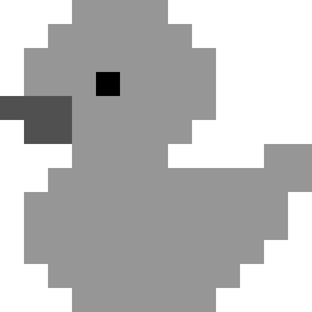
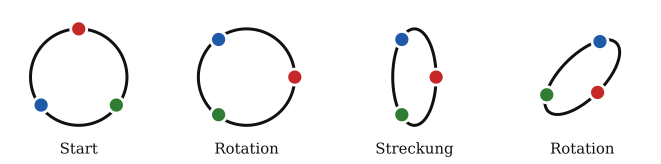

## Singulärwertzerlegung {.title-slide}

::: {.subtitle}
::: {.title-expansion}
Singular Value Decomposition (SVD)
:::

Erklärt anhand von Bildkomprimierung
:::

## Warum hilft SVD bei Bildkomprimierung?

::: {.compression-hook}

::: {.hook-visual}
::: {.transform-panel}
{.generated-symbols fig-alt="Rotation, horizontale Streckung und vertikale Stauchung"}
:::

::: {.duck-matrix}
::: {.matrix-frame}
{fig-alt="Pixelgrafik einer Ente"}
:::

::: {.caption}
Ein Bild als Matrix aus Pixelwerten
:::
:::
:::

::: {.hook-text}
Ein Graustufenbild ist im Kern eine Matrix: jeder Eintrag steht für einen Pixelwert.

Die SVD findet in dieser Matrix die wichtigsten Muster zuerst. Für eine komprimierte Näherung speichern wir nicht mehr jeden einzelnen Pixelwert, sondern nur die stärksten Muster und ihre Gewichte.

::: {.hook-equation}
$$A \approx U_k \Sigma_k V_k^T$$
:::

Je kleiner $k$ ist, desto weniger Daten müssen gespeichert werden. Das Bild verliert Details, bleibt aber oft erstaunlich gut erkennbar.
:::

:::

## Bild als Matrix

::: {.image-matrix-slide}
{.duck-to-matrix fig-alt="Pixelente wird in eine Matrix mit Werten von 0 bis 255 umgewandelt"}
:::

## Was bedeutet die SVD-Zerlegung?

::: {.svd-explain-slide}

::: {.svd-formula}
$$
A = {\color{#1e88ff}{U}}\,{\color{#f2aa00}{\Sigma}}\,{\color{#ff3b35}{V^T}}
$$
:::

::: {.svd-cards}
::: {.svd-card .u-card}
::: {.factor-name}
U
:::

Zweite Drehung oder Spiegelung

::: {.factor-detail}
Ausrichtung im Zielraum
:::
:::

::: {.svd-card .sigma-card}
::: {.factor-name}
Σ
:::

Streckung oder Stauchung

::: {.factor-detail}
Singulärwerte auf der Diagonalen
:::
:::

::: {.svd-card .v-card}
::: {.factor-name}
Vᵀ
:::

Erste Drehung oder Spiegelung

::: {.factor-detail}
Wahl der Eingangsrichtungen
:::
:::
:::

::: {.svd-footnote}
SVD steht für **Singular Value Decomposition**, auf Deutsch **Singularwertzerlegung**.
:::

:::

## Rang-k-Näherung der Ente

::: {.rank-slide}

::: {.rank-explanation}
Mit jedem Rang kommt ein weiteres Muster dazu:

$$
A_k = \sum_{i=1}^{k} \sigma_i u_i v_i^T.
$$

Der Slider berechnet die Rekonstruktion aus den SVD-Faktoren neu. Kleine Ränge speichern wenig, verlieren aber Details. Größere Ränge nähern sich der Originalmatrix an.
:::

```{=html}
<div class="svd-rank-demo">
  <div class="rank-control">
    <label>Rang k = <strong data-role="rank-label">1</strong></label>
    <input data-role="rank-slider" type="range" min="1" max="13" value="1" step="1">
    <span data-role="storage-label"></span>
  </div>
  <div class="rank-grids">
    <div>
      <div class="grid-title">Original</div>
      <div data-role="original-grid"></div>
    </div>
    <div>
      <div class="grid-title">Rekonstruktion</div>
      <div data-role="reconstructed-grid"></div>
    </div>
  </div>
</div>
```

:::

## Von einer Form zur anderen

::: {.lead-text}
Bevor wir Bilder komprimieren, betrachten wir eine einfachere Frage: Wie kann eine lineare Abbildung einen Kreis in ein gedrehtes Oval verwandeln?
:::

::: {.generated-visual-wrap}
{.generated-puzzle fig-alt="Ausgangskreis wird mathematisch zu einem gestauchten und rotierten Oval transformiert"}
:::

## Die Idee: Rotation, Streckung, Rotation

::: {.concept-slide}

::: {.concept-chain}
::: {.concept-step}
**1. Rotation**

Koordinatensystem passend ausrichten.

$$
R_{-90^\circ} =
\begin{pmatrix}
0 & 1 \\
-1 & 0
\end{pmatrix}
$$
:::

::: {.concept-arrow}
$\longrightarrow$
:::

::: {.concept-step}
**2. Streckung**

Eine Achse stauchen, die andere unverändert lassen.

$$
\Sigma =
\begin{pmatrix}
0.45 & 0 \\
0 & 1
\end{pmatrix}
$$
:::

::: {.concept-arrow}
$\longrightarrow$
:::

::: {.concept-step}
**3. Rotation**

Das Ergebnis in die Zielrichtung drehen.

$$
R_{-45^\circ} =
\begin{pmatrix}
\frac{\sqrt2}{2} & \frac{\sqrt2}{2} \\
-\frac{\sqrt2}{2} & \frac{\sqrt2}{2}
\end{pmatrix}
$$
:::
:::

::: {.concept-result}
$$
A = R_{-45^\circ}\,\Sigma\,R_{-90^\circ}
$$
:::

:::

## Was daran schon SVD ist und was noch fehlt

::: {.steps-explain-slide}

::: {.steps-left}
::: {.generated-visual-wrap .compact}
{.generated-steps fig-alt="Vier Transformationsschritte: Start, Rotation, Streckung, Rotation"}
:::

::: {.math-grid}
::: {.math-cell}
$$
R_{-90^\circ} =
\begin{pmatrix}
0 & 1 \\
-1 & 0
\end{pmatrix}
$$
:::

::: {.math-cell}
$$
\Sigma =
\begin{pmatrix}
0.45 & 0 \\
0 & 1
\end{pmatrix}
$$
:::

::: {.math-cell}
$$
R_{-45^\circ} =
\begin{pmatrix}
\frac{\sqrt2}{2} & \frac{\sqrt2}{2} \\
-\frac{\sqrt2}{2} & \frac{\sqrt2}{2}
\end{pmatrix}
$$
:::
:::
:::

::: {.steps-explanation}
Diese Zerlegung zeigt das Grundprinzip der SVD: Eine kompliziertere lineare Abbildung wird in einfache geometrische Bausteine zerlegt.

Die echte SVD schreibt allgemein

$$
A = U \Sigma V^T.
$$

Dabei sind $U$ und $V^T$ orthogonale Matrizen, also Rotationen oder Spiegelungen. $\Sigma$ enthält die Singulärwerte und beschreibt die Streckung entlang unabhängiger Achsen.

Unser Beispiel ist didaktisch vereinfacht: Es zeigt die geometrische Idee, aber noch nicht die vollständige SVD-Definition mit sortierten Singulärwerten, Vorzeichenwahl und allgemeiner Matrixgröße.
:::

:::
