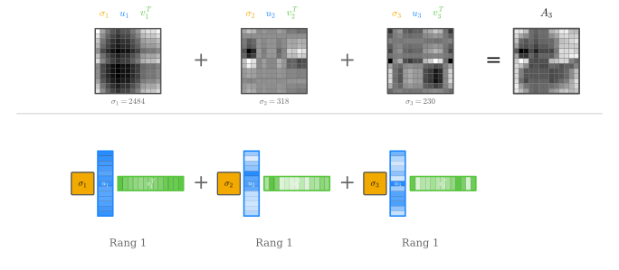

## Singulärwertzerlegung {.title-slide}

::: {.subtitle}
::: {.title-expansion}
Singular Value Decomposition (SVD)
:::

Erklärt anhand von Bildkomprimierung
:::

## Rotation und Skalierung

::: {.basics-slide}

::: {.basics-visual}
{.generated-symbols fig-alt="Rotieren und Skalieren als geometrische Grundoperationen"}
:::

::: {.basics-text}
Eine **Rotation** ist eine Drehung um einen Winkel.

Eine **Skalierung** streckt oder staucht entlang einer Achse.

Diese beiden Operationen sind die geometrischen Bausteine, mit denen wir gleich eine lineare Abbildung in einfache Schritte zerlegen.

::: {.quiet-note}
Die Matrixschreibweise kommt später; hier geht es zuerst nur um die sichtbare Wirkung.
:::
:::

:::

## Von einer Form zur anderen

::: {.lead-text}
Bevor wir Bilder komprimieren, betrachten wir ein Rätsel: Wie kommt man nur durch Rotationen und Skalierungen entlang der Achsen von der linken Grafik zur rechten?
:::

::: {.generated-visual-wrap}
{.generated-puzzle fig-alt="Ausgangskreis wird mathematisch zu einem gestauchten und rotierten Oval transformiert"}
:::

## Rotation, Skalierung, Rotation

::: {.step-action-slide}
{.step-actions fig-alt="Vier Zustände mit drei Aktionen: Rotation, Skalierung, Rotation"}

::: {.step-action-matrices}
::: {.step-action-matrix}
$$
R_{-90^\circ} =
\begin{pmatrix}
0 & 1 \\
-1 & 0
\end{pmatrix}
$$
:::

::: {.step-action-matrix}
$$
\Sigma =
\begin{pmatrix}
0.45 & 0 \\
0 & 1
\end{pmatrix}
$$
:::

::: {.step-action-matrix}
$$
R_{-45^\circ} =
\begin{pmatrix}
\tfrac{\sqrt2}{2} & \tfrac{\sqrt2}{2} \\
-\tfrac{\sqrt2}{2} & \tfrac{\sqrt2}{2}
\end{pmatrix}
$$
:::
:::

::: {.transition-question}
Doch was hat das mit SVD zu tun?
:::
:::

## Die Idee der SVD

::: {.svd-bridge-slide}

::: {.svd-bridge-visual}
{.svd-bridge fig-alt="Miniatur der Transformation und Zusammenhang mit A gleich U Sigma V transponiert"}
:::

::: {.svd-bridge-text}
Im Kern ist das das Prinzip der SVD:

$$
A = {\color{#1e88ff}{U}}\,{\color{#f2aa00}{\Sigma}}\,{\color{#55c63a}{V^T}}
$$

Eine lineare Abbildung wird in drei lesbare Bausteine zerlegt: erst eine Rotation oder Spiegelung, dann eine Skalierung, dann erneut eine Rotation oder Spiegelung.

Unser Ablauf von der vorherigen Folie ist dabei ein **didaktisches Beispiel im Stil der SVD**. Er zeigt das Grundprinzip, ist aber nicht die kanonische SVD, weil die Singulärwerte dort nach Größe sortiert werden und die stärkste Skalierung zuerst steht.

Für dieses Beispiel entsteht die Gesamtmatrix durch Multiplikation:

$$
A =
{\color{#1e88ff}{R_{-45^\circ}}}
{\color{#f2aa00}{\begin{pmatrix}0.45&0\\0&1\end{pmatrix}}}
{\color{#55c63a}{R_{-90^\circ}}}
\approx
\begin{pmatrix}
-0.707 & 0.318 \\
-0.707 & -0.318
\end{pmatrix}
$$
:::

:::

## Dimensionsreduktion

::: {.dimension-slide}

::: {.dimension-visual}
{.dimension-reduction fig-alt="Dimensionsreduktion: Kreis wird nach Rotation und Rang-1-Skalierung zu einer Linie"}
:::

::: {.dimension-example}
$$
\Sigma=\begin{pmatrix}0.45&0\\0&1\end{pmatrix}\binom{1}{1}=\binom{0.45}{1}
\qquad\Longrightarrow\qquad
\begin{pmatrix}{\color{#ff3b35}0}&0\\0&1\end{pmatrix}\binom{1}{1}=\binom{{\color{#ff3b35}0}}{1}
$$

Den ersten Eintrag auf ${\color{#ff3b35}0}$ setzen löscht die horizontale Richtung — alle Punkte landen auf der $y$-Achse. *(Die Werte stammen direkt aus dem Beispiel der Vorgängerfolie; in der kanonischen SVD wären sie absteigend sortiert.)*
:::

::: {.dimension-text}
In der SVD $A=U\Sigma{\color{#55c63a}{V^T}}$ steckt die ganze Streckung in $\Sigma$: dort stehen die **Singulärwerte** $\sigma_1\ge\sigma_2\ge\dots\ge 0$.

Sie bestimmen, wie stark jede Richtung gewichtet wird. Einen Eintrag auf $0$ zu setzen entfernt die zugehörige Richtung vollständig — aus einer Fläche wird eine Linie.

Genau das ist Dimensionsreduktion: unwichtige Richtungen weglassen. Dieselbe Idee trägt später die Bildkompression.
:::

:::

## Rang-1-Matrix

::: {.rank1-slide}

::: {.rank1-top}
::: {.rank1-visual}
{.rank1-matrix fig-alt="Eine Rang-1-Matrix wird als Spaltenvektor mal Zeilenvektor dargestellt"}
:::

::: {.rank1-formula}
$$A = {\color{#19a7ff}{u}}\,{\color{#55c63a}{v^T}}$$
:::
:::

::: {.rank1-desc}
Die 4×4-Matrix links enthält 16 Zahlen. Sie lässt sich exakt als Produkt zweier Vektoren schreiben: ein **blauer Spaltenvektor** (4 Zahlen) multipliziert mit einem **grünen Zeilenvektor** (4 Zahlen) — zusammen nur 8 statt 16 Zahlen, mit identischem Ergebnis.
:::

::: {.rank1-text}
**Lineare Abhängigkeit** — Zeilen, die sich als Vielfache einer anderen schreiben lassen, liefern keine neue Information. Alle vier Zeilen dieser Matrix zeigen in dieselbe Richtung.

**Zeilenraum** — Der Raum aller Linearkombinationen der Zeilen heißt Zeilenraum. Obwohl die Matrix 4×4 groß ist, spannen die Zeilen nur eine einzige Linie auf — der Zeilenraum hat Dimension 1.

**Rang** — Die Dimension des Zeilenraums heißt Rang. Diese Matrix hat Rang 1, nicht Rang 4. Der Rang beschreibt nicht die Größe der Matrix, sondern wie viele Zeilen wirklich unabhängig sind.
:::

::: {.notes}
Die vier Zeilen lauten $(1,2,3,4)$, $-(1,2,3,4)$, $2(1,2,3,4)$ und $10(1,2,3,4)$ — alle skalieren denselben Zeilenvektor. Das ist das Paradebeispiel für lineare Abhängigkeit: keine der anderen drei Zeilen fügt eine neue Richtung hinzu. In späteren Folien kommt zu jedem Rang-1-Term noch ein Singulärwert $\sigma_i$ dazu.
:::

:::

## Höherer Rang: Summe aus Rang-1-Matrizen

::: {.rank-approx-slide}

::: {.rank-approx-visual}
{.rank-approx fig-alt="Eine Matrix mit höherem Rang wird durch mehrere Rang-1-Matrizen angenähert"}
:::

::: {.rank-approx-formula}
$$A_k = {\color{#f2aa00}{\sigma_1}} {\color{#19a7ff}{u_1}} {\color{#55c63a}{v_1^T}} + {\color{#f2aa00}{\sigma_2}} {\color{#19a7ff}{u_2}} {\color{#55c63a}{v_2^T}} + \dots + {\color{#f2aa00}{\sigma_k}} {\color{#19a7ff}{u_k}} {\color{#55c63a}{v_k^T}}$$
:::

::: {.rank-approx-text}
Bei einer Matrix mit Rang $4$ sind die Zeilen nicht mehr alle Vielfache voneinander. Die einfache Zerlegung aus der vorherigen Folie reicht dann nicht mehr aus.

Das Grundprinzip bleibt aber gleich: Wir beschreiben die Matrix als Summe mehrerer Rang-1-Matrizen.

Für $k=r$ ist das die vollständige Zerlegung. Für $k<r$ entsteht eine Näherung: Je mehr Bausteine wir addieren, desto genauer wird sie. Für Kompression speichern wir nur die wichtigsten Bausteine und lassen kleine Beiträge weg.
:::

:::

## SVD als Summe von Rang-1-Beiträgen

::: {.svd-sum-slide}

::: {.svd-sum-top}
Die Produktform

$$
A =
{\color{#1e88ff}{U}}
{\color{#f2aa00}{\Sigma}}
{\color{#55c63a}{V^T}}
$$

ist gleichbedeutend mit einer Summe aus einzelnen Rang-1-Matrizen:

$$
A =
{\color{#f2aa00}{\sigma_1}}
{\color{#1e88ff}{u_1}}
{\color{#55c63a}{v_1^T}}
+
{\color{#f2aa00}{\sigma_2}}
{\color{#1e88ff}{u_2}}
{\color{#55c63a}{v_2^T}}
+
\dots
+
{\color{#f2aa00}{\sigma_r}}
{\color{#1e88ff}{u_r}}
{\color{#55c63a}{v_r^T}}.
$$
:::

::: {.svd-sum-bottom}
::: {.sum-piece .blue-piece}
$u_i$  
Spalte aus $U$
:::

::: {.sum-times}
$\times$
:::

::: {.sum-piece .yellow-piece}
$\sigma_i$  
Gewichtung aus $\Sigma$
:::

::: {.sum-times}
$\times$
:::

::: {.sum-piece .green-piece}
$v_i^T$  
Zeile aus $V^T$
:::

::: {.sum-result}
$=$ ein Rang-1-Beitrag
:::
:::

:::

## SVD-Rang-1-Zerlegung {.rank-sum-reconstruction-slide}

::: {.reconstruction-lead}
Dieselbe Zerlegung in zwei Sichtweisen: oben als **Produkt** $A=U\Sigma V^T$, unten als **Summe** einzelner Rang-1-Beiträge $\sigma_i u_i v_i^T$.
:::

::: {.rank-sum-reconstruction-wrap}
{.rank-sum-reconstruction fig-alt="SVD als Produkt A gleich U Sigma V transponiert und als Summe von vier Rang-1-Beiträgen"}
:::

::: {.reconstruction-caption}
${\color{#1e88ff}{u_i}}$ — Spalten von $U$ · ${\color{#f2aa00}{\sigma_i}}$ — Singulärwerte in $\Sigma$ · ${\color{#55c63a}{v_i^T}}$ — Zeilen von $V^T$

Jeder Block ${\color{#f2aa00}{\sigma_i}}{\color{#1e88ff}{u_i}}{\color{#55c63a}{v_i^T}}$ unten ist eine **Rang-1-Matrix**; aufsummiert ergeben sie genau die Produktform oben.
:::

## Bild als Matrix

::: {.image-matrix-slide}
::: {.image-matrix-visual}
{.duck-to-matrix fig-alt="Pixelente wird in eine Matrix mit Werten von 0 bis 255 umgewandelt"}
:::

::: {.image-matrix-text}
Bis hierhin haben wir Matrizen als Summen von Rang-1-Beiträgen betrachtet. Jetzt wenden wir genau diese Idee auf ein Bild an.

Ein Graustufenbild ist nichts anderes als eine Matrix $A$: Jeder Eintrag ist ein Pixelwert zwischen $0$ und $255$.

$$
A = U\Sigma V^T,
$$

zerlegt diese Pixelmatrix in geordnete Bildbausteine.

Die größten Singulärwerte beschreiben die wichtigsten Strukturen der Ente. Für die Kompression speichern wir nur diese stärksten Beiträge und lassen kleinere Details weg.
:::

:::

## SVD der Ente: erster Beitrag {.duck-svd-first-slide}

::: {.duck-svd-first-wrap}
{.duck-svd-first fig-alt="Entenmatrix mit SVD-Matrizen U Sigma V transponiert und erstem Rang-1-Beitrag"}
:::

## Rang-1-Beiträge der Ente

::: {.duck-rank-v4-slide}

::: {.duck-rank-v4-visual}
{.duck-rank-v4-img fig-alt="Links die drei einzelnen Rang-1-Beiträge der Ente mit farbigen Beschriftungen; rechts die kumulierten Bilder A1, A2, A3 mit zugehöriger Formel"}
:::

::: {.duck-rank-v4-caption}
Jeder Rang-1-Term $\sigma_i u_i v_i^T$ ergibt ein eigenes Muster (oben). Unten: der Singulärwert $\sigma_i$ (gelb) gewichtet das äußere Produkt $u_i v_i^T$ — ein Spaltenvektor mal einem Zeilenvektor. Die Summe $A_3 = \sigma_1 u_1 v_1^T + \sigma_2 u_2 v_2^T + \sigma_3 u_3 v_3^T$ ist akkurat berechnet und individuell auf $[0,255]$ skaliert.
:::

:::

## Rang-k-Näherung der Ente

::: {.rank-slide}

::: {.rank-explanation}
Bei einem Bild ist $A$ die Matrix der Pixelwerte.

$$
A_k = \sum_{i=1}^{k} \sigma_i u_i v_i^T.
$$

Mit jedem Rang kommt ein weiteres Muster dazu. Kleine Ränge speichern wenig, verlieren aber Details; größere Ränge nähern sich der Originalmatrix an.
:::

```{=html}
<div class="svd-rank-demo">
  <div class="rank-control">
    <label>Rang k = <strong data-role="rank-label">1</strong></label>
    <input data-role="rank-slider" type="range" min="1" max="11" value="1" step="1">
    <span data-role="storage-label"></span>
  </div>
  <div class="rank-grids">
    <div>
      <div class="grid-title">Original</div>
      <div data-role="original-grid"></div>
    </div>
    <div>
      <div class="grid-title">Rekonstruktion</div>
      <div data-role="reconstructed-grid"></div>
    </div>
  </div>
</div>
```

:::

## Rang-k-Näherung von Albert Einstein

::: {.rank-slide}

::: {.rank-explanation}
Bei einem hochaufgelösten Bild wird die Pixelmatrix deutlich größer. Ein Originalbild mit $m$ Zeilen und $n$ Spalten speichert ungefähr $m\cdot n$ Helligkeitswerte.

$$
\text{Original: } m\cdot n \\
\text{Rang-}k\text{: } k(m+n+1)
$$

Bei hoher Auflösung lohnt sich diese Speicherung stärker: Für kleine $k$ behalten wir nur wenige wichtige Bildmuster, sparen aber sehr viele Pixelwerte ein.

Je höher wir $k$ wählen, desto mehr Details, Kanten und feine Kontraste kommen zurück. Gleichzeitig steigt aber auch die Datenmenge wieder.
:::

```{=html}
<div class="svd-rank-demo image-rank-demo" data-svd-source="einstein" data-render="canvas">
  <div class="rank-control">
    <label>Rang k = <strong data-role="rank-label">1</strong></label>
    <input data-role="rank-slider" type="range" min="1" max="600" value="1" step="1">
    <span data-role="storage-label"></span>
  </div>
  <div class="rank-grids">
    <div>
      <div class="grid-title">Original</div>
      <div data-role="original-grid"></div>
    </div>
    <div>
      <div class="grid-title">Rekonstruktion</div>
      <div data-role="reconstructed-grid"></div>
    </div>
  </div>
</div>
```

:::

## Von der Matrix zur SVD

::: {.svd-question-slide}

::: {.svd-question-left}
Bis hierhin haben wir die SVD benutzt. Jetzt klären wir, wie man aus einer gegebenen Matrix $A$ die drei Teile findet:

$$
A =
{\color{#1e88ff}{U}}
{\color{#f2aa00}{\Sigma}}
{\color{#ff3b35}{V^T}}.
$$

Die äquivalente Rang-Form ist:

$$
A_k =
\sum_{i=1}^{k}
{\color{#f2aa00}{\sigma_i}}\,
{\color{#1e88ff}{u_i}}\,
{\color{#ff3b35}{v_i^T}}.
$$
:::

::: {.svd-question-right}
::: {.mini-example}
Für ein Bild ist $A$ die Pixelmatrix:

$$
A =
\begin{pmatrix}
a_{11} & \dots & a_{1n}\\
\vdots & \ddots & \vdots\\
a_{m1} & \dots & a_{mn}
\end{pmatrix}.
$$

Die SVD sucht darin geordnete Muster: erst die wichtigsten, dann immer feinere Details.
:::

::: {.big-question}
Wie berechnet man
${\color{#1e88ff}{U}}$,
${\color{#f2aa00}{\Sigma}}$
und
${\color{#ff3b35}{V^T}}$
aus $A$?
:::
:::

:::

## Ziel: drei einfache Bausteine

::: {.derivation-slide .derivation-start}

::: {.derivation-main}
Für $A\in\mathbb{R}^{m\times n}$ suchen wir

$$
A =
{\color{#1e88ff}{U}}
{\color{#f2aa00}{\Sigma}}
{\color{#ff3b35}{V^T}},
$$

mit

$$
{\color{#1e88ff}{U^TU=I}},\qquad
{\color{#ff3b35}{V^TV=I}},\qquad
{\color{#f2aa00}{\Sigma}} =
\begin{pmatrix}
\sigma_1 & 0 & \dots\\
0 & \sigma_2 & \dots\\
\vdots & \vdots & \ddots
\end{pmatrix}.
$$
:::

::: {.derivation-cards}
::: {.derivation-card .blue-card}
$U$  
orthogonale Richtungen im Zielraum
:::

::: {.derivation-card .yellow-card}
$\Sigma$  
Stärken der Richtungen
:::

::: {.derivation-card .red-card}
$V^T$  
orthogonale Richtungen im Eingaberaum
:::
:::

::: {.derivation-note}
Orthogonale Matrizen sind wie Rotationen oder Spiegelungen: Sie verändern Längen nicht. Die eigentliche Streckung steckt vollständig in den Singulärwerten.
:::

:::

## Satz: Existenz und Dimensionen

::: {.svd-theorem-slide}

::: {.svd-shape-row}
::: {.shape-unit}
::: {.shape-box .box-A}
[A]{}
:::
::: {.shape-label}
$m\times n$
:::
:::

::: {.shape-op}
$=$
:::

::: {.shape-unit}
::: {.shape-box .box-U}
[U]{}
:::
::: {.shape-label}
$m\times m$
:::
:::

::: {.shape-unit}
::: {.shape-box .box-S}
[Σ]{}
:::
::: {.shape-label}
$m\times n$
:::
:::

::: {.shape-unit}
::: {.shape-box .box-V}
[Vᵀ]{}
:::
::: {.shape-label}
$n\times n$
:::
:::
:::

::: {.svd-theorem-text}
::: {.theorem-left}
**Satz (Singulärwertzerlegung).** Jede Matrix $A\in\mathbb{R}^{m\times n}$ besitzt eine Zerlegung

$$
A = U\Sigma V^T
$$

mit **orthogonalen** $U,V$ und einer Diagonalmatrix $\Sigma$ mit

$$
\sigma_1\ge\sigma_2\ge\dots\ge 0.
$$

Die Singulärwerte $\sigma_i$ sind dabei eindeutig bestimmt.
:::

::: {.theorem-right}
Nur die ersten $r=\operatorname{rang}(A)$ Singulärwerte sind positiv. Die übrigen Beiträge sind null.

Die **reduzierte (Thin-)SVD** behält genau diese $r$ Richtungen:

$$
U_r\,(m\times r),\quad
\Sigma_r\,(r\times r),\quad
V_r^T\,(r\times n).
$$

Bildkompression heißt: nur die stärksten $k\le r$ behalten.
:::
:::

:::

## Werkzeuge: orthogonale Matrizen und Eigenwerte

::: {.derivation-slide .two-column-derivation}

::: {.derivation-left}
**Orthogonale Matrix.** $Q$ heißt orthogonal, wenn

$$
Q^TQ = I
\quad\Longleftrightarrow\quad
Q^{-1}=Q^T.
$$

Ihre Spalten sind orthonormal. Geometrisch sind das **Drehungen und Spiegelungen**: Längen und Winkel bleiben erhalten,

$$
\|Qx\| = \|x\|.
$$

Deshalb steckt in ${\color{#1e88ff}{U}}$ und ${\color{#ff3b35}{V}}$ keine Streckung, nur Richtung.
:::

::: {.derivation-right}
**Eigenwert und Eigenvektor.**

$$
A v = \lambda v,\qquad v\neq 0.
$$

$v$ wird durch $A$ nur gestreckt, nicht gedreht.

**Spektralsatz.** Eine symmetrische Matrix $S=S^T$ hat reelle Eigenwerte und eine **orthonormale** Eigenvektorbasis:

$$
S = Q\Lambda Q^T,\qquad Q\ \text{orthogonal}.
$$

Genau das wenden wir gleich auf $S=A^TA$ an.
:::

:::

## Schritt 1: Warum $A^TA$?

::: {.derivation-slide .two-column-derivation}

::: {.derivation-left}
Wir suchen Eingaberichtungen $v_i$, die durch $A$ besonders stark oder schwach gestreckt werden.

Die Länge nach der Abbildung ist

$$
\|Av\|^2.
$$

Das lässt sich umformen:

$$
\|Av\|^2
= (Av)^T(Av)
= v^T A^T A v.
$$
:::

::: {.derivation-right}
$A^TA$ ist kein Zufall: $A$ selbst ist beliebig — meist rechteckig, unsymmetrisch und nicht diagonalisierbar. Auf $A$ ist der Spektralsatz **nicht** anwendbar.

$A^TA$ ist dagegen immer symmetrisch:

$$
(A^TA)^T=A^TA.
$$

und positiv semidefinit:

$$
v^TA^TAv=\|Av\|^2\ge 0.
$$
:::

::: {.derivation-fullnote}
Symmetrisch **und** positiv semidefinit heißt: der **Spektralsatz** greift auf $A^TA$ — mit reellen, nichtnegativen Eigenwerten und einer orthonormalen Eigenvektorbasis. Dieser Umweg über $A^TA$ macht die SVD für **jede** reelle $m\times n$-Matrix möglich, auch wenn $A$ selbst keine Eigenzerlegung besitzt.
:::

:::

## Schritt 2: Eigenzerlegung

::: {.derivation-slide .two-column-derivation}

::: {.derivation-left}
Für symmetrische Matrizen gilt der **Spektralsatz**:

Sie besitzen orthogonale Eigenvektoren und lassen sich diagonalisieren.

$$
A^TA =
{\color{#ff3b35}{V}}
\Lambda
{\color{#ff3b35}{V^T}}.
$$

Die Spalten von $V$ sind Eigenvektoren:

$$
A^TA{\color{#ff3b35}{v_i}}
=
\lambda_i{\color{#ff3b35}{v_i}}.
$$
:::

::: {.derivation-right}
Diese Eigenvektoren sind die Eingaberichtungen der SVD.

Warum ist das nützlich?

$$
\|A v_i\|^2
= v_i^TA^TA v_i
= \lambda_i.
$$

Die Eigenwerte $\lambda_i$ sagen also, wie stark $A$ die Richtung $v_i$ streckt.
:::
:::

## Schritt 3: Singulärwerte

::: {.derivation-slide .two-column-derivation}

::: {.derivation-left}
Aus den Eigenwerten von $A^TA$ werden die Singulärwerte:

$$
{\color{#f2aa00}{\sigma_i}}=\sqrt{\lambda_i}.
$$

Da $A^TA$ positiv semidefinit ist, gilt

$$
\lambda_i\ge 0.
$$

Also sind die Singulärwerte reell und nichtnegativ.
:::

::: {.derivation-right}
Sortiert wird absteigend:

$$
\sigma_1\ge\sigma_2\ge\dots\ge\sigma_r>0.
$$

Dadurch stehen die wichtigsten Muster zuerst:

$$
\Sigma =
\begin{pmatrix}
\sigma_1 & 0 & \dots\\
0 & \sigma_2 & \dots\\
\vdots & \vdots & \ddots
\end{pmatrix}.
$$
:::

:::

## Schritt 4: Zielrichtungen $u_i$

::: {.derivation-slide .two-column-derivation}

::: {.derivation-left}
Wenn $v_i$ bekannt ist, zeigt $Av_i$ in den Zielraum.

Die Länge kennen wir schon:

$$
\|A v_i\| = \sigma_i.
$$

Also normieren wir:

$$
{\color{#1e88ff}{u_i}} =
\frac{1}{\sigma_i} A{\color{#ff3b35}{v_i}}.
$$
:::

::: {.derivation-right}
Damit gilt

$$
A{\color{#ff3b35}{v_i}}
=
{\color{#f2aa00}{\sigma_i}}
{\color{#1e88ff}{u_i}}.
$$

Alle Richtungen zusammen:

$$
A{\color{#ff3b35}{V}}
=
{\color{#1e88ff}{U}}
{\color{#f2aa00}{\Sigma}}.
$$

Da $V$ orthogonal ist, gilt $V^{-1}=V^T$. Also:

$$
A =
{\color{#1e88ff}{U}}
{\color{#f2aa00}{\Sigma}}
{\color{#ff3b35}{V^T}}.
$$
:::

:::

## Algorithmus für eine Matrix

::: {.derivation-slide .algorithm-slide}

::: {.algorithm-steps}
::: {.algorithm-step}
**1.** Berechne $A^TA$.
:::

::: {.algorithm-step}
**2.** Löse $A^TA v_i=\lambda_i v_i$.
:::

::: {.algorithm-step}
**3.** Setze $\sigma_i=\sqrt{\lambda_i}$ und sortiere absteigend.
:::

::: {.algorithm-step}
**4.** Baue $V=(v_1,\dots,v_n)$ und $\Sigma$.
:::

::: {.algorithm-step}
**5.** Berechne $u_i=\frac{1}{\sigma_i}Av_i$ für $\sigma_i>0$.
:::
:::

::: {.algorithm-summary}
Für Bilder macht man das numerisch. Die Idee bleibt:

$$
\text{Richtungen finden}
\rightarrow
\text{Stärken sortieren}
\rightarrow
\text{erste }k\text{ behalten}.
$$

So entsteht die Kompression:

$$
A_k=\sum_{i=1}^{k}\sigma_i u_i v_i^T.
$$
:::

:::

## Mini-Beispiel: SVD Schritt für Schritt

::: {.derivation-slide .two-column-derivation}

::: {.derivation-left}
Gegeben $A=\begin{pmatrix}2&2\\-1&2\end{pmatrix}$ — hier werden $U,V$ echte Rotationen.

**1.** $A^TA$ berechnen:

$$
A^TA=\begin{pmatrix}2&-1\\2&2\end{pmatrix}\!\begin{pmatrix}2&2\\-1&2\end{pmatrix}=\begin{pmatrix}5&2\\2&8\end{pmatrix}
$$

**2.** Eigenwerte aus $\det(A^TA-\lambda I)=0$:

$$
\lambda^2-13\lambda+36=0\ \Rightarrow\ \lambda_1=9,\ \lambda_2=4
$$

Eigenvektoren lösen, dann normieren:

$$
v_1=\tfrac{1}{\sqrt5}\binom{1}{2},\qquad
v_2=\tfrac{1}{\sqrt5}\binom{-2}{1}
$$

**3.** $\sigma_i=\sqrt{\lambda_i}$: $\ \sigma_1=3,\ \sigma_2=2$.
:::

::: {.derivation-right}
**4.** Spalten von $V$ einsetzen, $\Sigma$ diagonal:

$$
V^T=\tfrac{1}{\sqrt5}\begin{pmatrix}1&2\\-2&1\end{pmatrix},\quad
\Sigma=\begin{pmatrix}3&0\\0&2\end{pmatrix}
$$

**5.** $u_i=\tfrac{1}{\sigma_i}Av_i$, z. B.

$$
u_1=\tfrac{1}{3}\cdot\tfrac{1}{\sqrt5}\binom{6}{3}=\tfrac{1}{\sqrt5}\binom{2}{1},\quad
u_2=\tfrac{1}{\sqrt5}\binom{-1}{2}
$$

$$
U=\tfrac{1}{\sqrt5}\begin{pmatrix}2&-1\\1&2\end{pmatrix}
$$
:::

::: {.derivation-fullnote}
**Ergebnis** — die einzelnen Matrizen der SVD:

$$
A=
\underset{\textstyle U}{\vphantom{\big|}{\color{#1e88ff}{\tfrac{1}{\sqrt5}\begin{pmatrix}2&-1\\1&2\end{pmatrix}}}}\;
\underset{\textstyle \Sigma}{\vphantom{\big|}{\color{#f2aa00}{\begin{pmatrix}3&0\\0&2\end{pmatrix}}}}\;
\underset{\textstyle V^T}{\vphantom{\big|}{\color{#ff3b35}{\tfrac{1}{\sqrt5}\begin{pmatrix}1&2\\-2&1\end{pmatrix}}}}
$$
:::

:::

## Mini-Beispiel: geometrische Deutung

::: {.derivation-slide .example-slide}

::: {.example-left}
Die gerade berechneten Faktoren haben eine **geometrische Bedeutung**: $U$ und $V^T$ sind beide reine **Drehungen** ($\det=1$), $\Sigma$ ist eine **Streckung** entlang der Achsen.

$$
A=
\underset{\textstyle U}{\color{#1e88ff}{R_{+26{,}6^\circ}}}\;
\underset{\textstyle \Sigma}{\color{#f2aa00}{\begin{pmatrix}3&0\\0&2\end{pmatrix}}}\;
\underset{\textstyle V^T}{\color{#ff3b35}{R_{-63{,}4^\circ}}}
$$

Die SVD zerlegt also jede Matrix in immer dasselbe Muster:

$$
\text{Rotation}
\rightarrow
\text{Skalierung}
\rightarrow
\text{Rotation}.
$$
:::

::: {.example-right}
Mit jedem Vektor $x$ passiert nacheinander:

- **$V^T$** dreht ihn um $-63{,}4^\circ$ in das Achsensystem der Singulärrichtungen.
- **$\Sigma$** streckt entlang dieser Achsen um $\sigma_1=3$ und $\sigma_2=2$.
- **$U$** dreht das Ergebnis um $+26{,}6^\circ$ in die endgültige Lage.

Die Singulärwerte $\sigma_1=3,\ \sigma_2=2$ sind also die reinen Streckfaktoren; $U$ und $V$ liefern nur die Richtungen.

Das verbindet die geometrischen Folien am Anfang mit der Bildkompression am Ende.
:::

:::

## Numerischer Bezug: QR

::: {.derivation-slide .two-column-derivation}

::: {.derivation-left}
Die Herleitung nutzt die Eigenzerlegung von $A^TA$:

$$
A^TA=V\Lambda V^T.
$$

In der Numerik berechnet man Eigenwerte oft iterativ. Ein wichtiger Baustein ist die **QR-Zerlegung**:

$$
B=QR,
$$

wobei $Q$ orthogonal und $R$ eine obere Dreiecksmatrix ist.
:::

::: {.derivation-right}
Wichtig:

QR ist **nicht** die SVD.

Aber QR ist verwandt über orthogonale Matrizen. QR-Verfahren können Eigenwerte stabil approximieren, und daraus kann man wiederum Singulärwerte gewinnen.

Für große Bilder verwendet man meist direkte oder iterative SVD-Algorithmen, statt $A^TA$ naiv per Hand auszurechnen.
:::

:::

## Warum Rang-$k$ optimal ist

::: {.derivation-slide .two-column-derivation}

::: {.derivation-left}
Wir können $A$ als Summe von Rang-1-Bausteinen schreiben und nach $k$ Termen **abschneiden**:

$$
A_k=\sum_{i=1}^{k}\sigma_i\,u_i\,v_i^T .
$$

Aber ist dieses simple Abschneiden wirklich die *beste* Wahl? Der Satz von **Eckart-Young-Mirsky** sagt: ja. Unter **allen** Matrizen $B$ mit Rang höchstens $k$ macht $A_k$ den Fehler am kleinsten:

$$
\|A-A_k\|_F \;\le\; \|A-B\|_F
\quad\text{für alle}\quad
\operatorname{rang}(B)\le k.
$$

Das ist bemerkenswert: unter unendlich vielen Rang-$k$-Matrizen gewinnt ausgerechnet die abgeschnittene SVD.
:::

::: {.derivation-right}
Dabei misst die **Frobenius-Norm** $\|M\|_F=\sqrt{\sum_{i,j}m_{ij}^2}$ den Gesamtfehler — wie ein Abstand zwischen Matrizen.

Der Clou: der verbleibende Fehler ist **exakt** die „Energie" der weggelassenen Singulärwerte:

$$
\|A-A_k\|_F^2
=
\sigma_{k+1}^2+\sigma_{k+2}^2+\dots+\sigma_r^2 .
$$

Da $\sigma_1\ge\sigma_2\ge\dots\ge 0$ absteigend sortiert sind, stecken in den ersten $k$ Termen die größten Beiträge — der Rest ist nur Feinkorrektur.
:::

::: {.derivation-fullnote}
**Anschaulich (Ente / Einstein):** Die ersten Singulärwerte tragen die grobe Bildstruktur, die späteren nur feine Details. Sind die späteren $\sigma_i$ klein, sehen wir kaum einen Unterschied — speichern statt $m\cdot n$ Zahlen aber nur $k\,(m+n+1)$. Genau deshalb funktioniert SVD-Bildkompression.
:::

:::

## Quellen {.sources-slide}

::: {.sources-list}
- **[Bae16]** Bärwolff, G. *Numerik für Ingenieure, Physiker und Informatiker.* Springer, 2. Aufl., 2016 (Kap. 3).
- **[Bas20]** Bashier, E. *Practical Numerical and Scientific Computing with MATLAB and Python.* CRC Press, 2020 (Kap. 1).
- **[Kar15]** Karpfinger, C. *Höhere Mathematik in Rezepten.* Springer, 2. Aufl., 2015 (Kap. 42.3–42.4).
- **[Kel21]** Keller, A. *Aufgaben und Lösungen zur Mathematik für den Studienstart.* Springer, 2021 (Kap. 25.8–25.9).
- **[Kel24]** Keller, A. *Handout Eigenwerte, Spektralsatz, Singular Value Decomposition und Least-Squares.* THWS, 2024.
- **[Mol04]** Moler, C. B. *Numerical Computing with MATLAB.* SIAM, 2004 (Kap. 10.1–10.4 und 10.11).
- **[TB22]** Trefethen, L. und Bau, D. *Numerical Linear Algebra.* SIAM, 2022.
- **[Str10]** Strang, G. *Wissenschaftliches Rechnen.* Springer, 2010 (Kap. 1).
:::

## Eigenständigkeitserklärung {.ai-declaration-slide}

::: {.ai-decl-intro}
Bei der Erstellung dieser Themenausarbeitung wurden KI-gestützte Werkzeuge gemäß der KI-Leitlinie Hochschullehre Bayern wie folgt eingesetzt:
:::

::: {.ai-decl-table}
| KI-Werkzeug | Einsatzzweck |
|---|---|
| Claude (Anthropic) | Strukturierung und sprachliche Überarbeitung der Folien |
| Claude (Anthropic) | Erzeugung der Python-Skripte für die generierten Visualisierungen |
| Claude (Anthropic) | Unterstützung bei der Python-Implementierung der SVD-Bildkompression |
:::

::: {.ai-decl-statement}
Die durch die KI-Werkzeuge erzeugten Inhalte wurden von uns kritisch geprüft, überarbeitet und auf fachliche Richtigkeit kontrolliert. Die Verantwortung für sämtliche Inhalte dieser Arbeit liegt vollständig bei den Autorinnen und Autoren.
:::
