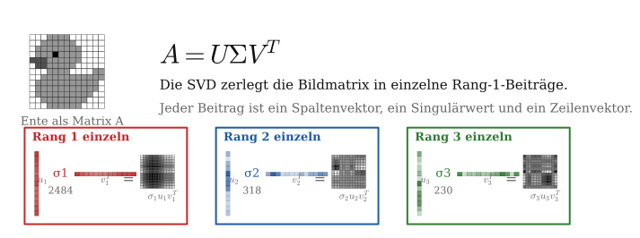

## Singulärwertzerlegung {.title-slide}

::: {.subtitle}
::: {.title-expansion}
Singular Value Decomposition (SVD)
:::

Erklärt anhand von Bildkomprimierung
:::

## Rotation und Skalierung

::: {.basics-slide}

::: {.basics-visual}
{.generated-symbols fig-alt="Rotieren und Skalieren als geometrische Grundoperationen"}
:::

::: {.basics-text}
Eine **Rotation** ist eine Drehung um einen Winkel.

Eine **Skalierung** streckt oder staucht entlang einer Achse.

Diese beiden Operationen sind die geometrischen Bausteine, mit denen wir gleich eine lineare Abbildung in einfache Schritte zerlegen.

::: {.quiet-note}
Die Matrixschreibweise kommt später; hier geht es zuerst nur um die sichtbare Wirkung.
:::
:::

:::

## Von einer Form zur anderen

::: {.lead-text}
Bevor wir Bilder komprimieren, betrachten wir ein Rätsel: Wie kommt man nur durch Rotationen und Skalierungen entlang der Achsen von der linken Grafik zur rechten?
:::

::: {.generated-visual-wrap}
{.generated-puzzle fig-alt="Ausgangskreis wird mathematisch zu einem gestauchten und rotierten Oval transformiert"}
:::

## Rotation, Skalierung, Rotation

::: {.step-action-slide}
{.step-actions fig-alt="Vier Zustände mit drei Aktionen: Rotation, Skalierung, Rotation"}

::: {.step-action-matrices}
$$
R_{-90^\circ} =
\begin{pmatrix}
0 & 1 \\
-1 & 0
\end{pmatrix}
\qquad
\Sigma =
\begin{pmatrix}
0.45 & 0 \\
0 & 1
\end{pmatrix}
\qquad
R_{-45^\circ} =
\begin{pmatrix}
\frac{\sqrt2}{2} & \frac{\sqrt2}{2} \\
-\frac{\sqrt2}{2} & \frac{\sqrt2}{2}
\end{pmatrix}
$$
:::

::: {.transition-question}
Doch was hat das mit SVD zu tun?
:::
:::

## Die Idee der SVD

::: {.svd-bridge-slide}

::: {.svd-bridge-visual}
{.svd-bridge fig-alt="Miniatur der Transformation und Zusammenhang mit A gleich U Sigma V transponiert"}
:::

::: {.svd-bridge-text}
Im Kern ist das das Prinzip der SVD:

$$
A = {\color{#1e88ff}{U}}\,{\color{#f2aa00}{\Sigma}}\,{\color{#ff3b35}{V^T}}
$$

Eine lineare Abbildung wird in drei lesbare Bausteine zerlegt: erst eine Rotation oder Spiegelung, dann eine Skalierung, dann erneut eine Rotation oder Spiegelung.

Für unser Beispiel entsteht die Gesamtmatrix durch Multiplikation:

$$
A =
{\color{#1e88ff}{R_{-45^\circ}}}
{\color{#f2aa00}{\begin{pmatrix}0.45&0\\0&1\end{pmatrix}}}
{\color{#ff3b35}{R_{-90^\circ}}}
\approx
\begin{pmatrix}
-0.707 & 0.318 \\
-0.707 & -0.318
\end{pmatrix}
$$
:::

:::

## Dimensionsreduktion

::: {.dimension-slide}

::: {.dimension-visual}
{.dimension-reduction fig-alt="Dimensionsreduktion: Kreis wird nach Rotation und Rang-1-Skalierung zu einer Linie"}
:::

::: {.dimension-text}
Warum ist die Zerlegung nützlich, wenn eine einzige Matrix $A$ die Abbildung auch direkt beschreibt?

Der entscheidende Punkt liegt in $\Sigma$: Wenn ein Skalierungswert auf $0$ gesetzt wird, bleibt eine Richtung erhalten und die andere verschwindet.

Aus einer Fläche wird eine Linie. Genau diese Idee steckt hinter Dimensionsreduktion und später hinter Bildkomprimierung.
:::

:::

## Rang-1-Matrix

::: {.rank1-slide}

::: {.rank1-visual}
{.rank1-matrix fig-alt="Eine Rang-1-Matrix wird als Spaltenvektor mal Zeilenvektor dargestellt"}
:::

::: {.rank1-text}
Diese Matrix wirkt zuerst wie 16 einzelne Zahlen. Tatsächlich steckt aber viel weniger unabhängige Information darin.

Alle Zeilen sind Vielfache der ersten Zeile:

$$
(1,2,3,4),\quad -(1,2,3,4),\quad 2(1,2,3,4),\quad 10(1,2,3,4).
$$

Die Matrix hat also vier Zeilen und vier Spalten, aber nur **eine unabhängige Richtung**. Deshalb ist ihr Rang gleich $1$.

Statt 16 Zahlen speichern wir nur zwei Vektoren mit insgesamt 8 Zahlen:

$$
A = u v^T.
$$
:::

:::

## Höherer Rang: Summe aus Rang-1-Matrizen

::: {.rank-approx-slide}

::: {.rank-approx-visual}
{.rank-approx fig-alt="Eine Matrix mit höherem Rang wird durch mehrere Rang-1-Matrizen angenähert"}
:::

::: {.rank-approx-text}
Bei einer Matrix mit Rang $4$ sind die Zeilen nicht mehr alle Vielfache voneinander. Die einfache Zerlegung aus der vorherigen Folie reicht dann nicht mehr aus.

Das Grundprinzip bleibt aber gleich: Wir beschreiben die Matrix als Summe mehrerer Rang-1-Matrizen.

$$
A \approx \sigma_1 u_1 v_1^T + \sigma_2 u_2 v_2^T + \dots + \sigma_k u_k v_k^T
$$

Je mehr Bausteine wir addieren, desto genauer wird die Annäherung. Für Kompression speichern wir nur die wichtigsten Bausteine und lassen kleine Beiträge weg.
:::

:::

## SVD als Summe von Rang-1-Beiträgen

::: {.svd-sum-slide}

::: {.svd-sum-top}
Die Produktform

$$
A =
{\color{#1e88ff}{U}}
{\color{#f2aa00}{\Sigma}}
{\color{#ff3b35}{V^T}}
$$

ist gleichbedeutend mit einer Summe aus einzelnen Rang-1-Matrizen:

$$
A =
{\color{#f2aa00}{\sigma_1}}
{\color{#1e88ff}{u_1}}
{\color{#ff3b35}{v_1^T}}
+
{\color{#f2aa00}{\sigma_2}}
{\color{#1e88ff}{u_2}}
{\color{#ff3b35}{v_2^T}}
+
\dots
+
{\color{#f2aa00}{\sigma_r}}
{\color{#1e88ff}{u_r}}
{\color{#ff3b35}{v_r^T}}.
$$
:::

::: {.svd-sum-bottom}
::: {.sum-piece .blue-piece}
$u_i$  
Spalte aus $U$
:::

::: {.sum-times}
$\times$
:::

::: {.sum-piece .yellow-piece}
$\sigma_i$  
Gewichtung aus $\Sigma$
:::

::: {.sum-times}
$\times$
:::

::: {.sum-piece .red-piece}
$v_i^T$  
Zeile aus $V^T$
:::

::: {.sum-result}
$=$ ein Rang-1-Beitrag
:::
:::

:::

## Bild als Matrix

::: {.image-matrix-slide}
::: {.image-matrix-visual}
{.duck-to-matrix fig-alt="Pixelente wird in eine Matrix mit Werten von 0 bis 255 umgewandelt"}
:::

::: {.image-matrix-text}
Ein Graustufenbild kann als Matrix $A$ verstanden werden: Jeder Eintrag beschreibt den Helligkeitswert eines Pixels.

Wenn wir diese Matrix mit der SVD zerlegen,

$$
A = U\Sigma V^T,
$$

dann sortiert $\Sigma$ die wichtigsten Bildmuster nach ihrer Stärke.

Für eine Kompression speichern wir nur die größten Singulärwerte und die zugehörigen Vektoren. Dadurch behalten wir die grobe Bildstruktur, müssen aber deutlich weniger Daten speichern.
:::

:::

## Einzelne Rang-Beiträge der Ente

::: {.duck-rank-terms-slide}

::: {.duck-rank-terms-visual}
{.duck-rank-terms fig-alt="Die Ente wird in einzelne farbige SVD-Rang-Beiträge zerlegt"}
:::

::: {.duck-rank-terms-text}
::: {.duck-rank-note}
Oben steht die SVD-Zerlegung der Bildmatrix:

$$
A = U\Sigma V^T.
$$
:::

::: {.duck-rank-note}
Unten sind einzelne Rang-Beiträge der Ente zu sehen. Jeder Beitrag besteht aus einem Vektor aus $U$, einem Singulärwert aus $\Sigma$ und einem Vektor aus $V^T$.
:::

::: {.duck-rank-note}
$$
A_k = \sum_{i=1}^{k} \sigma_i u_i v_i^T
$$

Wichtig: Die kleinen Enten unten sind **nicht aufsummiert**, sondern zeigen jeweils nur den einzelnen Beitrag eines Rangs.
:::
:::

:::

## Rang-k-Näherung der Ente

::: {.rank-slide}

::: {.rank-explanation}
Bei einem Bild ist $A$ die Matrix der Pixelwerte.

$$
A_k = \sum_{i=1}^{k} \sigma_i u_i v_i^T.
$$

Mit jedem Rang kommt ein weiteres Muster dazu. Kleine Ränge speichern wenig, verlieren aber Details; größere Ränge nähern sich der Originalmatrix an.
:::

```{=html}
<div class="svd-rank-demo">
  <div class="rank-control">
    <label>Rang k = <strong data-role="rank-label">1</strong></label>
    <input data-role="rank-slider" type="range" min="1" max="13" value="1" step="1">
    <span data-role="storage-label"></span>
  </div>
  <div class="rank-grids">
    <div>
      <div class="grid-title">Original</div>
      <div data-role="original-grid"></div>
    </div>
    <div>
      <div class="grid-title">Rekonstruktion</div>
      <div data-role="reconstructed-grid"></div>
    </div>
  </div>
</div>
```

:::

## Rang-k-Näherung von Albert Einstein

::: {.rank-slide}

::: {.rank-explanation}
Das gleiche Prinzip funktioniert auch für ein echtes Graustufenbild:

$$
A_k = \sum_{i=1}^{k} \sigma_i u_i v_i^T.
$$

Hier wird das Einstein-Bild aus der hochauflösenden Vorlage als Matrix zerlegt. Kleine Ränge zeigen zuerst die grobe Struktur; höhere Ränge ergänzen Details, Kanten und feine Kontraste.
:::

```{=html}
<div class="svd-rank-demo image-rank-demo" data-svd-source="einstein" data-render="canvas">
  <div class="rank-control">
    <label>Rang k = <strong data-role="rank-label">1</strong></label>
    <input data-role="rank-slider" type="range" min="1" max="600" value="1" step="1">
    <span data-role="storage-label"></span>
  </div>
  <div class="rank-grids">
    <div>
      <div class="grid-title">Original</div>
      <div data-role="original-grid"></div>
    </div>
    <div>
      <div class="grid-title">Rekonstruktion</div>
      <div data-role="reconstructed-grid"></div>
    </div>
  </div>
</div>
```

:::

## Von der Matrix zur SVD

::: {.svd-question-slide}

::: {.svd-question-left}
Die SVD kann man auf zwei gleichwertige Arten lesen:

$$
A =
{\color{#1e88ff}{U}}
{\color{#f2aa00}{\Sigma}}
{\color{#ff3b35}{V^T}}
$$

oder als Summe einzelner Rang-1-Bausteine:

$$
A =
\sum_{i=1}^{r}
{\color{#f2aa00}{\sigma_i}}\,
{\color{#1e88ff}{u_i}}\,
{\color{#ff3b35}{v_i^T}}.
$$
:::

::: {.svd-question-right}
::: {.mini-example}
Mini-Beispiel:

$$
A =
\begin{pmatrix}
1 & 2\\
2 & 4
\end{pmatrix}
=
\begin{pmatrix}
1\\
2
\end{pmatrix}
\begin{pmatrix}
1 & 2
\end{pmatrix}
$$

Das ist ein einzelner Rang-1-Baustein. Bei Bildern addieren wir viele solcher Bausteine.
:::

::: {.big-question}
Wie findet man aus einer Pixelmatrix wie der Ente eigentlich die drei Matrizen
${\color{#1e88ff}{U}}$,
${\color{#f2aa00}{\Sigma}}$
und
${\color{#ff3b35}{V^T}}$?
:::
:::

:::

## Herleitung: Was suchen wir?

::: {.derivation-slide .derivation-start}

::: {.derivation-main}
Für eine Matrix $A \in \mathbb{R}^{m\times n}$ suchen wir

$$
A =
{\color{#1e88ff}{U}}
{\color{#f2aa00}{\Sigma}}
{\color{#ff3b35}{V^T}},
$$

wobei $U$ und $V$ orthogonale Matrizen sind und $\Sigma$ nur auf der Diagonalen Einträge hat.
:::

::: {.derivation-cards}
::: {.derivation-card .blue-card}
$U$  
orthogonale Richtungen im Zielraum
:::

::: {.derivation-card .yellow-card}
$\Sigma$  
Stärken der einzelnen Richtungen
:::

::: {.derivation-card .red-card}
$V^T$  
orthogonale Richtungen im Eingaberaum
:::
:::

::: {.derivation-note}
Die Frage ist also nicht, ob so eine Zerlegung nützlich ist, sondern wie wir diese Richtungen und Stärken systematisch aus $A$ berechnen.
:::

:::

## Schritt 1: Eingaberichtungen finden

::: {.derivation-slide .two-column-derivation}

::: {.derivation-left}
Wir betrachten zuerst

$$
A^T A.
$$

Diese Matrix hat zwei wichtige Eigenschaften:

1. Sie ist symmetrisch: $(A^T A)^T = A^T A$.
2. Sie ist positiv semidefinit:

$$
x^T A^T A x = \|Ax\|^2 \ge 0.
$$
:::

::: {.derivation-right}
Symmetrische Matrizen haben orthogonale Eigenvektoren. Deshalb wählen wir die Spalten von $V$ als Eigenvektoren von $A^T A$:

$$
A^T A v_i = \lambda_i v_i.
$$

Diese $v_i$ sind die Eingaberichtungen, also die Richtungen, die vor der Skalierung betrachtet werden.
:::

:::

## Schritt 2: Singulärwerte

::: {.derivation-slide .two-column-derivation}

::: {.derivation-left}
Weil

$$
x^T A^T A x = \|Ax\|^2 \ge 0,
$$

sind alle Eigenwerte von $A^T A$ nichtnegativ:

$$
\lambda_i \ge 0.
$$

Daraus definieren wir die Singulärwerte:

$$
{\color{#f2aa00}{\sigma_i}} = \sqrt{\lambda_i}.
$$
:::

::: {.derivation-right}
Die Singulärwerte stehen in $\Sigma$ auf der Diagonalen:

$$
\Sigma =
\begin{pmatrix}
\sigma_1 & 0 & \dots \\
0 & \sigma_2 & \dots \\
\vdots & \vdots & \ddots
\end{pmatrix}.
$$

Große $\sigma_i$ bedeuten: Diese Richtung trägt viel zur Matrix bei. Kleine $\sigma_i$ können wir für eine Rang-$k$-Näherung weglassen.
:::

:::

## Schritt 3: Zielrichtungen berechnen

::: {.derivation-slide .two-column-derivation}

::: {.derivation-left}
Wenn $v_i$ eine Eingaberichtung ist, dann zeigt $A v_i$, wohin diese Richtung durch $A$ abgebildet wird.

Die Länge dieses Bildes ist der Singulärwert:

$$
\|A v_i\| = \sigma_i.
$$

Für $\sigma_i > 0$ normieren wir deshalb:

$$
{\color{#1e88ff}{u_i}} =
\frac{1}{\sigma_i} A{\color{#ff3b35}{v_i}}.
$$
:::

::: {.derivation-right}
Damit gilt für jede wichtige Richtung:

$$
A{\color{#ff3b35}{v_i}}
=
{\color{#f2aa00}{\sigma_i}}
{\color{#1e88ff}{u_i}}.
$$

Schreibt man alle Richtungen gleichzeitig als Matrizen, erhält man:

$$
A{\color{#ff3b35}{V}}
=
{\color{#1e88ff}{U}}
{\color{#f2aa00}{\Sigma}}.
$$

Multiplikation mit $V^T$ liefert die SVD:

$$
A =
{\color{#1e88ff}{U}}
{\color{#f2aa00}{\Sigma}}
{\color{#ff3b35}{V^T}}.
$$
:::

:::

## Rechenweg für eine Bildmatrix

::: {.derivation-slide .algorithm-slide}

::: {.algorithm-steps}
::: {.algorithm-step}
**1.** Pixelmatrix $A$ aufstellen.
:::

::: {.algorithm-step}
**2.** $A^T A$ berechnen.
:::

::: {.algorithm-step}
**3.** Eigenvektoren von $A^T A$ bestimmen. Diese bilden $V$.
:::

::: {.algorithm-step}
**4.** Singulärwerte berechnen: $\sigma_i = \sqrt{\lambda_i}$.
:::

::: {.algorithm-step}
**5.** Zielrichtungen berechnen: $u_i = \frac{1}{\sigma_i} A v_i$.
:::
:::

::: {.algorithm-summary}
Danach haben wir

$$
A =
{\color{#1e88ff}{U}}
{\color{#f2aa00}{\Sigma}}
{\color{#ff3b35}{V^T}}
\qquad\text{und}\qquad
A_k =
\sum_{i=1}^{k}
\sigma_i u_i v_i^T.
$$

Für echte Bilder wird dieser Prozess numerisch berechnet. Mathematisch passiert aber genau das: Wir finden Richtungen, ordnen sie nach Stärke und behalten für die Kompression nur die wichtigsten.
:::

:::

## Mini-Beispiel: Rang 1

::: {.derivation-slide .example-slide}

::: {.example-left}
Nehmen wir

$$
A =
\begin{pmatrix}
1 & 2\\
2 & 4
\end{pmatrix}.
$$

Dann ist

$$
A^T A =
\begin{pmatrix}
5 & 10\\
10 & 20
\end{pmatrix}.
$$

Die Eigenwerte sind

$$
\lambda_1 = 25,\qquad \lambda_2 = 0.
$$
:::

::: {.example-right}
Also sind die Singulärwerte

$$
\sigma_1 = 5,\qquad \sigma_2 = 0.
$$

Ein passender Eigenvektor ist

$$
v_1 =
\frac{1}{\sqrt5}
\begin{pmatrix}
1\\
2
\end{pmatrix}.
$$

Daraus folgt

$$
u_1 =
\frac{1}{5} A v_1
=
\frac{1}{\sqrt5}
\begin{pmatrix}
1\\
2
\end{pmatrix}.
$$

Damit besteht $A$ aus einem einzigen Rang-1-Beitrag:

$$
A = 5\,u_1 v_1^T.
$$
:::

:::
